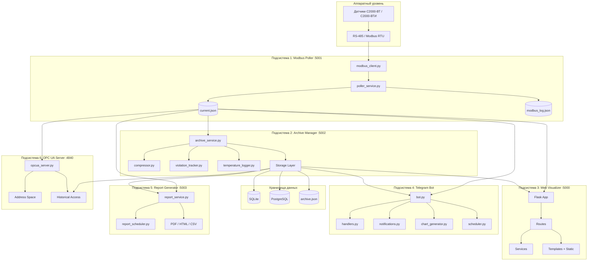
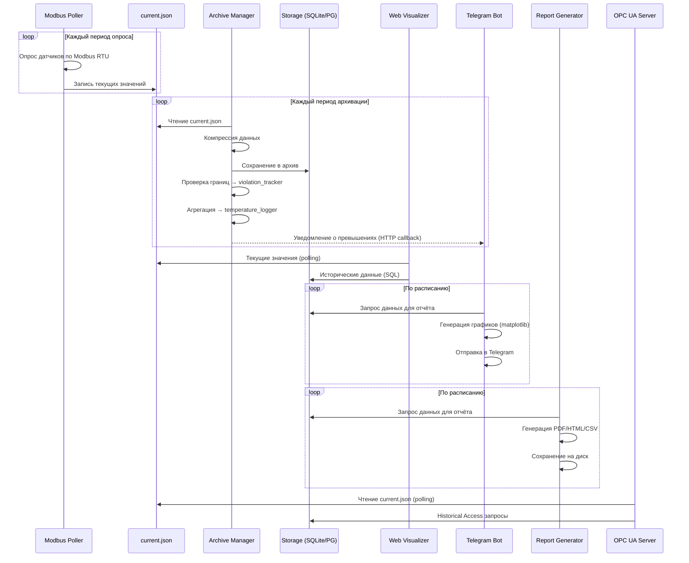
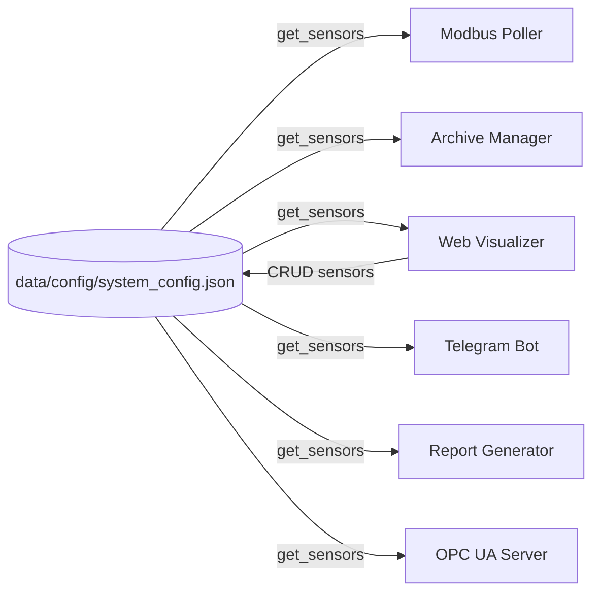

# Design Document: Система мониторинга КВТ

## Overview

Система КВТ — комплекс мониторинга температуры и влажности на базе датчиков С2000-ВТ/С2000-ВТИ (Болид) через преобразователь С2000-ПП по протоколу Modbus RTU. Система состоит из шести независимых подсистем: Modbus Poller, Archive Manager, Web Visualizer, Telegram Bot, Report Generator и OPC UA Server. Все подсистемы взаимодействуют через файловую систему (current.json, конфигурационные файлы) и общую базу данных (SQLite/PostgreSQL).

Технологический стек: Python 3.8+, Flask, pymodbus, SQLAlchemy, python-telegram-bot, matplotlib, opcua.

## Architecture

### Общая архитектура



### Взаимодействие подсистем



### Порты и сервисы

| № | Подсистема | Порт | Протокол | Назначение |
|---|------------|------|----------|------------|
| 1 | Modbus Poller | 5001 | HTTP REST | Управление опросом, конфигурация |
| 2 | Archive Manager | 5002 | HTTP REST | Запросы архива, экспорт, журналы |
| 3 | Web Visualizer | 5000 | HTTP | Веб-интерфейс + REST API |
| 4 | Telegram Bot | — | Telegram API | Команды, уведомления, отчёты |
| 5 | Report Generator | 5003 | HTTP REST | Управление генерацией отчётов |
| 6 | OPC UA Server | 4840 | OPC UA | Данные для SCADA-клиентов |

### Решение по межсервисному взаимодействию

Подсистемы взаимодействуют через:
1. Файловую систему — current.json как шина данных реального времени (Poller → все потребители)
2. Общую БД (SQLite/PostgreSQL) — архивные данные (Archive Manager → все потребители)
3. Конфигурационные JSON-файлы — общий каталог data/config/
4. HTTP REST — для управляющих команд между подсистемами (например, Web Visualizer → Poller для перезапуска)

Обоснование: файловая шина проста, не требует брокера сообщений, подходит для ARM-контроллера с ограниченными ресурсами. SQLite обеспечивает конкурентное чтение без сервера БД.

### Принцип единого конфига датчиков

Все подсистемы используют `data/config/system_config.json` как единственный источник истины для списка датчиков. Ни одна подсистема не хранит свою копию списка датчиков.



- Web Visualizer — единственная подсистема, которая пишет в system_config.json (CRUD датчиков)
- Все остальные подсистемы только читают system_config.json
- При изменении конфигурации подсистемы получают обновления через:
  - Poller: POST /api/poller/reload или watch файла
  - OPC UA Server: watch файла, обновление адресного пространства в течение 5 секунд
  - Остальные: перечитывают при следующем цикле работы
- poller_config.json содержит ТОЛЬКО параметры COM-порта и опроса, список датчиков НЕ дублируется

## Components and Interfaces

### Подсистема 1: Modbus Poller

Отвечает за циклический опрос датчиков С2000-ВТ/С2000-ВТИ через С2000-ПП по Modbus RTU.

Ограничения: система поддерживает до 256 датчиков на одном С2000-ПП, каждый датчик занимает 2 Modbus-адреса (температура + влажность) (Req 4.5).

Протокол опроса:
- Функция Modbus 0x04 (Read Input Registers)
- Регистры значений: base address 30000+N (чётный адрес — температура, нечётный — влажность)
- Регистры статусов: base address 40000+N
- Конвертация: raw 16-bit / 10 → физические единицы (°C, %)

Модули:
- `poller/app.py` — Flask-приложение, REST API (порт 5001)
- `poller/poller_service.py` — основной цикл опроса в отдельном потоке
- `poller/modbus_client.py` — обёртка над pymodbus: подключение, чтение регистров, обработка ошибок
- `poller/config.py` — загрузка/сохранение poller_config.json
- `poller/models.py` — dataclass-модели SensorReading, PollerStatus

REST API:

| Метод | Endpoint | Описание |
|-------|----------|----------|
| GET | /api/poller/status | Статус опросчика (running/stopped, статистика) |
| GET | /api/poller/current | Текущие значения (current.json) |
| GET | /api/poller/log | Лог Modbus-обмена (modbus_log.json) |
| POST | /api/poller/config | Обновить конфигурацию подключения |
| POST | /api/poller/start | Запустить опрос |
| POST | /api/poller/stop | Остановить опрос |
| GET | /api/poller/ports | Список доступных COM-портов |
| POST | /api/poller/reload | Перезагрузить конфигурацию датчиков |
| GET | /api/poller/health | Проверка состояния подсистемы |

Конфигурация подключения (poller_config.json):
- com_port, baudrate (1200–115200), data_bits (7 или 8), parity (None, Even, Odd), stop_bits (1 или 2)
- poll_period (100–60000 мс), timeout (100–5000 мс), retry_count (default 3)
- Список датчиков НЕ хранится — берётся из system_config.json

### Подсистема 2: Archive Manager

Отвечает за сбор, компрессию, хранение и ротацию данных измерений.

Модули:
- `archiver/app.py` — Flask-приложение, REST API (порт 5002)
- `archiver/archive_service.py` — основной сервис: чтение current.json, диспетчеризация в storage
- `archiver/compressor.py` — алгоритм схлопывания одинаковых значений
- `archiver/violation_tracker.py` — отслеживание выхода за границы, создание записей в threshold_violations
- `archiver/temperature_logger.py` — агрегация min/max/avg по периодам (hour/day/week)
- `archiver/cleaner.py` — ротация данных по политикам хранения, контроль дискового пространства
- `archiver/storage/sqlite_storage.py` — реализация хранилища SQLite через SQLAlchemy
- `archiver/storage/postgres_storage.py` — реализация хранилища PostgreSQL
- `archiver/storage/json_storage.py` — реализация хранилища JSON-файл
- `archiver/config.py` — загрузка archive_config.json

REST API:

| Метод | Endpoint | Описание |
|-------|----------|----------|
| GET | /api/archive/status | Статус архива (размер, кол-во записей) |
| GET | /api/archive/query | Запрос данных с фильтрами и агрегацией |
| GET | /api/archive/events | Журнал событий |
| POST | /api/archive/events/{id}/ack | Квитировать событие |
| GET | /api/archive/temperature-log | Журнал температур по периодам |
| GET | /api/archive/violations | Журнал превышений |
| POST | /api/archive/violations/{id}/ack | Квитировать превышение |
| POST | /api/archive/cleanup | Принудительная очистка |
| GET | /api/archive/export | Экспорт CSV/JSON |
| POST | /api/archive/config | Обновить конфигурацию |
| GET | /api/archive/health | Проверка состояния подсистемы |

### Подсистема 3: Web Visualizer

Отвечает за веб-интерфейс: мнемосхема, графики, настройки, журналы, план помещения.

Модули:
- `visualizer/app.py` — Flask-приложение (порт 5000)
- `visualizer/routes/main.py` — главная страница (мнемосхема с плашками датчиков, включая мини-график за последний час)
- `visualizer/routes/sensor.py` — детальный просмотр датчика, графики
- `visualizer/routes/journal.py` — журналы событий (/events), температур (/journal/temperatures) и превышений (/journal/violations) с фильтрацией по датчику, типу события, диапазону дат; квитирование событий и превышений
- `visualizer/routes/settings.py` — страницы настроек (poller, sensors, archive, notifications, reports, appearance, system)
- `visualizer/routes/config_api.py` — REST API конфигурации и датчиков
- `visualizer/routes/floorplan.py` — план помещения (страница + API)
- `visualizer/routes/export.py` — страница экспорта данных (/export): выбор датчиков, периода, формата (CSV/JSON), проксирование запроса к Archive Manager API
- `visualizer/routes/api.py` — общий API для фронтенда (текущие данные, тема)
- `shared/config_bundle.py` — экспорт/импорт полного конфигурационного ZIP-архива (конфиги, планы, диагностические снимки)
- `visualizer/services/config_service.py` — CRUD датчиков, версионность, бэкапы
- `visualizer/services/notification_service.py` — отправка email-уведомлений через SMTP (при превышениях + ежедневный отчёт по расписанию, default 08:00)
- `visualizer/services/report_service.py` — генерация отчётов по запросу

Страницы:

| URL | Шаблон | Назначение |
|-----|--------|------------|
| / | index.html | Мнемосхема с плашками датчиков |
| /floorplan | floorplan.html | План помещения |
| /sensor/{id} | sensor.html | Детальный просмотр датчика |
| /events | events.html | Журнал событий |
| /journal/temperatures | temperatures.html | Журнал температур |
| /journal/violations | violations.html | Журнал превышений |
| /export | export.html | Экспорт данных (CSV/JSON) |
| /settings | settings/index.html | Общие настройки |
| /settings/poller | settings/poller.html | Настройки Modbus |
| /settings/sensors | settings/sensors.html | Управление датчиками |
| /settings/archive | settings/archive.html | Настройки архива |
| /settings/notifications | settings/notifications.html | Уведомления |
| /settings/reports | settings/reports.html | Отчёты |
| /settings/appearance | settings/appearance.html | Оформление и темы |
| /settings/system | settings/system.html | Системные настройки |
| /settings/config-transfer | settings/config_transfer.html | Импорт/экспорт полного конфигурационного архива |

Возможности мнемосхемы (index.html):
- «Ping линии» в карточке датчика — выводится только для датчиков на Ethernet-линии (по `poll_port_id`): последний ping (`<мс> мс`/`нет связи`/`—`); у COM-датчиков строка скрыта. Отдельной плашки доступности по линии на мнемосхеме нет. Источник — `availability_daily.json` через `/api/availability/daily`.
- «Дерево датчиков» — иерархическая группировка датчиков по веткам/подветкам; в корне ветки выводятся название и текущий min-max температуры и влажности (агрегация по датчикам ветки на клиенте). Лист-датчик повторяет данные плашки (имя, t/влажность, линия, последние данные, получено за сегодня, ping линии). Конфигурация — `mnemo_tree.json` (модуль `shared/config_manager.py`: `load_mnemo_tree`/`save_mnemo_tree` с рекурсивной санацией).
- «Режим редактирования» — кнопка в шапке мнемосхемы открывает встроенный редактор дерева (ветки/подветки, переименование, удаление, выбор датчиков чекбоксами, сохранение/отмена). Флаг «Показывать плашки вне дерева» (`show_flat_cards` в `mnemo_tree.json`) скрывает/показывает общую сетку плашек; при выключении остаётся только дерево.

Дополнительные endpoint'ы фронтенда (`visualizer/routes/api.py`):

| Метод | Endpoint | Описание |
|-------|----------|----------|
| GET | /api/availability/daily | Суточная доступность линий и датчиков; для Ethernet-линий выполняется ping |
| GET | /api/mnemo/tree | Получить конфигурацию дерева датчиков |
| POST | /api/mnemo/tree | Сохранить дерево датчиков (с санацией структуры) |
| GET | /api/config/bundle/summary | Сводка переносимого набора конфигурации |
| GET | /api/config/bundle/export | Скачать полный ZIP-архив конфигурации |
| POST | /api/config/bundle/import | Восстановить конфигурацию из ZIP-архива |

### Подсистема 4: Telegram Bot

Отвечает за интерактивное взаимодействие через Telegram: команды, уведомления, регулярные отчёты.

Модули:
- `telegram_bot/bot.py` — инициализация бота, запуск polling
- `telegram_bot/handlers.py` — обработчики команд (/status, /chart, /mute, /schedule и др.)
- `telegram_bot/notifications.py` — отправка уведомлений о превышениях и тревогах
- `telegram_bot/report_generator.py` — формирование текстовых отчётов
- `telegram_bot/chart_generator.py` — генерация PNG-графиков через matplotlib
- `telegram_bot/scheduler.py` — APScheduler для регулярных отчётов
- `telegram_bot/config.py` — загрузка telegram_config.json и notifications.json

Команды:

| Команда | Описание |
|---------|----------|
| /start | Регистрация чата |
| /status | Текущие значения всех датчиков |
| /sensor {id\|name} | Значения конкретного датчика |
| /chart {id\|name} [period] | График (1h, 6h, 24h, 7d, 30d) |
| /violations [period] | Список превышений |
| /report | Сформировать отчёт сейчас |
| /journal [period] | Сводка min/max/avg |
| /schedule | Показать расписание |
| /schedule {type} {on\|off} | Вкл/выкл тип отчёта |
| /mute {minutes} | Приостановить уведомления |
| /unmute | Возобновить уведомления |
| /help | Список команд |

### Подсистема 5: Report Generator

Отвечает за автоматическую генерацию отчётов по расписанию и сохранение на диск.

Модули:
- `report_gen/app.py` — Flask-приложение, REST API (порт 5003)
- `report_gen/report_service.py` — генерация отчётов (текст + графики)
- `report_gen/report_scheduler.py` — APScheduler для расписания
- `report_gen/formatters/pdf_formatter.py` — генерация PDF (ReportLab или WeasyPrint)
- `report_gen/formatters/html_formatter.py` — генерация HTML
- `report_gen/formatters/csv_formatter.py` — генерация CSV
- `report_gen/config.py` — загрузка report_config.json

REST API:

| Метод | Endpoint | Описание |
|-------|----------|----------|
| GET | /api/reports/status | Статус генератора, последние отчёты |
| POST | /api/reports/generate | Ручная генерация отчёта |
| GET | /api/reports/list | Список сгенерированных отчётов |
| GET | /api/reports/download/{filename} | Скачать отчёт |
| POST | /api/reports/config | Обновить конфигурацию |
| GET | /api/reports/health | Проверка состояния подсистемы |

Именование файлов отчётов:
- Формат: `{type}_{date}_{time}.{format}` (например, `daily_2026-01-14_080000.pdf`)
- Директория по умолчанию: `data/reports/`

Политика хранения отчётов:
- Ротация по двум критериям: максимальный размер директории (настраивается) и максимальное количество файлов (настраивается)
- Срок хранения по умолчанию: 365 дней
- При превышении любого из лимитов удаляются старейшие файлы

### Подсистема 6: OPC UA Server

Отвечает за предоставление данных внешним SCADA-системам по протоколу OPC UA.

Библиотека: `asyncua` 2.x (opcua-asyncio). Endpoint по умолчанию `opc.tcp://0.0.0.0:4840/kvt/`, namespace `urn:kvt:c:monitoring`. Режим безопасности `anonymous_readonly` (параметры `certificate`/`user_password` — заготовки в конфиге). Источник текущих значений — тот же нормализованный срез, что и `/api/current`; сервер не опрашивает оборудование сам.

Модули:
- `opcua_server/app.py` — CLI entrypoint (`python -m opcua_server.app`), разбор `--host/--port/--endpoint-path`, запуск сервиса
- `opcua_server/service.py` — asyncua-рантайм: построение адресного пространства, публикация текущего среза по `publishing.update_interval_ms`, запись `data/opcua_status.json`, автоперечитывание `opcua_config.json`
- `opcua_server/nodes.py` — стабильные NodeId и выбор публикуемых датчиков/полей
- `opcua_server/ha_provider.py` — OPC UA Historical Access: чтение архивных данных температуры/влажности из хранилища Archive_Manager по sensor_id и диапазону времени *(планируется; зависит от Archive Manager)*
- конфигурация читается через `shared.config_manager.load_opcua_config()` (`data/config/opcua_config.json`)

Адресное пространство OPC UA:

```
Objects
└── KVT
    ├── System            (ServerName, NamespaceUri, LastUpdate, SourceTimestamp, ExportedSensorCount)
    ├── PollPorts
    │   └── PollPort_<id>  (Name, Transport, State, LastPingMs, LastError)
    └── Sensors
        └── Sensor_<id>    (Name, DisplayNumber, Temperature, Humidity, CombinedStatus,
                            Timestamp, PollPortId, PollPortName, Transport, TempMin/TempMax, HumMin/HumMax)
```

Стабильные NodeId: `KVT.Sensors.<id>.<Field>` (например `KVT.Sensors.7.Temperature`), `KVT.PollPorts.<token>.<Field>`. При отсутствии/устаревании значения числовой узел публикуется с качеством BadNoData, но browse-метка и служебные поля остаются доступны. Состояние сервиса пишется в `data/opcua_status.json` и доступно через Web Visualizer (`/api/opcua/status`); настройка — на `/settings/opcua`.

### Общие модули (shared/)

- `shared/models.py` — dataclass-модели: SensorConfig, SensorReading, Measurement, Event, Violation (с полями квитирования), TemperatureLogEntry
- `shared/config_manager.py` — загрузка/сохранение JSON-конфигов с версионностью и бэкапами
- `shared/utils.py` — утилиты: форматирование дат, конвертация единиц, валидация

## Data Models

### Основные модели данных (shared/models.py)

```python
@dataclass
class SensorConfig:
    id: int
    enabled: bool
    name: str
    description: str
    modbus_slave_id: int
    modbus_addr_temp: int
    modbus_addr_hum: int
    temp_limits: dict  # {min, max, warning_delta, alarm_delta}
    hum_limits: dict   # {min, max, warning_delta, alarm_delta}
    guarded: bool
    notifications: dict  # {email_on_warning, email_on_alarm, telegram_on_alarm}

@dataclass
class SensorReading:
    sensor_id: int
    name: str
    temperature: float
    humidity: float
    temp_status: str      # ok, timeout, crc_error, exception, offline
    hum_status: str
    combined_status: str   # normal, warning_*, alarm, no_connection, guarded
    timestamp: datetime

@dataclass
class Measurement:
    sensor_id: int
    timestamp_start: datetime
    timestamp_end: datetime
    duration_seconds: int
    sample_count: int
    temperature: float
    humidity: float
    temp_status: str
    hum_status: str
    combined_status: str

@dataclass
class Event:
    sensor_id: int
    timestamp: datetime
    event_type: str       # alarm, warning, config_change, etc.
    value: float
    threshold: float
    acknowledged: bool
    acknowledged_at: Optional[datetime]
    acknowledged_by: Optional[str]
    comment: Optional[str]

@dataclass
class Violation:
    sensor_id: int
    started_at: datetime
    ended_at: Optional[datetime]
    duration_seconds: Optional[int]
    parameter: str         # temperature, humidity
    violation_type: str    # warning_high, warning_low, alarm_high, alarm_low
    value_at_start: float
    value_peak: float
    threshold: float
    acknowledged: bool
    acknowledged_at: Optional[datetime]
    acknowledged_by: Optional[str]
    comment: Optional[str]

@dataclass
class TemperatureLogEntry:
    sensor_id: int
    period_type: str       # hour, day, week
    period_start: datetime
    period_end: datetime
    temp_min: float
    temp_max: float
    temp_avg: float
    hum_min: float
    hum_max: float
    hum_avg: float
    sample_count: int
```

### Схема БД (SQLite / PostgreSQL)

```sql
CREATE TABLE sensors (
    id INTEGER PRIMARY KEY,
    name TEXT NOT NULL,
    modbus_slave_id INTEGER,
    modbus_addr_temp INTEGER,
    modbus_addr_hum INTEGER,
    created_at TIMESTAMP DEFAULT CURRENT_TIMESTAMP
);

CREATE TABLE measurements (
    id INTEGER PRIMARY KEY AUTOINCREMENT,
    sensor_id INTEGER REFERENCES sensors(id),
    timestamp_start TIMESTAMP NOT NULL,
    timestamp_end TIMESTAMP NOT NULL,
    duration_seconds INTEGER,
    sample_count INTEGER DEFAULT 1,
    temperature REAL,
    humidity REAL,
    temp_status TEXT,
    hum_status TEXT,
    combined_status TEXT
);
CREATE INDEX idx_sensor_time ON measurements(sensor_id, timestamp_start);

CREATE TABLE events (
    id INTEGER PRIMARY KEY AUTOINCREMENT,
    sensor_id INTEGER REFERENCES sensors(id),
    timestamp TIMESTAMP NOT NULL,
    event_type TEXT NOT NULL,
    value REAL,
    threshold REAL,
    acknowledged BOOLEAN DEFAULT FALSE,
    acknowledged_at TIMESTAMP,
    acknowledged_by TEXT,
    comment TEXT
);

CREATE TABLE temperature_log (
    id INTEGER PRIMARY KEY AUTOINCREMENT,
    sensor_id INTEGER REFERENCES sensors(id),
    period_type TEXT NOT NULL,
    period_start TIMESTAMP NOT NULL,
    period_end TIMESTAMP NOT NULL,
    temp_min REAL, temp_max REAL, temp_avg REAL,
    hum_min REAL, hum_max REAL, hum_avg REAL,
    sample_count INTEGER DEFAULT 0
);
CREATE INDEX idx_temp_log_sensor_period ON temperature_log(sensor_id, period_type, period_start);

CREATE TABLE threshold_violations (
    id INTEGER PRIMARY KEY AUTOINCREMENT,
    sensor_id INTEGER REFERENCES sensors(id),
    started_at TIMESTAMP NOT NULL,
    ended_at TIMESTAMP,
    duration_seconds INTEGER,
    parameter TEXT NOT NULL,
    violation_type TEXT NOT NULL,
    value_at_start REAL,
    value_peak REAL,
    threshold REAL,
    acknowledged BOOLEAN DEFAULT FALSE,
    acknowledged_at TIMESTAMP,
    acknowledged_by TEXT,
    comment TEXT
);
CREATE INDEX idx_violations_sensor ON threshold_violations(sensor_id, started_at);
CREATE INDEX idx_violations_open ON threshold_violations(ended_at) WHERE ended_at IS NULL;

CREATE TABLE archive_stats (
    id INTEGER PRIMARY KEY AUTOINCREMENT,
    timestamp TIMESTAMP DEFAULT CURRENT_TIMESTAMP,
    total_records INTEGER,
    disk_usage_bytes INTEGER,
    compression_ratio REAL
);
```

### Конфигурационные файлы

Все конфигурации хранятся в `data/config/`:

| Файл | Подсистема | Назначение |
|------|------------|------------|
| system_config.json | Все | Датчики, системные настройки, версионность |
| poller_config.json | Modbus Poller | Параметры COM-порта, период опроса |
| archive_config.json | Archive Manager | Режим сбора, хранилища, компрессия, ротация |
| telegram_config.json | Telegram Bot | Токен, чаты, настройки графиков |
| notifications.json | Web Visualizer, Telegram Bot | Email SMTP, Telegram уведомления, расписание |
| report_config.json | Report Generator | Расписание, форматы, директория сохранения |
| opcua_config.json | OPC UA Server | Endpoint, порт, security, аутентификация |
| layout.json | Web Visualizer | Расположение плашек на мнемосхеме, ссылка на фоновое изображение |
| floorplan_config.json | Web Visualizer | Планы помещений, позиции датчиков |
| theme_config.json | Web Visualizer | Темы, цвета, название приложения |
| mnemo_tree.json | Web Visualizer | Дерево датчиков на мнемосхеме (ветки, подветки, состав) |

Помимо `data/config/`, в `data/` ведётся рабочий файл `availability_daily.json` (суточный учёт доступности линий и датчиков: ping, % доступности, число снимков).

### Конфигурационный ZIP-архив

Полный переносимый архив формируется модулем `shared/config_bundle.py` и используется страницей `/settings/config-transfer`.

Структура ZIP:

```text
manifest.json
config/*.json
assets/floorplans/*.{png,jpg,jpeg,gif,bmp,webp,svg}
diagnostics/current.json
diagnostics/availability_daily.json
diagnostics/modbus_log.json
diagnostics/events.json
```

- `config/*.json` — все верхнеуровневые JSON-конфиги из `data/config/`; подкаталоги `backups/`, `import_backups/` и служебные файлы не включаются.
- `assets/floorplans/` — картинки и SVG, загруженные для планов помещений.
- `diagnostics/` — export-only снимки текущей работы (`current.json`, `availability_daily.json`, `modbus_log.json`, `events.json`); они нужны для заводской диагностики и не восстанавливаются при импорте.
- Перед импортом создаётся резервный ZIP текущего состояния в `data/config/import_backups/`.
- Импорт проверяет `manifest.json`, обязательные конфиги, допустимые пути ZIP, расширения файлов планов и ограничения размера; после записи конфигов Visualizer запрашивает перечитывание настроек Poller.

## Error Handling

### Стратегия обработки ошибок по подсистемам

#### Modbus Poller
- Таймаут ответа датчика → retry до retry_count (default 3), затем статус "offline"
- Ошибка CRC → статус "crc_error", повторный запрос
- Modbus exception → статус "exception", логирование в modbus_log.json
- Потеря COM-порта → статус poller "error", попытка переподключения каждые 5 секунд
- Все ошибки логируются в modbus_log.json (circular buffer, max 1000 записей)

#### Archive Manager
- Ошибка чтения current.json → пропуск цикла, повтор на следующем интервале
- Ошибка записи в БД → retry 3 раза с экспоненциальной задержкой, затем fallback на JSON-хранилище
- Нехватка дискового пространства (< min_free_space_mb) → принудительная очистка старых данных
- Ошибка компрессии → запись без компрессии (raw)

#### Web Visualizer
- Недоступность Poller API → отображение последних известных данных с индикатором "данные устарели"
- Недоступность Archive API → отображение сообщения "архив недоступен" на страницах графиков/журналов
- Ошибка валидации конфигурации → HTTP 400 с описанием ошибки
- Ошибка отправки email → логирование, повтор через 5 минут (max 3 попытки)

#### Telegram Bot
- Ошибка Telegram API → retry с экспоненциальной задержкой (1s, 2s, 4s, max 60s)
- Недоступность данных → сообщение пользователю "данные временно недоступны"
- Ошибка генерации графика → отправка только текстового отчёта
- Неизвестная команда → сообщение с подсказкой /help

#### Report Generator
- Ошибка генерации PDF → fallback на HTML формат
- Ошибка записи на диск → логирование, уведомление через Telegram (если настроен)
- Превышение лимита хранения (по размеру директории или количеству файлов) → удаление старейших отчётов по retention policy

#### OPC UA Server
- Ошибка чтения current.json → возврат последних известных значений с StatusCode Bad_OutOfDate
- Ошибка Historical Access → StatusCode Bad_InternalError
- Изменение конфигурации датчиков → динамическое обновление адресного пространства в течение 5 секунд

### Общие принципы
- Все подсистемы используют Python logging с ротацией файлов (max 10 MB, 5 файлов)
- Критические ошибки дублируются в Telegram (если бот настроен)
- Каждая подсистема имеет endpoint /api/{subsystem}/health для мониторинга

## Testing Strategy

### Модульные тесты (pytest)

| Модуль | Тестируемая функциональность |
|--------|------------------------------|
| test_modbus_client.py | Парсинг регистров, конвертация raw → физические единицы, обработка ошибок |
| test_compressor.py | Алгоритм компрессии: схлопывание, tolerance, граничные случаи |
| test_violation_tracker.py | Детекция превышений, начало/конец violation, пиковые значения |
| test_temperature_logger.py | Агрегация min/max/avg по периодам |
| test_config_manager.py | Версионность, бэкапы, валидация, восстановление |
| test_chart_generator.py | Генерация PNG-графиков, корректность данных на графике |
| test_report_formatters.py | Генерация PDF/HTML/CSV, корректность содержимого |
| test_opcua_address_space.py | Построение адресного пространства, обновление при изменении конфигурации |

### Интеграционные тесты

| Тест | Описание |
|------|----------|
| test_poller_to_archive.py | Poller пишет current.json → Archive Manager читает и сохраняет в БД |
| test_archive_to_visualizer.py | Archive Manager сохраняет данные → Web Visualizer отображает графики |
| test_violation_notification.py | Превышение границы → уведомление в Telegram |
| test_config_crud.py | CRUD датчиков через Web API → обновление system_config.json → Poller перезагружает конфигурацию |
| test_opcua_data_flow.py | Poller обновляет current.json → OPC UA Server обновляет переменные |

### Тестирование API

Все REST API тестируются через Flask test client:
- Проверка HTTP-кодов ответов (200, 400, 404, 500)
- Валидация JSON-схем ответов
- Проверка CRUD-операций для датчиков
- Проверка фильтрации и пагинации

### Тестовые данные

- Фикстуры с предзаполненными current.json, system_config.json
- SQLite in-memory БД для тестов хранилища
- Mock-объекты для pymodbus (эмуляция ответов датчиков)
- Mock для Telegram API (python-telegram-bot test utilities)
