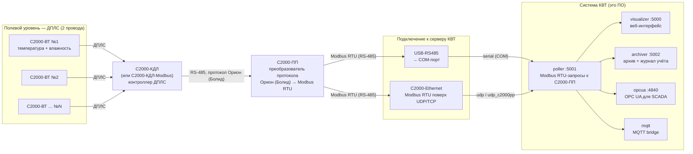

# KVT-C

Система мониторинга температуры и влажности для оборудования **Болид**: веб-интерфейс, архивирование, складской журнал учёта, OPC UA и MQTT для внешних SCADA/АСУ ТП. Данные собираются с адресных датчиков **С2000-ВТ** и читаются из преобразователя протокола **С2000-ПП** по Modbus RTU.

## О системе и оборудовании

Цепочка сбора данных построена на приборах ИСО «Орион» (Болид) и настраивается фирменной утилитой **UProg**:

1. **Датчики — [С2000-ВТ](https://bolid.ru/production/s2000-vt.html)** — адресные измерители температуры и влажности. Подключаются к **ДПЛС** (двухпроводной линии связи).
2. **Контроллер ДПЛС — [С2000-КДЛ](https://bolid.ru/production/s2000-kdl.html)** (или **[С2000-КДЛ-Modbus](https://bolid.ru/production/s2_kdl_modbus.html)**) — опрашивает адресные С2000-ВТ на ДПЛС. Адреса датчиков и параметры линии задаются в UProg.
3. **Преобразователь протокола — [С2000-ПП](https://bolid.ru/production/s2000-pp.html)** — собирает данные по внутреннему протоколу Болид («Орион», RS-485) и отдаёт их наружу как **ведомый Modbus RTU**. Таблица зон/регистров Modbus настраивается в UProg.
4. **Система КВТ (это ПО)** — модуль `poller` циклически **запрашивает С2000-ПП по Modbus RTU**. Подключение к серверу — одним из двух способов:
   - через **[USB-RS485](https://bolid.ru/production/usb-rs485.html)** — как локальный **COM-порт** (транспорт `serial`);
   - через **[С2000-Ethernet](https://bolid.ru/production/s2000-ethernet.html)** — Modbus RTU «поверх сети» по UDP/TCP (транспорт `udp` / `udp_c2000pp`), когда С2000-ПП подключён Modbus-портом к С2000-Ethernet.

Полученные данные `poller` публикует остальным подсистемам: веб-визуализация, архив/журнал учёта, OPC UA и MQTT bridge.



> Настройка приборов Болид (адресация С2000-ВТ на ДПЛС, параметры С2000-КДЛ, таблица Modbus-регистров С2000-ПП) выполняется утилитой **UProg**. Сама система КВТ прибором не управляет — она только читает готовые значения из С2000-ПП по Modbus RTU. Mock-сервер из `MocTestServer` эмулирует ответы С2000-ПП для отладки без реального железа.

## Что есть в проекте
- `visualizer` (Flask, порт `5000`) — веб UI, настройки, API.
- `poller` (Flask, порт `5001`) — опрос С2000-ПП по Modbus RTU, лог обменов, текущее состояние.
- `archiver` (Flask, порт `5002`) — Archive Manager: архивирование `current.json`, `archive.json`, `archive_daily.json`, SQLite-зеркало и REST API.
- `opcua` (asyncua, порт `4840`) — read-only OPC UA сервер для передачи текущих данных датчиков внешним SCADA/АСУ ТП клиентам.
- `mqtt` (paho-mqtt) — двунаправленный MQTT bridge: публикация текущих данных и приём входящих MQTT-сообщений.
- `MocTestServer` — тестовый сервер/генератор данных, эмулирует С2000-ПП (опционально).
- `data/config/*.json` — рабочие конфиги системы.

## Единая точка запуска
Запуск/остановка/статус из одного места:

```bash
python run_kvt.py start
python run_kvt.py status
python run_kvt.py stop
```

Дополнительно:

```bash
python run_kvt.py restart
python run_kvt.py start --service poller
python run_kvt.py start --service archiver
python run_kvt.py start --service opcua
python run_kvt.py start --service mqtt
python run_kvt.py stop --service visualizer
```

`--service all` (по умолчанию) поднимает `poller`, `archiver`, `visualizer`, `opcua` и `mqtt`.

Логи:
- `logs/poller.out.log`, `logs/poller.err.log`
- `logs/archiver.out.log`, `logs/archiver.err.log`
- `logs/opcua.out.log`, `logs/opcua.err.log`
- `logs/mqtt.out.log`, `logs/mqtt.err.log`
- `logs/visualizer.out.log`, `logs/visualizer.err.log`

PID-файлы:
- `.run/poller.pid`
- `.run/archiver.pid`
- `.run/opcua.pid`
- `.run/mqtt.pid`
- `.run/visualizer.pid`

## Установка
```bash
python -m venv .venv
.venv\Scripts\activate
pip install -r requirements.txt
```

## Адреса сервисов
- Visualizer UI: `http://127.0.0.1:5000/`
- Poller API/UI: `http://127.0.0.1:5001/`
- Archive Manager API/UI: `http://127.0.0.1:5002/`
- OPC UA endpoint: `opc.tcp://127.0.0.1:4840/kvt/`
- MQTT broker: по умолчанию `127.0.0.1:1883`, настраивается в `data/config/mqtt_config.json` и на `/settings/mqtt`
- Poller status API: `http://127.0.0.1:5001/api/poller/status`
- Archive status API: `http://127.0.0.1:5002/api/archive/status`

При запуске через `python run_kvt.py start` сервисы слушают адреса из `data/config/system_config.json`.
По умолчанию `web_host` и `poller_host` равны `0.0.0.0`, поэтому интерфейс доступен и по IP машины:
- Visualizer UI: `http://<IP-компьютера>:5000/`
- Poller API/UI: `http://<IP-компьютера>:5001/`
- Archive Manager API/UI: `http://<IP-компьютера>:5002/`
- OPC UA endpoint: `opc.tcp://<IP-компьютера>:4840/kvt/`

## Poller: подключение к С2000-ПП (Modbus transport)
Модуль `poller` — Modbus RTU **мастер**, С2000-ПП — ведомый. Поддерживаются режимы транспорта:
- `serial` — через **COM-порт** (RTU). Используется с преобразователем **USB-RS485**.
- `udp` — нативный RTU-over-UDP (RTU-кадр + CRC через UDP-сокет).
- `udp_c2000pp` — RTU в 5-байтовой UDP-обёртке `10 LEN SEQ 10` на передачу и приём — путь через **С2000-Ethernet**.

Несколько именованных линий опроса задаются в `poll_ports[]` (независимый worker на каждый COM/UDP-порт под управлением `PollPortManager`), датчики привязываются к конкретной линии. Полная спецификация — в `Общее ТЗ на систему КВТ С.md`.

Базовые ключи в `data/config/poller_config.json`:

```json
{
  "transport": "serial",
  "com_port": "COM8",
  "baudrate": 9600,
  "bytesize": 8,
  "parity": "N",
  "stopbits": 1,
  "udp_host": "127.0.0.1",
  "udp_port": 502,
  "timeout_ms": 500
}
```

Переключение режима и настройка линий — в UI: `Settings → Poller`.

## Archive Manager и журнал учёта
- Archive Manager читает `data/current.json`, пишет сжатые измерения в `data/archive.json`, поддерживает SQLite-файл `data/archive.db` при включённом хранилище и формирует файловую суточную вьюху `data/archive_daily.json`.
- Основные API доступны и через visualizer (`/api/archive/status`, `/api/archive/query`, `/api/archive/temperature-log`, `/api/archive/violations`, `/api/archive/export`), и через отдельный сервис archiver на порту `5002`.
- Настройки архива — на `/settings/archive`; там же можно вручную снять текущий срез и запустить очистку по retention.
- Складская отчётность — на `/logbook`: суточные min/max/avg температуры и влажности, число превышений, ежедневная подпись оператора, пакетная подпись выходных/праздников и печатный лист `/logbook/<report_id>/print`.
- Конфиги журналов, операторов и календаря: `data/config/reports_config.json`, `data/config/operators.json`, `data/config/holidays.json`; подписи со снимками значений хранятся в `data/logbook_signoffs.json`.
- Админка журналов — на `/settings/reports`.

## OPC UA сервер
- Конфиг сервера хранится в `data/config/opcua_config.json`; включается/выключается кнопками «Запустить/Остановить» на `/settings/opcua` (флаг `enabled` сохраняется в конфиге и задаёт автозапуск при старте системы).
- Endpoint по умолчанию: `opc.tcp://0.0.0.0:4840/kvt/`; namespace URI: `urn:kvt:c:monitoring`.
- Сервер запускается отдельным процессом через `python run_kvt.py start --service opcua`; при `--service all` — вместе с poller/archiver/visualizer. Флаг `enabled` процесс применяет вживую (~2 секунды), без перезапуска.
- OPC UA публикует тот же нормализованный срез датчиков, что и `/api/current`: значения из `current.json`, fallback на последние временные снимки и архивные значения, плюс привязка к `poll_port_id`.
- Адресное пространство: `KVT/System`, `KVT/PollPorts/<poll_port_id>`, `KVT/Sensors/Sensor_<id>`. NodeId датчиков стабильные: `KVT.Sensors.<id>.Temperature`, `Humidity`, `CombinedStatus`, `Timestamp`, `PollPortId`.
- На `/settings/opcua` настраиваются host/port/path, namespace, интервал публикации, список датчиков, экспортируемые поля и заготовки security. Runtime сейчас поддерживает read-only anonymous mode; certificate/user-password сохраняются в конфиге для следующего ужесточения.
- Статус пишется в `data/opcua_status.json` и доступен через Visualizer API `/api/opcua/status`.
- Historical Access (HA): поля настройки уже есть в `opcua_config.json` и на `/settings/opcua`, но runtime HistoryRead ещё не реализован; пока сервер публикует только текущие значения.

## MQTT bridge
- Конфиг bridge хранится в `data/config/mqtt_config.json`; пароль broker хранится отдельно в `data/config/mqtt_password.key` или берётся из `KVT_MQTT_PASSWORD` и не попадает в Git/config bundle.
- Сервис запускается отдельным процессом через `python run_kvt.py start --service mqtt`; при `--service all` — вместе с остальными сервисами. Флаг `enabled` в конфиге включает/выключает соединение с broker.
- Публикуется тот же нормализованный срез датчиков, что и `/api/current`: общий retained snapshot и отдельные retained payload по каждому датчику.
- Topics при `base_topic="kvt-c"`: `kvt-c/status`, `kvt-c/current`, `kvt-c/sensors/<sensor_id>`, `kvt-c/inbound/sensors/<sensor_id>`, `kvt-c/commands/republish`, `kvt-c/commands/ping`.
- Входящие payload датчиков сохраняются в `data/mqtt_inbound.json` и доступны через `/api/mqtt/inbound`; они не перезаписывают `data/current.json` в текущей версии.
- Настройки broker, username/password, TLS-пути, QoS, retain, interval и base topic доступны на `/settings/mqtt`; статус — через `/api/mqtt/status`.

## Импорт/экспорт конфигурации
- Страница переноса настроек: `http://127.0.0.1:5000/settings/config-transfer`.
- ZIP-архив содержит `manifest.json`, все верхнеуровневые JSON-конфиги из `data/config/` (включая `opcua_config.json` и `mqtt_config.json`), изображения планов из `visualizer/static/floorplans/` и диагностические снимки `current.json`, `availability_daily.json`, `modbus_log.json`, `events.json`, `opcua_status.json`, `mqtt_status.json`, `mqtt_inbound.json`.
- При импорте восстанавливаются конфиги и изображения планов; диагностические файлы остаются только для анализа и обратно не накатываются.
- Перед импортом текущая конфигурация автоматически сохраняется в `data/config/import_backups/`.

## Визуализация актуальности
- На каждой плашке датчика на главном экране отображается строка `Последние данные: ...`.
- Время берётся из `sensor.temperature.timestamp` (fallback: общий `current.timestamp`).
- Метка нужна для быстрого контроля свежести данных по каждому датчику.

## Мнемосхема (главный экран)
- **Ping в карточке датчика** — строка `Ping линии` показывается ТОЛЬКО для датчиков, привязанных к Ethernet-линии (UDP/С2000-ПП через С2000-Ethernet), и содержит последний ping линии опроса (`<мс> мс` / `нет связи` / `—`). У датчиков на COM-линии строка скрыта.
- **Дерево датчиков** — настраиваемая группировка датчиков по веткам (с подветками). В корне каждой ветки выводятся название, число датчиков и текущий диапазон min-max температуры и влажности. Конфигурация хранится в `data/config/mnemo_tree.json`.
- **Режим редактирования мнемосхемы** — кнопка «Режим редактирования» в шапке открывает встроенный редактор дерева (добавить ветку/подветку, переименовать, удалить, выбрать датчики чекбоксами, сохранить/отменить).
- Суточные счётчики доступности (включая `Получено данных сегодня` и ping линий) ведутся в `data/availability_daily.json`.

> Примечание по эксплуатации: visualizer запускается без debug, поэтому шаблоны кэшируются. Включён `TEMPLATES_AUTO_RELOAD`, но процесс нужно один раз перезапустить (`python run_kvt.py restart --service visualizer`). Если правки не видны — проверьте, нет ли «забытого» процесса на порту 5000 (`Get-NetTCPConnection -LocalPort 5000`), который перехватывает запросы.

## Быстрый smoke-test
1. `python run_kvt.py start`
2. Открыть `http://127.0.0.1:5000/`
3. Проверить `http://127.0.0.1:5001/api/poller/status`
4. Проверить `http://127.0.0.1:5002/api/archive/status`
5. Открыть `/settings/opcua`, при необходимости нажать «Запустить»
6. Проверить `http://127.0.0.1:5000/api/opcua/status` и подключение к `opc.tcp://127.0.0.1:4840/kvt/`
7. Открыть `/settings/mqtt`, при необходимости задать broker и проверить `http://127.0.0.1:5000/api/mqtt/status`
8. `python run_kvt.py stop`

## Замечания по проекту (актуальные)
- Docker/compose артефактов в текущем дереве нет.
- Основной поддерживаемый сценарий запуска: `run_kvt.py`.

## Журнал документации
- 2026-07-03: добавлен двунаправленный MQTT bridge (`mqtt_bridge`, `data/config/mqtt_config.json`, `/settings/mqtt`, `/api/mqtt/*`, запуск через `run_kvt.py --service mqtt`) для публикации текущих данных и приёма входящих MQTT-сообщений.
- 2026-07-01: README переписан — добавлены описание оборудования Болид (С2000-ВТ → ДПЛС/С2000-КДЛ → С2000-ПП → Modbus RTU через USB-RS485 или С2000-Ethernet, настройка UProg) и диаграмма пути данных; на `/settings/opcua` добавлены кнопки «Запустить/Остановить» и автозапуск (флаг `enabled`).
- 2026-06-30: добавлен отдельный OPC UA сервер на `asyncua` (`opcua_server`, `data/config/opcua_config.json`, `/settings/opcua`, `/api/opcua/*`, запуск через `run_kvt.py --service opcua`) для read-only передачи текущих данных датчиков внешним клиентам.
- 2026-06-24: реализован `archiver` как Archive Manager (`archive.json`, `archive_daily.json`, SQLite-зеркало, REST API, запуск через `run_kvt.py`) и складской журнал учёта (`/settings/reports`, `/logbook`, подписи со снимками значений, пакетная подпись нерабочих дней, печатный лист).
- 2026-06-19: добавлен полный импорт/экспорт конфигурационного ZIP-архива (`/settings/config-transfer`, `/api/config/bundle/*`) для передачи настроек, планов, мнемосхемы и диагностических снимков на завод и восстановления на другой установке.
- 2026-06-17: с мнемосхемы убрана плашка «Доступность Ethernet-линий»; ping показывается строкой в карточке каждого Ethernet-датчика (у COM-датчиков скрыт); добавлены дерево датчиков (`mnemo_tree.json`, API `/api/mnemo/tree`) с min-max в корне ветки и встроенный «Режим редактирования». В `visualizer/app.py` включён авто-перечитыватель шаблонов/статики. Обновлены `README.md`, `Общее ТЗ на систему КВТ С.md` (раздел 5) и `.kiro` specs.
- 2026-06-03: исправлена кодировка русских строк в `Общее ТЗ на систему КВТ С.md`, `visualizer/routes/api.py` и `shared/config_manager.py`; общий ТЗ снова корректно отображается в GitHub.
- 2026-06-03: файл ревью `CODE_REVIEW_RECOMMENDATIONS.md` обновлён: пункт про кодировки отмечен как выполненный, а оставшиеся рекомендации сохранены как открытые.
- 2026-06-03: выполнен первый проход по `CODE_REVIEW_RECOMMENDATIONS.md`: добавлены atomic JSON helpers, tolerant runtime JSON reads, отложенное применение poller config, запрет scan во время polling, throttling записи `modbus_log.json`, generated Flask secret, MockServer stdout/stderr logs, валидация poller config и `.gitignore` для runtime/cache/secret артефактов.
- 2026-06-03: дополнительно закрыты пункты ревью `P1 Кодировки`, `P1 Runtime logs`, `P2 Репозиторий/runtime`: добавлены `.editorconfig`/`.gitattributes`, `modbus_log.json` переведён на компактную atomic-запись, `.gitignore` расширен на runtime JSON и `data/config/backups/`.
- 2026-06-03: закрыт пункт ревью про умножение timeout на группы регистров: при ошибке чтения `values` poller явно пропускает `statuses`, пишет `status="skipped"` в exchange log и считает `skipped_status_reads`.
