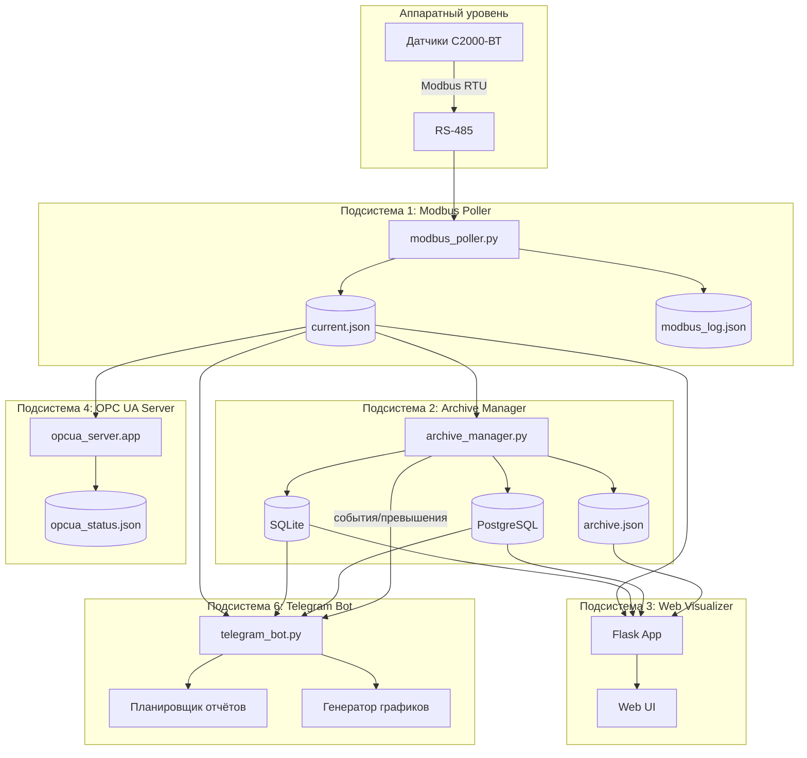
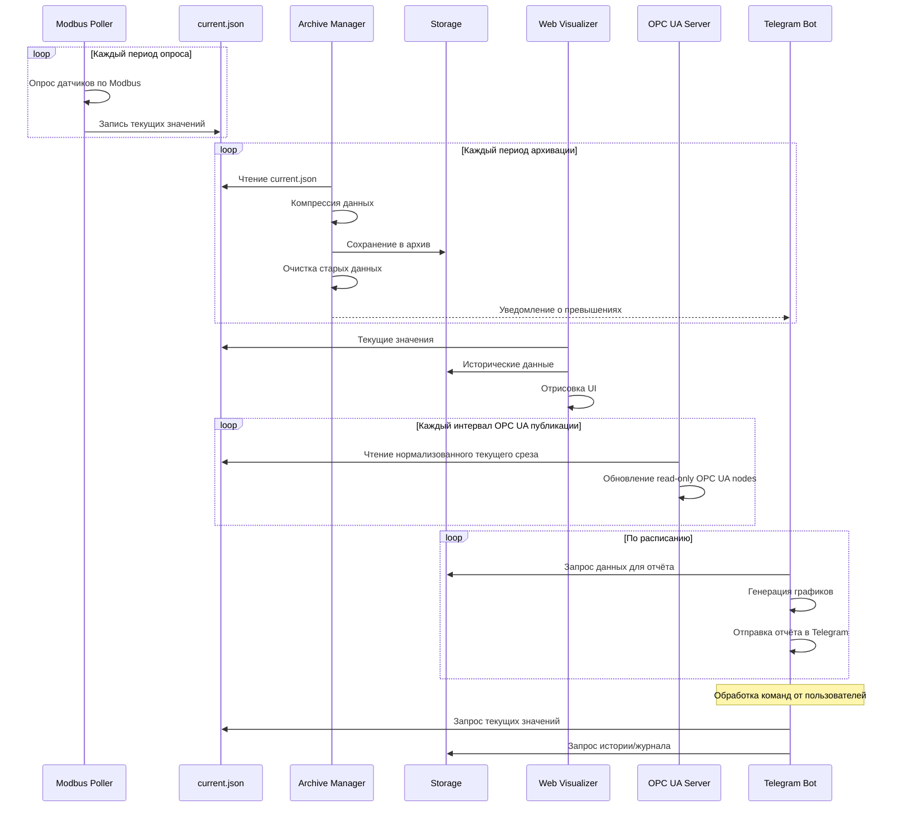

# 2. Архитектура системы

## 2.1 Структурная схема

## 2.2 Взаимодействие подсистем

## 2.3 Независимые подсистемы

| № | Подсистема | Порт | Назначение | Состояние |
|---|------------|------|------------|-----------|
| 1 | Modbus Poller | 5001 | Опрос датчиков по Modbus RTU | реализовано |
| 2 | Archive Manager | 5002 | Архивирование и хранение данных | реализовано |
| 3 | Web Visualizer | 5000 | Веб-интерфейс визуализации, журнал учёта | реализовано |
| 4 | OPC UA Server | 4840 | Read-only передача текущих данных датчиков по OPC UA | реализовано |
| 5 | MQTT Bridge | 1883 (брокер) | Двунаправленный обмен текущими данными по MQTT (см. §7) | реализовано |
| 6 | Telegram Bot | — | Уведомления, графики, отчёты через Telegram (см. §8) | ⚠️ только спецификация |

> Сводная таблица состояния реализации всех подсистем — в [индексе документации](../README.md).
> Запуск и управление сервисами — единой точкой `run_kvt.py` (см. §11); сервисы `opcua` и `mqtt`
> поднимаются при `--service all` только при включённом в их конфигурации `autostart`.
