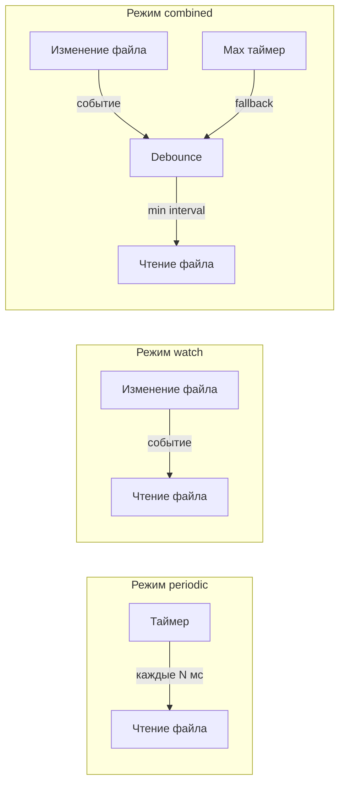

# 4. Подсистема 2: Archive Manager

## 4.1 Функциональные требования

- Копирование данных из current.json в архив (по таймеру или по изменению)
- Поддержка нескольких хранилищ: SQLite, PostgreSQL, JSON-файл
- Компрессия данных (схлопывание одинаковых значений)
- Управление размером архива
- Резервирование свободного места на диске
- Автоматическая ротация старых данных

## 4.2 Режимы забора данных

Система архивирования поддерживает два режима забора данных из опросчика Modbus:

### 4.2.1 Режим по таймеру (periodic)

Архиватор периодически читает файл `current.json` с заданным интервалом.

| Параметр | По умолчанию | Диапазон |
|----------|--------------|----------|
| archive_period_ms | 1000 | 100-60000 мс |

**Особенности:**
- Простая реализация
- Предсказуемая нагрузка на систему
- Возможна потеря данных при периоде архивации > периода опроса

### 4.2.2 Режим по изменению файла (watch)

Архиватор отслеживает изменения файла `current.json` и забирает данные сразу после обновления.

**Особенности:**
- Гарантированный захват всех данных
- Минимальная задержка архивации
- Нагрузка зависит от частоты опроса

### 4.2.3 Комбинированный режим (combined)

Сочетает оба подхода: отслеживает изменения файла, но не чаще заданного интервала.

| Параметр | По умолчанию | Описание |
|----------|--------------|----------|
| min_interval_ms | 500 | Минимальный интервал между архивациями |
| max_interval_ms | 5000 | Максимальный интервал (принудительное чтение) |

### 4.2.4 Конфигурация режимов забора данных

```json
{
  "data_collection": {
    "mode": "combined",
    "source_file": "./data/current.json",
    "periodic": {
      "enabled": false,
      "interval_ms": 1000
    },
    "watch": {
      "enabled": true,
      "debounce_ms": 100
    },
    "combined": {
      "enabled": true,
      "min_interval_ms": 500,
      "max_interval_ms": 5000
    }
  }
}
```

### 4.2.5 Диаграмма режимов



## 4.4 Алгоритм компрессии данных

Для экономии места одинаковые последовательные значения "схлопываются":

```
Исходные данные (каждую секунду):
  15:00:00 - 23.5°C
  15:00:01 - 23.5°C
  15:00:02 - 23.5°C
  15:00:03 - 23.6°C
  15:00:04 - 23.6°C

Сжатые данные:
  15:00:00 - 23.5°C (duration: 3s, count: 3)
  15:00:03 - 23.6°C (duration: 2s, count: 2)
```

## 4.5 Схема БД SQLite/PostgreSQL

```sql
-- Таблица датчиков
CREATE TABLE sensors (
    id INTEGER PRIMARY KEY,
    name TEXT NOT NULL,
    modbus_slave_id INTEGER,
    modbus_addr_temp INTEGER,
    modbus_addr_hum INTEGER,
    created_at TIMESTAMP DEFAULT CURRENT_TIMESTAMP
);

-- Таблица измерений (со схлопыванием)
CREATE TABLE measurements (
    id INTEGER PRIMARY KEY AUTOINCREMENT,
    sensor_id INTEGER REFERENCES sensors(id),
    timestamp_start TIMESTAMP NOT NULL,
    timestamp_end TIMESTAMP NOT NULL,
    duration_seconds INTEGER,
    sample_count INTEGER DEFAULT 1,
    temperature REAL,
    humidity REAL,
    temp_status TEXT,
    hum_status TEXT,
    combined_status TEXT
);

-- Индекс для быстрого поиска
CREATE INDEX idx_sensor_time ON measurements(sensor_id, timestamp_start);

-- Таблица событий (тревоги, квитирование)
CREATE TABLE events (
    id INTEGER PRIMARY KEY AUTOINCREMENT,
    sensor_id INTEGER REFERENCES sensors(id),
    timestamp TIMESTAMP NOT NULL,
    event_type TEXT NOT NULL,
    value REAL,
    threshold REAL,
    acknowledged BOOLEAN DEFAULT FALSE,
    acknowledged_at TIMESTAMP,
    acknowledged_by TEXT,
    comment TEXT
);

-- Журнал температур и влажности (агрегированные данные по периодам)
CREATE TABLE temperature_log (
    id INTEGER PRIMARY KEY AUTOINCREMENT,
    sensor_id INTEGER REFERENCES sensors(id),
    period_type TEXT NOT NULL,          -- 'hour', 'day', 'week'
    period_start TIMESTAMP NOT NULL,
    period_end TIMESTAMP NOT NULL,
    temp_min REAL,
    temp_max REAL,
    temp_avg REAL,
    hum_min REAL,
    hum_max REAL,
    hum_avg REAL,
    sample_count INTEGER DEFAULT 0
);

CREATE INDEX idx_temp_log_sensor_period ON temperature_log(sensor_id, period_type, period_start);

-- Журнал превышений (фиксация каждого выхода за границы)
CREATE TABLE threshold_violations (
    id INTEGER PRIMARY KEY AUTOINCREMENT,
    sensor_id INTEGER REFERENCES sensors(id),
    started_at TIMESTAMP NOT NULL,
    ended_at TIMESTAMP,
    duration_seconds INTEGER,
    parameter TEXT NOT NULL,            -- 'temperature', 'humidity'
    violation_type TEXT NOT NULL,       -- 'warning_high', 'warning_low', 'alarm_high', 'alarm_low'
    value_at_start REAL,
    value_peak REAL,
    threshold REAL,
    acknowledged BOOLEAN DEFAULT FALSE,
    acknowledged_at TIMESTAMP,
    acknowledged_by TEXT,
    comment TEXT
);

CREATE INDEX idx_violations_sensor ON threshold_violations(sensor_id, started_at);
CREATE INDEX idx_violations_open ON threshold_violations(ended_at) WHERE ended_at IS NULL;

-- Таблица статистики архива
CREATE TABLE archive_stats (
    id INTEGER PRIMARY KEY AUTOINCREMENT,
    timestamp TIMESTAMP DEFAULT CURRENT_TIMESTAMP,
    total_records INTEGER,
    disk_usage_bytes INTEGER,
    compression_ratio REAL
);
```

## 4.6 Формат JSON-архива (archive.json)

```json
{
  "version": "1.0",
  "created_at": "2026-01-01T00:00:00",
  "last_updated": "2026-01-14T15:30:45",
  "compression_enabled": true,
  "sensors": {
    "1": {
      "name": "ХРАН. № 1",
      "measurements": [
        {
          "ts": "2026-01-14T15:00:00",
          "te": "2026-01-14T15:00:03",
          "d": 3,
          "n": 3,
          "t": 23.5,
          "h": 45.2,
          "s": "normal"
        }
      ],
      "events": []
    }
  }
}
```

**Расшифровка полей:**
- `ts` - timestamp_start
- `te` - timestamp_end
- `d` - duration (секунды)
- `n` - количество измерений
- `t` - температура
- `h` - влажность
- `s` - статус

## 4.7 Политики хранения

| Период | Детализация | Хранение |
|--------|-------------|----------|
| Последние 24 часа | Каждое измерение | Полное |
| 1-7 дней | 1 минута (усреднение) | Сжатое |
| 7-30 дней | 5 минут | Сжатое |
| 30-365 дней | 1 час | Сжатое |
| Более 1 года | 1 день | Сжатое |

## 4.8 Управление дисковым пространством (archive_config.json)

```json
{
  "data_collection": {
    "mode": "combined",
    "source_file": "./data/current.json",
    "periodic": {
      "interval_ms": 1000
    },
    "watch": {
      "debounce_ms": 100
    },
    "combined": {
      "min_interval_ms": 500,
      "max_interval_ms": 5000
    }
  },
  "storage": {
    "sqlite": {
      "enabled": true,
      "path": "./data/archive.db",
      "max_size_mb": 500,
      "reserve_space_mb": 100
    },
    "postgresql": {
      "enabled": false,
      "host": "localhost",
      "port": 5432,
      "database": "kvt",
      "user": "kvt_user",
      "password": "****",
      "max_records": 10000000
    },
    "json_file": {
      "enabled": true,
      "path": "./data/archive.json",
      "max_size_mb": 100,
      "reserve_space_mb": 50
    }
  },
  "compression": {
    "enabled": true,
    "tolerance_temp": 0.1,
    "tolerance_hum": 0.5
  },
  "retention": {
    "max_days": 365,
    "cleanup_on_low_space": true,
    "min_free_space_mb": 200
  }
}
```

## 4.9 API Archive Manager (REST)

| Метод | Endpoint | Описание |
|-------|----------|----------|
| GET | /api/archive/status | Статус архива (размер, записей) |
| GET | /api/archive/query | Запрос данных с фильтрами |
| GET | /api/archive/events | Журнал событий |
| POST | /api/archive/events/{id}/ack | Квитировать событие |
| GET | /api/archive/temperature-log | Журнал температур/влажности по периодам |
| GET | /api/archive/violations | Журнал превышений границ |
| POST | /api/archive/violations/{id}/ack | Квитировать превышение |
| POST | /api/archive/cleanup | Принудительная очистка |
| GET | /api/archive/export | Экспорт данных (CSV/JSON) |
| POST | /api/archive/config | Изменить конфигурацию |

## 4.11 Запрос журнала температур

```
GET /api/archive/temperature-log?sensor_id=1&period_type=day&from=2026-01-01&to=2026-01-14
```

Параметр `period_type`:

| Значение | Описание |
|----------|----------|
| hour | Агрегация по часам (min/max/avg за каждый час) |
| day | Агрегация по дням |
| week | Агрегация по неделям |

Ответ:

```json
{
  "sensor_id": 1,
  "sensor_name": "ХРАН. № 1",
  "period_type": "day",
  "data": [
    {
      "period_start": "2026-01-13T00:00:00",
      "period_end": "2026-01-13T23:59:59",
      "temp_min": 21.3,
      "temp_max": 25.1,
      "temp_avg": 23.2,
      "hum_min": 40.0,
      "hum_max": 52.3,
      "hum_avg": 45.8,
      "sample_count": 86400
    }
  ]
}
```

## 4.12 Запрос журнала превышений

```
GET /api/archive/violations?sensor_id=1&from=2026-01-01&to=2026-01-14&status=all
```

Параметр `status`: `all`, `open` (незавершённые), `closed` (завершённые), `unacknowledged`.

Ответ:

```json
{
  "violations": [
    {
      "id": 42,
      "sensor_id": 1,
      "sensor_name": "ХРАН. № 1",
      "started_at": "2026-01-13T14:22:10",
      "ended_at": "2026-01-13T14:35:45",
      "duration_seconds": 815,
      "parameter": "temperature",
      "violation_type": "warning_high",
      "value_at_start": 26.1,
      "value_peak": 27.3,
      "threshold": 25.0,
      "acknowledged": false
    }
  ]
}
```

## 4.10 Запрос архивных данных

```
GET /api/archive/query?sensor_id=1&from=2026-01-01&to=2026-01-14&resolution=hour
```

Параметр `resolution` определяет агрегацию:

| Значение | Описание |
|----------|----------|
| raw | Все записи без агрегации |
| minute | Агрегация по минутам |
| hour | Агрегация по часам |
| day | Агрегация по дням |
| auto | Автоматически в зависимости от диапазона |
