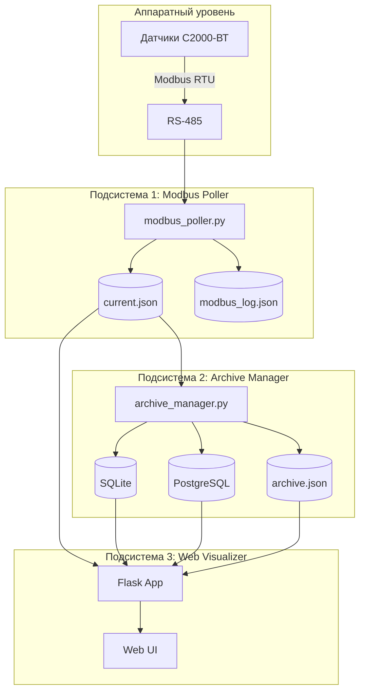
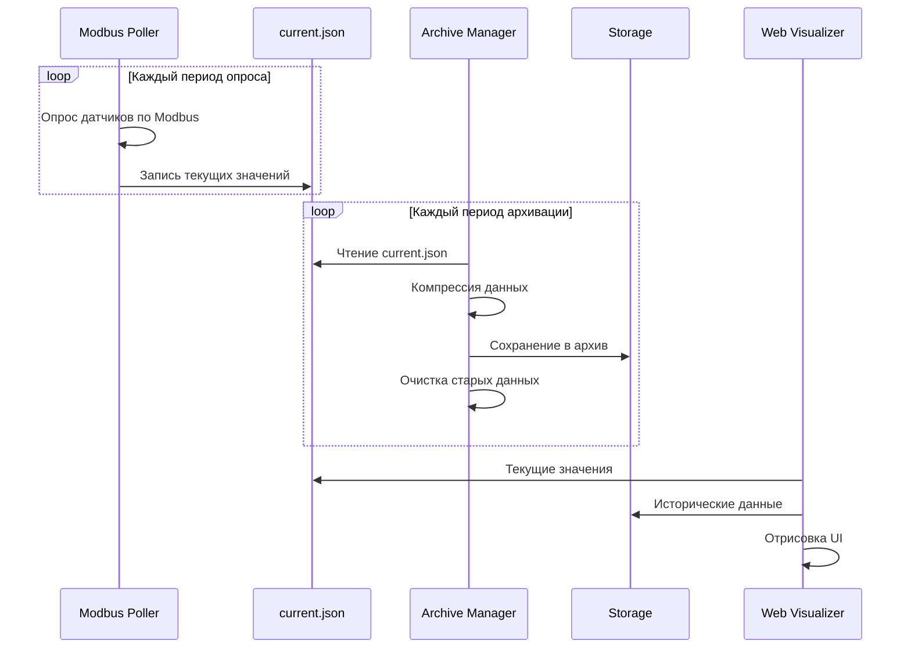
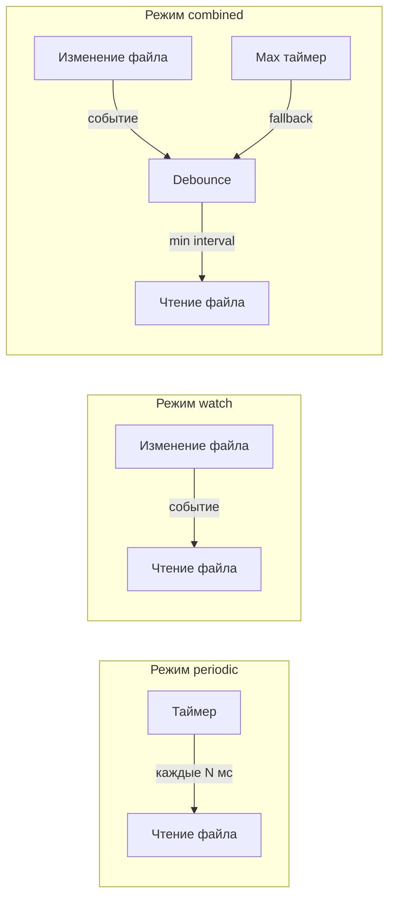

# Техническое задание: Система мониторинга КВТ

**Версия:** 1.1  
**Дата:** 14.01.2026  

---

## 1. Общие сведения

### 1.1 Назначение системы

Комплект измерения температуры и влажности "КВТ" предназначен для автоматического измерения температуры и влажности датчиками С2000-ВТ (Болид) и дальнейшей обработки, хранения с привязкой по времени и визуализации.

**Ссылка на датчик:** https://bolid.ru/production/s2000-vt.html

### 1.2 Масштабируемость системы

Система поддерживает **произвольное количество датчиков**:

- Датчики можно добавлять по одному или группами (например, по 10)
- Датчики можно удалять в любой момент
- Нет жёсткого ограничения на количество датчиков
- Рекомендуемые конфигурации для типовых решений:

| Конфигурация | Количество датчиков | Адреса Modbus |
|--------------|---------------------|---------------|
| КВТ-10 | до 10 | 20 адресов |
| КВТ-20 | до 20 | 40 адресов |
| КВТ-40 | до 40 | 80 адресов |
| КВТ-60 | до 60 | 120 адресов |
| Произвольная | N датчиков | 2×N адресов |

### 1.3 Целевая платформа

- **Основная:** ARM v7 4-ядерный контроллер
- **Совместимость:** Linux x86_64, Windows (ПК, серверы)
- **Контейнеризация:** Docker

### 1.4 Технологический стек

- Python 3.8+
- Flask (веб-фреймворк)
- pymodbus (Modbus RTU)
- SQLite / PostgreSQL (архивная БД)
- HTML/CSS/JS (фронтенд)

---

## 2. Архитектура системы

### 2.1 Структурная схема



### 2.2 Взаимодействие подсистем



### 2.3 Три независимые подсистемы

| № | Подсистема | Порт | Назначение |
|---|------------|------|------------|
| 1 | Modbus Poller | 5001 | Опрос датчиков по Modbus RTU |
| 2 | Archive Manager | 5002 | Архивирование и хранение данных |
| 3 | Web Visualizer | 5000 | Веб-интерфейс визуализации |

---

## 3. Подсистема 1: Modbus Poller

### 3.1 Функциональные требования

- Опрос регистров функцией 0x04 (Read Input Registers)
- **Адреса регистров значений:** 30000 + N (Input Registers)
- **Адреса регистров статусов:** 40000 + N (Holding Registers)
- Чётный адрес - температура, нечётный - влажность
- Непрерывный опрос без остановки
- Логирование обмена по Modbus
- Настройка параметров COM-порта

### 3.2 Параметры подключения (настраиваемые)

| Параметр | По умолчанию | Диапазон |
|----------|--------------|----------|
| COM-порт | /dev/ttyUSB0 | Список доступных |
| Скорость | 9600 | 1200-115200 |
| Биты данных | 8 | 7, 8 |
| Чётность | None | None, Even, Odd |
| Стоп-биты | 1 | 1, 2 |
| Период опроса | 1000 мс | 100-60000 мс |
| Таймаут | 500 мс | 100-5000 мс |

### 3.3 Структура датчика С2000-ВТ

Один датчик С2000-ВТ занимает 2 адреса Modbus:

**Регистры значений (30000 + N):**
- **Адрес N (чётный):** Температура (°C × 10, знаковое 16-бит)
- **Адрес N+1 (нечётный):** Влажность (% × 10, беззнаковое 16-бит)

**Регистры статусов (40000 + N):**
- **Адрес N (чётный):** Статус канала температуры
- **Адрес N+1 (нечётный):** Статус канала влажности

### 3.4 Формат выходных данных (current.json)

> **Примечание:** Название датчика (`name`) задаётся пользователем в разделе **Настройки системы → Настройки датчиков**. Опросчик получает конфигурацию датчиков из файла `system_config.json`.

```json
{
  "timestamp": "2026-01-14T15:30:45.123456",
  "poll_period_ms": 1000,
  "com_port": "/dev/ttyUSB0",
  "baudrate": 9600,
  "sensors": [
    {
      "id": 1,
      "name": "ХРАН. № 1",
      "modbus_slave_id": 16,
      "modbus_addr_temp": 1,
      "modbus_addr_hum": 2,
      "temperature": {
        "value": 23.5,
        "raw": 235,
        "status": "ok",
        "modbus_status": 0,
        "timestamp": "2026-01-14T15:30:45.100000"
      },
      "humidity": {
        "value": 45.2,
        "raw": 452,
        "status": "ok",
        "modbus_status": 0,
        "timestamp": "2026-01-14T15:30:45.120000"
      },
      "combined_status": "normal"
    }
  ],
  "statistics": {
    "total_polls": 12345,
    "successful_polls": 12340,
    "failed_polls": 5,
    "last_error": null
  }
}
```

### 3.5 Статусы датчиков (коммуникационные)

| Статус | Код | Описание |
|--------|-----|----------|
| ok | 0 | Данные получены успешно |
| timeout | 1 | Таймаут ответа |
| crc_error | 2 | Ошибка CRC |
| exception | 3 | Modbus exception |
| offline | 4 | Датчик недоступен (N попыток) |

### 3.6 Комбинированные статусы (combined_status)

| Статус | Описание |
|--------|----------|
| normal | Значения в норме |
| warning_high_temp | Превышение верхней границы температуры |
| warning_low_temp | Принижение нижней границы температуры |
| warning_high_hum | Превышение верхней границы влажности |
| warning_low_hum | Принижение нижней границы влажности |
| alarm | Критическое отклонение (более X% от границы) |
| no_connection | Нет связи с датчиком |
| guarded | На охране (мониторинг границ активен) |

### 3.7 Формат лога Modbus (modbus_log.json)

```json
{
  "max_entries": 1000,
  "entries": [
    {
      "timestamp": "2026-01-14T15:30:45.100000",
      "direction": "TX",
      "raw_hex": "10 04 75 30 00 02 XX XX",
      "parsed": {
        "slave_id": 16,
        "function": 4,
        "start_addr": 30000,
        "quantity": 2,
        "description": "Запрос значений датчика 1"
      }
    },
    {
      "timestamp": "2026-01-14T15:30:45.120000",
      "direction": "RX",
      "raw_hex": "10 04 04 00 EB 01 C4 XX XX",
      "parsed": {
        "slave_id": 16,
        "function": 4,
        "byte_count": 4,
        "values": [235, 452],
        "description": "Ответ: T=23.5°C, H=45.2%"
      }
    },
    {
      "timestamp": "2026-01-14T15:30:45.150000",
      "direction": "TX",
      "raw_hex": "10 04 9C 40 00 02 XX XX",
      "parsed": {
        "slave_id": 16,
        "function": 4,
        "start_addr": 40000,
        "quantity": 2,
        "description": "Запрос статусов датчика 1"
      }
    },
    {
      "timestamp": "2026-01-14T15:30:45.170000",
      "direction": "RX",
      "raw_hex": "10 04 04 00 00 00 00 XX XX",
      "parsed": {
        "slave_id": 16,
        "function": 4,
        "byte_count": 4,
        "values": [0, 0],
        "description": "Ответ: статусы OK"
      }
    }
  ]
}
```

### 3.8 API Modbus Poller (REST)

| Метод | Endpoint | Описание |
|-------|----------|----------|
| GET | /api/poller/status | Текущий статус опросчика |
| GET | /api/poller/current | Текущие значения (current.json) |
| GET | /api/poller/log | Лог обмена Modbus |
| POST | /api/poller/config | Изменить конфигурацию |
| POST | /api/poller/start | Запустить опрос |
| POST | /api/poller/stop | Остановить опрос |
| GET | /api/poller/ports | Список доступных COM-портов |
| POST | /api/poller/reload | Перезагрузить конфигурацию датчиков |

### 3.9 Конфигурация Modbus Poller (poller_config.json)

```json
{
  "com_port": "/dev/ttyUSB0",
  "baudrate": 9600,
  "bytesize": 8,
  "parity": "N",
  "stopbits": 1,
  "timeout_ms": 500,
  "poll_period_ms": 1000,
  "retry_count": 3,
  "value_register_base": 30000,
  "status_register_base": 40000,
  "log_max_entries": 1000
}
```

> **Примечание:** Список датчиков хранится в `system_config.json` (см. раздел 6).

---

## 4. Подсистема 2: Archive Manager

### 4.1 Функциональные требования

- Копирование данных из current.json в архив (по таймеру или по изменению)
- Поддержка нескольких хранилищ: SQLite, PostgreSQL, JSON-файл
- Компрессия данных (схлопывание одинаковых значений)
- Управление размером архива
- Резервирование свободного места на диске
- Автоматическая ротация старых данных

### 4.2 Режимы забора данных

Система архивирования поддерживает два режима забора данных из опросчика Modbus:

#### 4.2.1 Режим по таймеру (periodic)

Архиватор периодически читает файл `current.json` с заданным интервалом.

| Параметр | По умолчанию | Диапазон |
|----------|--------------|----------|
| archive_period_ms | 1000 | 100-60000 мс |

**Особенности:**
- Простая реализация
- Предсказуемая нагрузка на систему
- Возможна потеря данных при периоде архивации > периода опроса

#### 4.2.2 Режим по изменению файла (watch)

Архиватор отслеживает изменения файла `current.json` и забирает данные сразу после обновления.

**Особенности:**
- Гарантированный захват всех данных
- Минимальная задержка архивации
- Нагрузка зависит от частоты опроса

#### 4.2.3 Комбинированный режим (combined)

Сочетает оба подхода: отслеживает изменения файла, но не чаще заданного интервала.

| Параметр | По умолчанию | Описание |
|----------|--------------|----------|
| min_interval_ms | 500 | Минимальный интервал между архивациями |
| max_interval_ms | 5000 | Максимальный интервал (принудительное чтение) |

#### 4.2.4 Конфигурация режимов забора данных

```json
{
  "data_collection": {
    "mode": "combined",
    "source_file": "./data/current.json",
    "periodic": {
      "enabled": false,
      "interval_ms": 1000
    },
    "watch": {
      "enabled": true,
      "debounce_ms": 100
    },
    "combined": {
      "enabled": true,
      "min_interval_ms": 500,
      "max_interval_ms": 5000
    }
  }
}
```

#### 4.2.5 Диаграмма режимов



### 4.4 Алгоритм компрессии данных

Для экономии места одинаковые последовательные значения "схлопываются":

```
Исходные данные (каждую секунду):
  15:00:00 - 23.5°C
  15:00:01 - 23.5°C
  15:00:02 - 23.5°C
  15:00:03 - 23.6°C
  15:00:04 - 23.6°C

Сжатые данные:
  15:00:00 - 23.5°C (duration: 3s, count: 3)
  15:00:03 - 23.6°C (duration: 2s, count: 2)
```

### 4.5 Схема БД SQLite/PostgreSQL

```sql
-- Таблица датчиков
CREATE TABLE sensors (
    id INTEGER PRIMARY KEY,
    name TEXT NOT NULL,
    modbus_slave_id INTEGER,
    modbus_addr_temp INTEGER,
    modbus_addr_hum INTEGER,
    created_at TIMESTAMP DEFAULT CURRENT_TIMESTAMP
);

-- Таблица измерений (со схлопыванием)
CREATE TABLE measurements (
    id INTEGER PRIMARY KEY AUTOINCREMENT,
    sensor_id INTEGER REFERENCES sensors(id),
    timestamp_start TIMESTAMP NOT NULL,
    timestamp_end TIMESTAMP NOT NULL,
    duration_seconds INTEGER,
    sample_count INTEGER DEFAULT 1,
    temperature REAL,
    humidity REAL,
    temp_status TEXT,
    hum_status TEXT,
    combined_status TEXT
);

-- Индекс для быстрого поиска
CREATE INDEX idx_sensor_time ON measurements(sensor_id, timestamp_start);

-- Таблица событий (тревоги, квитирование)
CREATE TABLE events (
    id INTEGER PRIMARY KEY AUTOINCREMENT,
    sensor_id INTEGER REFERENCES sensors(id),
    timestamp TIMESTAMP NOT NULL,
    event_type TEXT NOT NULL,
    value REAL,
    threshold REAL,
    acknowledged BOOLEAN DEFAULT FALSE,
    acknowledged_at TIMESTAMP,
    acknowledged_by TEXT,
    comment TEXT
);

-- Таблица статистики архива
CREATE TABLE archive_stats (
    id INTEGER PRIMARY KEY AUTOINCREMENT,
    timestamp TIMESTAMP DEFAULT CURRENT_TIMESTAMP,
    total_records INTEGER,
    disk_usage_bytes INTEGER,
    compression_ratio REAL
);
```

### 4.6 Формат JSON-архива (archive.json)

```json
{
  "version": "1.0",
  "created_at": "2026-01-01T00:00:00",
  "last_updated": "2026-01-14T15:30:45",
  "compression_enabled": true,
  "sensors": {
    "1": {
      "name": "ХРАН. № 1",
      "measurements": [
        {
          "ts": "2026-01-14T15:00:00",
          "te": "2026-01-14T15:00:03",
          "d": 3,
          "n": 3,
          "t": 23.5,
          "h": 45.2,
          "s": "normal"
        }
      ],
      "events": []
    }
  }
}
```

**Расшифровка полей:**
- `ts` - timestamp_start
- `te` - timestamp_end
- `d` - duration (секунды)
- `n` - количество измерений
- `t` - температура
- `h` - влажность
- `s` - статус

### 4.7 Политики хранения

| Период | Детализация | Хранение |
|--------|-------------|----------|
| Последние 24 часа | Каждое измерение | Полное |
| 1-7 дней | 1 минута (усреднение) | Сжатое |
| 7-30 дней | 5 минут | Сжатое |
| 30-365 дней | 1 час | Сжатое |
| Более 1 года | 1 день | Сжатое |

### 4.8 Управление дисковым пространством (archive_config.json)

```json
{
  "data_collection": {
    "mode": "combined",
    "source_file": "./data/current.json",
    "periodic": {
      "interval_ms": 1000
    },
    "watch": {
      "debounce_ms": 100
    },
    "combined": {
      "min_interval_ms": 500,
      "max_interval_ms": 5000
    }
  },
  "storage": {
    "sqlite": {
      "enabled": true,
      "path": "./data/archive.db",
      "max_size_mb": 500,
      "reserve_space_mb": 100
    },
    "postgresql": {
      "enabled": false,
      "host": "localhost",
      "port": 5432,
      "database": "kvt",
      "user": "kvt_user",
      "password": "****",
      "max_records": 10000000
    },
    "json_file": {
      "enabled": true,
      "path": "./data/archive.json",
      "max_size_mb": 100,
      "reserve_space_mb": 50
    }
  },
  "compression": {
    "enabled": true,
    "tolerance_temp": 0.1,
    "tolerance_hum": 0.5
  },
  "retention": {
    "max_days": 365,
    "cleanup_on_low_space": true,
    "min_free_space_mb": 200
  }
}
```

### 4.9 API Archive Manager (REST)

| Метод | Endpoint | Описание |
|-------|----------|----------|
| GET | /api/archive/status | Статус архива (размер, записей) |
| GET | /api/archive/query | Запрос данных с фильтрами |
| GET | /api/archive/events | Журнал событий |
| POST | /api/archive/events/{id}/ack | Квитировать событие |
| POST | /api/archive/cleanup | Принудительная очистка |
| GET | /api/archive/export | Экспорт данных (CSV/JSON) |
| POST | /api/archive/config | Изменить конфигурацию |

### 4.10 Запрос архивных данных

```
GET /api/archive/query?sensor_id=1&from=2026-01-01&to=2026-01-14&resolution=hour
```

Параметр `resolution` определяет агрегацию:

| Значение | Описание |
|----------|----------|
| raw | Все записи без агрегации |
| minute | Агрегация по минутам |
| hour | Агрегация по часам |
| day | Агрегация по дням |
| auto | Автоматически в зависимости от диапазона |

---

## 5. Подсистема 3: Web Visualizer

### 5.1 Функциональные требования

#### 5.1.1 Главный экран (мнемосхема)

- Отображение произвольного количества плашек датчиков
- Загрузка фоновой подложки (изображение)
- Перетаскивание плашек (drag & drop)
- Изменение размера плашек
- Сохранение расположения

#### 5.1.2 Плашка датчика

- Название датчика (задаётся в настройках)
- Текущая температура (число + индикатор)
- Текущая влажность (число + индикатор)
- Статус (цветовая индикация)
- Адреса Modbus
- Мини-график за последний час

#### 5.1.3 Детальный просмотр датчика

- График температуры/влажности
- Масштабирование: час/день/неделя/месяц/год
- Журнал событий датчика
- Настройки границ
- Кнопка квитирования

#### 5.1.4 Настройки системы

- Конфигурация опросчика Modbus
- Настройка каждого датчика (добавление, удаление, редактирование)
- Настройка архивирования
- Настройка уведомлений

#### 5.1.5 Уведомления

- Email при превышении/принижении границ
- Периодические сводки (Email/Telegram)
- Графики за период в отчётах

### 5.2 Структура страниц

```
/                       - Главный экран (мнемосхема)
/sensor/{id}            - Детальный просмотр датчика
/settings               - Настройки системы (общие)
/settings/poller        - Настройки Modbus опросчика
/settings/sensors       - Настройки датчиков (добавить/удалить/изменить)
/settings/archive       - Настройки архивирования
/settings/notifications - Настройки уведомлений
/settings/system        - Системные настройки и версионность
/events                 - Журнал событий
/export                 - Экспорт данных
```

### 5.3 Цветовая индикация статусов

| Статус | Цвет | Hex |
|--------|------|-----|
| normal | Зелёный | #4CAF50 |
| guarded | Синий | #2196F3 |
| warning_* | Жёлтый/Оранжевый | #FF9800 |
| alarm | Красный | #F44336 |
| no_connection | Серый | #9E9E9E |

### 5.4 Формат конфигурации макета (layout.json)

```json
{
  "background_image": "./static/backgrounds/schema.png",
  "canvas_width": 1920,
  "canvas_height": 1080,
  "sensors": [
    {
      "id": 1,
      "x": 100,
      "y": 50,
      "width": 150,
      "height": 100,
      "visible": true
    }
  ]
}
```

### 5.5 Настройки уведомлений (notifications.json)

```json
{
  "email": {
    "enabled": true,
    "smtp_server": "smtp.example.com",
    "smtp_port": 587,
    "smtp_user": "user@example.com",
    "smtp_password": "****",
    "from_address": "kvt@example.com",
    "recipients": ["admin@example.com"],
    "on_alarm": true,
    "on_warning": true,
    "daily_report": true,
    "daily_report_time": "08:00"
  },
  "telegram": {
    "enabled": false,
    "bot_token": "****",
    "chat_ids": [],
    "on_alarm": true,
    "on_warning": false,
    "daily_report": false
  },
  "per_sensor": {
    "1": {
      "email_on_alarm": true,
      "telegram_on_alarm": true
    }
  }
}
```

---

## 6. Настройки системы и версионность

### 6.1 Главный конфигурационный файл (system_config.json)

Файл содержит все настройки системы с поддержкой версионности.

```json
{
  "config_version": "1.0.3",
  "config_schema_version": "1.0",
  "created_at": "2026-01-01T00:00:00",
  "updated_at": "2026-01-14T15:30:45",
  "update_history": [
    {
      "version": "1.0.1",
      "timestamp": "2026-01-05T10:00:00",
      "changes": "Добавлен датчик ХРАН. № 3"
    },
    {
      "version": "1.0.2",
      "timestamp": "2026-01-10T14:30:00",
      "changes": "Изменены границы для датчика 1"
    },
    {
      "version": "1.0.3",
      "timestamp": "2026-01-14T15:30:45",
      "changes": "Удалён датчик ХРАН. № 2"
    }
  ],
  
  "system": {
    "name": "КВТ-10",
    "description": "Комплект контроля температуры и влажности",
    "location": "Склад №1",
    "timezone": "Europe/Moscow"
  },
  
  "sensors": [
    {
      "id": 1,
      "enabled": true,
      "name": "ХРАН. № 1",
      "description": "Хранилище 1, зона А",
      "modbus_slave_id": 16,
      "modbus_addr_temp": 1,
      "modbus_addr_hum": 2,
      "temp_limits": {
        "min": -40.0,
        "max": 85.0,
        "warning_delta": 3.0,
        "alarm_delta": 5.0
      },
      "hum_limits": {
        "min": 0.0,
        "max": 100.0,
        "warning_delta": 5.0,
        "alarm_delta": 10.0
      },
      "guarded": true,
      "notifications": {
        "email_on_warning": true,
        "email_on_alarm": true,
        "telegram_on_alarm": true
      },
      "created_at": "2026-01-01T00:00:00"
    },
    {
      "id": 3,
      "enabled": true,
      "name": "ХРАН. № 3",
      "description": "Хранилище 3, зона B",
      "modbus_slave_id": 16,
      "modbus_addr_temp": 5,
      "modbus_addr_hum": 6,
      "temp_limits": {
        "min": 2.0,
        "max": 8.0,
        "warning_delta": 1.0,
        "alarm_delta": 2.0
      },
      "hum_limits": {
        "min": 30.0,
        "max": 70.0,
        "warning_delta": 5.0,
        "alarm_delta": 10.0
      },
      "guarded": true,
      "notifications": {
        "email_on_warning": false,
        "email_on_alarm": true,
        "telegram_on_alarm": true
      },
      "created_at": "2026-01-05T10:00:00"
    }
  ],
  
  "next_sensor_id": 4
}
```

### 6.2 Версионность конфигурации

#### 6.2.1 Схема версионирования

- **config_version** - версия текущей конфигурации (изменяется при каждом изменении)
- **config_schema_version** - версия схемы/формата конфигурации (изменяется при изменении структуры)

#### 6.2.2 Автоматическое резервное копирование

При каждом изменении конфигурации создаётся резервная копия:

```
data/config/
├── system_config.json              # Текущая конфигурация
├── backups/
│   ├── system_config_1.0.1.json    # Резервная копия версии 1.0.1
│   ├── system_config_1.0.2.json    # Резервная копия версии 1.0.2
│   └── system_config_1.0.3.json    # Резервная копия версии 1.0.3
```

#### 6.2.3 Настройки резервного копирования

```json
{
  "backup": {
    "enabled": true,
    "max_backups": 50,
    "backup_on_change": true,
    "backup_path": "./data/config/backups/"
  }
}
```

### 6.3 API управления конфигурацией

| Метод | Endpoint | Описание |
|-------|----------|----------|
| GET | /api/config | Получить текущую конфигурацию |
| GET | /api/config/version | Получить версию конфигурации |
| GET | /api/config/history | История изменений |
| POST | /api/config | Сохранить конфигурацию |
| GET | /api/config/backup/{version} | Получить резервную копию |
| POST | /api/config/restore/{version} | Восстановить из резервной копии |
| POST | /api/config/export | Экспорт конфигурации |
| POST | /api/config/import | Импорт конфигурации |

### 6.4 API управления датчиками

| Метод | Endpoint | Описание |
|-------|----------|----------|
| GET | /api/sensors | Список всех датчиков |
| GET | /api/sensors/{id} | Получить датчик по ID |
| POST | /api/sensors | Добавить датчик(и) |
| PUT | /api/sensors/{id} | Обновить датчик |
| DELETE | /api/sensors/{id} | Удалить датчик |
| POST | /api/sensors/batch | Добавить несколько датчиков |
| DELETE | /api/sensors/batch | Удалить несколько датчиков |

#### 6.4.1 Добавление одного датчика

```http
POST /api/sensors
Content-Type: application/json

{
  "name": "ХРАН. № 4",
  "description": "Новое хранилище",
  "modbus_slave_id": 16,
  "modbus_addr_temp": 7,
  "modbus_addr_hum": 8,
  "temp_limits": {"min": -10.0, "max": 40.0, "warning_delta": 2.0, "alarm_delta": 5.0},
  "hum_limits": {"min": 20.0, "max": 80.0, "warning_delta": 5.0, "alarm_delta": 10.0},
  "guarded": true
}
```

#### 6.4.2 Добавление нескольких датчиков (batch)

```http
POST /api/sensors/batch
Content-Type: application/json

{
  "sensors": [
    {
      "name": "ХРАН. № 5",
      "modbus_slave_id": 16,
      "modbus_addr_temp": 9,
      "modbus_addr_hum": 10,
      "temp_limits": {"min": -10.0, "max": 40.0},
      "hum_limits": {"min": 20.0, "max": 80.0}
    },
    {
      "name": "ХРАН. № 6",
      "modbus_slave_id": 16,
      "modbus_addr_temp": 11,
      "modbus_addr_hum": 12,
      "temp_limits": {"min": -10.0, "max": 40.0},
      "hum_limits": {"min": 20.0, "max": 80.0}
    }
  ],
  "change_description": "Добавлены датчики для зоны C"
}
```

#### 6.4.3 Удаление нескольких датчиков

```http
DELETE /api/sensors/batch
Content-Type: application/json

{
  "sensor_ids": [5, 6, 7],
  "change_description": "Удалены датчики зоны C"
}
```

### 6.5 Валидация конфигурации

При изменении конфигурации выполняется валидация:

| Проверка | Описание |
|----------|----------|
| Уникальность ID | ID датчика должен быть уникальным |
| Уникальность адресов | Адреса Modbus не должны пересекаться |
| Границы значений | min < max для всех лимитов |
| Обязательные поля | name, modbus_slave_id, адреса |
| Допустимые значения | slave_id: 1-247, адреса: 0-65535 |

### 6.6 Миграция конфигурации

При изменении схемы конфигурации (config_schema_version) система автоматически мигрирует старые конфигурации:

```python
# Пример миграции с версии 0.9 на 1.0
def migrate_0_9_to_1_0(old_config):
    new_config = old_config.copy()
    new_config["config_schema_version"] = "1.0"
    
    # Добавляем новые обязательные поля
    for sensor in new_config["sensors"]:
        if "warning_delta" not in sensor["temp_limits"]:
            sensor["temp_limits"]["warning_delta"] = 3.0
        if "warning_delta" not in sensor["hum_limits"]:
            sensor["hum_limits"]["warning_delta"] = 5.0
    
    return new_config
```

---

## 7. Структура проекта

```
kvt/
├── docker-compose.yml
├── Dockerfile
├── requirements.txt
├── README.md
│
├── poller/                      # Подсистема 1: Modbus Poller
│   ├── __init__.py
│   ├── app.py                   # Flask приложение (API)
│   ├── modbus_client.py         # Работа с Modbus RTU
│   ├── poller_service.py        # Основной сервис опроса
│   ├── config.py                # Конфигурация
│   └── models.py                # Модели данных
│
├── archiver/                    # Подсистема 2: Archive Manager
│   ├── __init__.py
│   ├── app.py                   # Flask приложение (API)
│   ├── archive_service.py       # Сервис архивирования
│   ├── storage/
│   │   ├── __init__.py
│   │   ├── sqlite_storage.py
│   │   ├── postgres_storage.py
│   │   └── json_storage.py
│   ├── compressor.py            # Алгоритм сжатия данных
│   ├── cleaner.py               # Очистка старых данных
│   └── config.py
│
├── visualizer/                  # Подсистема 3: Web Visualizer
│   ├── __init__.py
│   ├── app.py                   # Flask приложение
│   ├── routes/
│   │   ├── __init__.py
│   │   ├── main.py              # Главная страница
│   │   ├── sensor.py            # Детали датчика
│   │   ├── settings.py          # Настройки
│   │   ├── config_api.py        # API конфигурации
│   │   └── api.py               # API для фронтенда
│   ├── services/
│   │   ├── config_service.py    # Сервис управления конфигурацией
│   │   ├── notification_service.py
│   │   └── report_service.py
│   ├── static/
│   │   ├── css/
│   │   ├── js/
│   │   └── backgrounds/
│   └── templates/
│       ├── base.html
│       ├── index.html
│       ├── sensor.html
│       └── settings/
│           ├── index.html
│           ├── sensors.html
│           ├── poller.html
│           ├── archive.html
│           ├── notifications.html
│           └── system.html
│
├── shared/                      # Общие модули
│   ├── __init__.py
│   ├── models.py                # Общие модели данных
│   ├── config_manager.py        # Менеджер конфигурации
│   └── utils.py                 # Утилиты
│
├── data/                        # Данные (volume в Docker)
│   ├── current.json
│   ├── modbus_log.json
│   ├── archive.db
│   ├── archive.json
│   └── config/
│       ├── system_config.json   # Главный конфиг с датчиками
│       ├── poller_config.json
│       ├── archive_config.json
│       ├── layout.json
│       ├── notifications.json
│       └── backups/             # Резервные копии конфигов
│
└── tests/
    ├── test_poller.py
    ├── test_archiver.py
    ├── test_visualizer.py
    └── test_config.py
```

---

## 8. Запуск и развёртывание

### 8.1 Локальный запуск (разработка)

```bash
# Установка зависимостей
pip install -r requirements.txt

# Запуск всех подсистем (в разных терминалах)
python -m poller.app --port 5001
python -m archiver.app --port 5002
python -m visualizer.app --port 5000
```

### 8.2 Docker Compose

```yaml
version: '3.8'

services:
  poller:
    build:
      context: .
      dockerfile: Dockerfile
    command: python -m poller.app
    ports:
      - "5001:5001"
    volumes:
      - ./data:/app/data
      - /dev:/dev
    privileged: true  # Для доступа к COM-портам
    restart: unless-stopped

  archiver:
    build:
      context: .
      dockerfile: Dockerfile
    command: python -m archiver.app
    ports:
      - "5002:5002"
    volumes:
      - ./data:/app/data
    depends_on:
      - poller
    restart: unless-stopped

  visualizer:
    build:
      context: .
      dockerfile: Dockerfile
    command: python -m visualizer.app
    ports:
      - "5000:5000"
    volumes:
      - ./data:/app/data
    depends_on:
      - poller
      - archiver
    restart: unless-stopped
```

### 8.3 Dockerfile

```dockerfile
FROM python:3.8-slim

WORKDIR /app

COPY requirements.txt .
RUN pip install --no-cache-dir -r requirements.txt

COPY . .

ENV PYTHONUNBUFFERED=1

CMD ["python", "-m", "visualizer.app"]
```

---

## 9. Требования к ресурсам

### 9.1 Минимальные требования

- **CPU:** ARM v7 или x86_64, 2 ядра
- **RAM:** 512 MB
- **Диск:** 1 GB (без учёта архива)

### 9.2 Рекомендуемые требования

- **CPU:** ARM v7 4 ядра или x86_64
- **RAM:** 1 GB
- **Диск:** 10+ GB (с учётом архива на год)

---

## 10. Зависимости (requirements.txt)

```
flask==2.0.3
pymodbus==2.5.3
pyserial==3.5
sqlalchemy==1.4.46
psycopg2-binary==2.9.5
apscheduler==3.9.1
requests==2.28.1
python-telegram-bot==13.15
matplotlib==3.5.3
Pillow==9.3.0
jsonschema==4.17.3
```

---

## 11. План реализации

| Этап | Задача | Приоритет |
|------|--------|-----------|
| 1 | Modbus Poller: базовый опрос и current.json | Высокий |
| 2 | Modbus Poller: API и логирование | Высокий |
| 3 | Система конфигурации с версионностью | Высокий |
| 4 | Archive Manager: SQLite хранилище | Высокий |
| 5 | Archive Manager: компрессия данных | Средний |
| 6 | Web Visualizer: главный экран с плашками | Высокий |
| 7 | Web Visualizer: графики и масштабирование | Высокий |
| 8 | Web Visualizer: управление датчиками (CRUD) | Высокий |
| 9 | Web Visualizer: настройки системы | Средний |
| 10 | Archive Manager: PostgreSQL, JSON | Средний |
| 11 | Web Visualizer: уведомления Email/Telegram | Средний |
| 12 | Docker-контейнеризация | Низкий |
| 13 | Тестирование на ARM | Низкий |

---

## 12. Ссылки

- **Датчик С2000-ВТ:** https://bolid.ru/production/s2000-vt.html
- **Документация pymodbus:** https://pymodbus.readthedocs.io/
- **Flask:** https://flask.palletsprojects.com/
