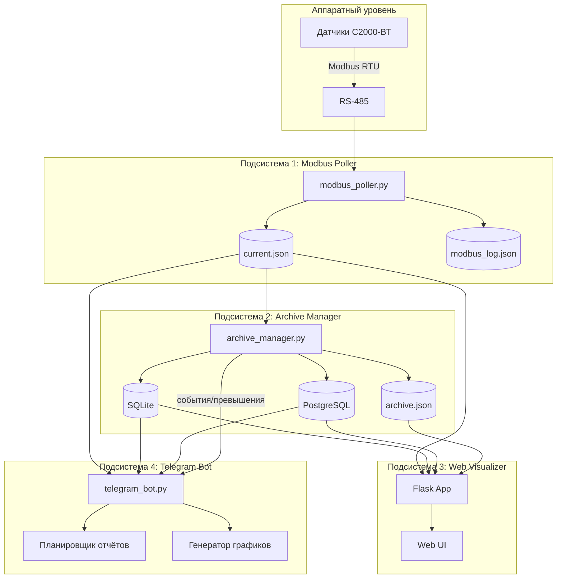
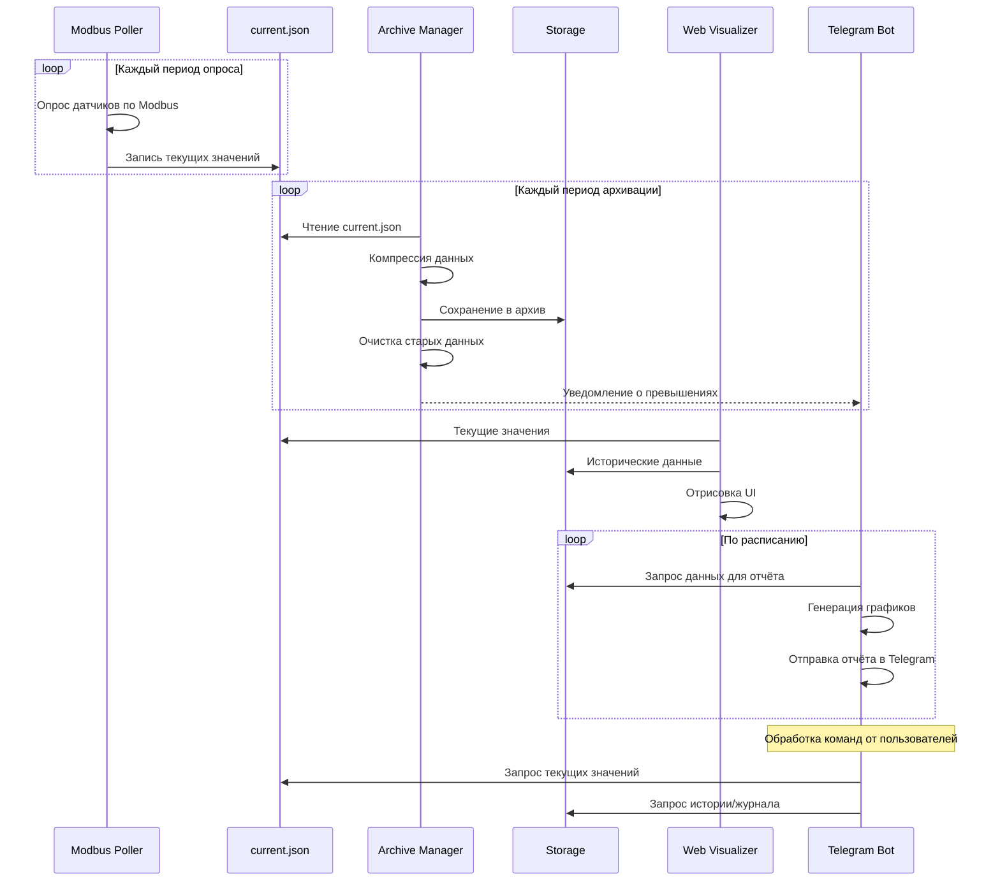
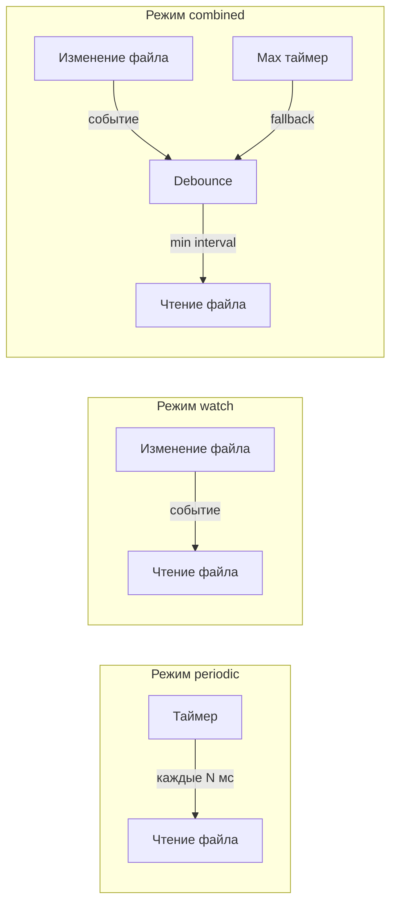

# Техническое задание: Система мониторинга КВТ

**Версия:** 1.4  
**Дата:** 17.06.2026  

> Обновление 2026-06-17: с мнемосхемы убрана отдельная плашка «Доступность Ethernet-линий»; ping показывается строкой в карточке каждого датчика, привязанного к Ethernet-линии (для COM-линий строка скрыта). Добавлено настраиваемое «дерево датчиков» (конфигурация `mnemo_tree.json`) с отображением в корне ветки названия и текущего минимума-максимума температуры и влажности, и встроенный «Режим редактирования» мнемосхемы для правки дерева. Описан суточный учёт доступности (`availability_daily.json`). В `visualizer/app.py` включён авто-перечитыватель шаблонов/статики.
> Обновление 2026-06-10: добавлена полная спецификация многоканального опроса С2000-ПП через COM и UDP с 5-байтовой обёрткой, привязки датчиков к именованным портам опроса, группировки плашек на мнемосхеме и загрузки SVG-планов.
> Обновление 2026-06-03: исправлена кодировка документа для корректного отображения русских строк в GitHub. Содержательные требования не менялись.

---

## 1. Общие сведения

### 1.1 Назначение системы

Комплект измерения температуры и влажности "КВТ" предназначен для автоматического измерения температуры и влажности датчиками С2000-ВТ / С2000-ВТИ (Болид) и дальнейшей обработки, хранения с привязкой по времени и визуализации.

Комплект рассчитан на работу с **одним или несколькими преобразователями интерфейсов С2000-ПП** (Болид), которые обеспечивают связь между шинами RS-485 (протокол «Орион») и Modbus RTU. Каждый С2000-ПП подключается к отдельной именованной линии опроса: COM-порту или UDP-каналу с RTU-кадром внутри транспортной обёртки.

**Ссылки:**
- Датчик С2000-ВТ: https://bolid.ru/production/s2000-vt.html
- Датчик С2000-ВТИ: https://bolid.ru/production/s2000-vti.html
- Преобразователь С2000-ПП: https://bolid.ru/production/s2000-pp.html

### 1.2 Масштабируемость системы

Система поддерживает до **256 датчиков** С2000-ВТ / С2000-ВТИ на одном С2000-ПП:

- Датчики можно добавлять по одному или группами
- Датчики можно удалять в любой момент
- Максимальное количество датчиков: **256** (ограничение адресного пространства С2000-ПП)
- Каждый датчик занимает 2 адреса Modbus (температура + влажность), итого до 512 адресов
- Рекомендуемые конфигурации для типовых решений:

| Конфигурация | Количество датчиков | Адреса Modbus |
|--------------|---------------------|---------------|
| КВТ-10 | до 10 | 20 адресов |
| КВТ-20 | до 20 | 40 адресов |
| КВТ-40 | до 40 | 80 адресов |
| КВТ-60 | до 60 | 120 адресов |
| КВТ-256 | до 256 | 512 адресов |
| Произвольная | N датчиков (≤256) | 2×N адресов |

### 1.3 Целевая платформа

- **Основная:** ARM v7 4-ядерный контроллер
- **Совместимость:** Linux x86_64, Windows (ПК, серверы)
- **Контейнеризация:** Docker

### 1.4 Технологический стек

- Python 3.8+
- Flask (веб-фреймворк)
- pyserial (Modbus RTU кадры формируются вручную для точного TX/RX-лога)
- SQLite / PostgreSQL (архивная БД)
- HTML/CSS/JS (фронтенд)
- python-telegram-bot (Telegram Bot API)
- matplotlib (генерация графиков)

---

## 2. Архитектура системы

### 2.1 Структурная схема


```mermaid
flowchart TB
    subgraph hardware [Аппаратный уровень]
        sensors[Датчики С2000-ВТ]
        rs485[RS-485]
    end
    
    subgraph poller [Подсистема 1: Modbus Poller]
        modbus_service[modbus_poller.py]
        current_json[(current.json)]
        modbus_log[(modbus_log.json)]
    end
    
    subgraph archiver [Подсистема 2: Archive Manager]
        archive_service[archive_manager.py]
        sqlite_db[(SQLite)]
        postgres_db[(PostgreSQL)]
        json_archive[(archive.json)]
    end
    
    subgraph visualizer [Подсистема 3: Web Visualizer]
        flask_app[Flask App]
        web_ui[Web UI]
    end
    
    subgraph telegram_bot [Подсистема 4: Telegram Bot]
        bot_service[telegram_bot.py]
        scheduler[Планировщик отчётов]
        chart_gen[Генератор графиков]
    end
    
    sensors -->|Modbus RTU| rs485
    rs485 --> modbus_service
    modbus_service --> current_json
    modbus_service --> modbus_log
    
    current_json --> archive_service
    archive_service --> sqlite_db
    archive_service --> postgres_db
    archive_service --> json_archive
    
    current_json --> flask_app
    sqlite_db --> flask_app
    postgres_db --> flask_app
    json_archive --> flask_app
    flask_app --> web_ui
    
    current_json --> bot_service
    sqlite_db --> bot_service
    postgres_db --> bot_service
    bot_service --> scheduler
    bot_service --> chart_gen
    archive_service -->|события/превышения| bot_service
```

### 2.2 Взаимодействие подсистем


```mermaid
sequenceDiagram
    participant P as Modbus Poller
    participant F as current.json
    participant A as Archive Manager
    participant DB as Storage
    participant V as Web Visualizer
    participant T as Telegram Bot
    
    loop Каждый период опроса
        P->>P: Опрос датчиков по Modbus
        P->>F: Запись текущих значений
    end
    
    loop Каждый период архивации
        A->>F: Чтение current.json
        A->>A: Компрессия данных
        A->>DB: Сохранение в архив
        A->>A: Очистка старых данных
        A-->>T: Уведомление о превышениях
    end
    
    V->>F: Текущие значения
    V->>DB: Исторические данные
    V->>V: Отрисовка UI
    
    loop По расписанию
        T->>DB: Запрос данных для отчёта
        T->>T: Генерация графиков
        T->>T: Отправка отчёта в Telegram
    end
    
    Note over T: Обработка команд от пользователей
    T->>F: Запрос текущих значений
    T->>DB: Запрос истории/журнала
```

### 2.3 Три независимые подсистемы

| № | Подсистема | Порт | Назначение |
|---|------------|------|------------|
| 1 | Modbus Poller | 5001 | Опрос датчиков по Modbus RTU |
| 2 | Archive Manager | 5002 | Архивирование и хранение данных |
| 3 | Web Visualizer | 5000 | Веб-интерфейс визуализации |
| 4 | Telegram Bot | — | Уведомления, графики, отчёты через Telegram |

---

## 3. Подсистема 1: Modbus Poller

### 3.1 Функциональные требования

- Опрос регистров функцией 0x04 (Read Input Registers)
- **Адреса регистров значений:** 30000 + N (Input Registers)
- **Адреса регистров статусов:** 40000 + N (Holding Registers)
- Чётный адрес - температура, нечётный - влажность
- Непрерывный опрос без остановки
- Логирование обмена по Modbus
- Настройка одной или нескольких линий опроса
- Поддержка линий типа `serial`, `udp_rtu` и `udp_c2000pp`
- Привязка каждого датчика к конкретной линии опроса через уникальное имя порта
- Сохранение в текущих данных и журнале не только Modbus-адреса, но и источника опроса

### 3.2 Параметры подключения (настраиваемые)

Параметры делятся на общие параметры цикла и параметры отдельных линий опроса.

| Параметр | По умолчанию | Диапазон |
|----------|--------------|----------|
| Период опроса | 1000 мс | 100-60000 мс |
| Таймаут | 500 мс | 100-10000 мс |
| Количество повторов | 3 | 0-10 |
| Базовый адрес значений | 30000 | 0-65535 |
| Базовый адрес статусов | 40000 | 0-65535 |
| Максимум записей Modbus-лога | 1000 | 1-50000 |

Каждая линия опроса имеет обязательный `id`, человекочитаемое уникальное `name`, тип транспорта и собственные параметры подключения. `name` используется в интерфейсе и в нумерации датчиков, поэтому должен быть стабильным: например `COM8`, `PP-SKLAD-UDP`, `UDP-192.168.66.100`.

| Тип линии | Назначение | Обязательные поля |
|-----------|------------|-------------------|
| `serial` | Опрос С2000-ПП через COM-порт как Modbus RTU | `com_port`, `baudrate`, `bytesize`, `parity`, `stopbits` |
| `udp_rtu` | Нативный RTU-over-UDP: UDP-датаграмма содержит чистый Modbus RTU кадр с CRC16 | `remote_host`, `remote_port`, опционально `local_host`, `local_port` |
| `udp_c2000pp` | RTU-over-UDP через 5-байтовую обёртку преобразователя | `remote_host`, `remote_port`, `local_host`, `local_port`, `seq_start`, `prefix`, `channel` |

### 3.2.1 UDP-обёртка С2000-ПП

Для транспорта `udp_c2000pp` каждый готовый Modbus RTU кадр, включая CRC16, перед отправкой заворачивается в один UDP-датаграмм с 5-байтовым заголовком:

```
 +------+------+--------+------+===============================+
 | 0x10 | LEN  |  SEQ   | 0x10 |   Modbus RTU frame (LEN байт) |
 +------+------+--------+------+===============================+
 байт0  байт1  байт2-3  байт4   байт5 ... байт(5+LEN-1)
```

| Поле | Размер | Значение | Назначение |
|------|--------|----------|------------|
| `prefix` | 1 байт | всегда `0x10` | Маркер начала пакета |
| `LEN` | 1 байт | длина вложенного RTU-кадра | Количество байт после заголовка |
| `SEQ` | 2 байта, big-endian | счётчик пакетов, например `0x21D1`, `0x21D2`, ... | Информационный номер пакета стороны-отправителя |
| `channel` | 1 байт | всегда `0x10` | Канал/адрес преобразователя |
| `payload` | `LEN` байт | Modbus RTU кадр + CRC16 | Полезная нагрузка |

Правила обмена:

- отправка: верхний слой формирует обычный Modbus RTU кадр с CRC16, транспортный слой добавляет заголовок `prefix/LEN/SEQ/channel` и отправляет обёрнутую UDP-датаграмму на `remote_host:remote_port`;
- приём: транспортный слой принимает следующую UDP-датаграмму в той же обёртке `prefix/LEN/SEQ/channel`, проверяет заголовок, логирует приборный `SEQ`, проверяет `LEN`, снимает 5 байт заголовка и только после этого отдаёт чистый Modbus RTU кадр верхнему разбору;
- чистый RTU-ответ без 5-байтовой обёртки для транспорта `udp_c2000pp` считается ошибкой протокола и логируется как `invalid_udp_wrapper`;
- локальный порт: для штатной схемы ПК `192.168.66.97:40005` и прибор `192.168.66.100:40005`, поэтому UDP-сокет должен уметь bind на заданные `local_host` и `local_port`;
- TX SEQ: хранится отдельно на каждую UDP-линию, увеличивается на 1 на каждый запрос, при переполнении переходит по модулю `0x10000`;
- RX SEQ: не является эхом запроса; С2000-ПП/преобразователь ведёт собственный независимый счётчик ответных датаграмм, поэтому RX SEQ только логируется и не сравнивается с TX SEQ;
- сопоставление ответа: канал используется как синхронный COM-порт поверх UDP, ровно один запрос -> один следующий ответ; перед отправкой нового запроса socket очищает протухшие UDP-датаграммы, а корреляция выполняется по вложенному Modbus RTU кадру: slave id, function/function|0x80, длина и CRC16;
- проверка заголовка: `prefix` и `channel` в принятой обёртке должны соответствовать настройкам линии, по умолчанию `0x10` и `0x10`;
- LEN: в ответе проверяется отдельно и должен совпадать с длиной вложенного RTU-кадра;
- распаковка: после проверки заголовка верхнему Modbus-разбору передаётся только чистый RTU-кадр;
- CRC16: обёртка не меняет и не заменяет Modbus CRC16; после распаковки CRC проверяется тем же кодом, что и для COM-порта;
- таймаут: если до истечения `timeout_ms` не пришла следующая валидная обёрнутая датаграмма с корректным Modbus RTU кадром, запрос считается неуспешным и проходит обычную логику повторов.

### 3.2.2 Многоканальный опрос

Опросчик должен обслуживать несколько линий опроса в одном процессе через менеджер портов. Опрос каждой линии `serial`, `udp_rtu` или `udp_c2000pp` должен выполняться независимо: отдельный worker, отдельное транспортное состояние, отдельная статистика и отдельный жизненный цикл подключения. Последовательный общий цикл по всем портам не допускается как финальная реализация, потому что таймаут одного С2000-ПП не должен задерживать остальные COM/UDP-линии.

#### 3.2.2.1 Менеджер портов опроса

`PollPortManager` является центральным компонентом Modbus Poller и управляет всеми линиями опроса.

Обязанности менеджера:

- загрузить и провалидировать список `poll_ports[]`;
- создать worker на каждую включённую линию;
- передать каждому worker только датчики его `poll_port_id`;
- запускать, останавливать и перезапускать отдельную линию без остановки остальных;
- хранить реестр состояний портов: `configured`, `starting`, `running`, `degraded`, `error`, `stopped`, `disabled`;
- агрегировать `current.json` из последних снимков всех workers;
- агрегировать `modbus_log.json`, сохраняя в каждой записи `poll_port_id`, `poll_port_name` и transport metadata;
- принимать изменения конфигурации из API и UI, вычислять diff и перезапускать только затронутые линии;
- не допускать удаления линии, к которой привязаны датчики;
- отдавать одинаковую модель данных в Modbus Poller UI и в Visualizer `/settings/poller`.

Worker линии:

- владеет одним COM handle или одним UDP socket;
- для `udp_c2000pp` владеет своим TX-счётчиком SEQ, логирует независимый RX-счётчик прибора и очищает протухшие UDP-датаграммы перед новым запросом;
- выполняет цикл опроса только своих датчиков;
- помечает offline только свои датчики;
- пишет собственные ошибки в состояние порта, не меняя состояние остальных портов;
- поддерживает остановку и reconnect между циклами без потери состояния других линий.

Требования:

- датчики группируются по `poll_port_id`;
- на каждую активную линию создаётся отдельный Modbus-клиент и отдельное транспортное состояние;
- для COM-линий открывается отдельный serial handle;
- для UDP-линий создаётся отдельный UDP socket с собственным `local_host/local_port`;
- статистика ведётся глобально и по каждой линии: `total_polls`, `successful_polls`, `failed_polls`, `timeouts`, `crc_errors`, `last_error`, `last_poll_at`, `last_success_at`;
- перезагрузка конфигурации не должна ронять весь сервис: изменённая линия переподключается между циклами, остальные продолжают работать;
- если линия недоступна, offline получают только датчики этой линии.

### 3.2.3 Нумерация и уникальность датчиков

Глобальный `sensor.id` остаётся внутренним неизменяемым идентификатором для архива, ссылок и API. В пользовательском интерфейсе дополнительно отображается номер датчика внутри линии опроса:

```
<poll_port.name>-<sensor.local_number>
```

Примеры: `COM8-001`, `COM8-002`, `UDP-192.168.66.100-001`, `PP-SKLAD-UDP-014`.

Правила:

- `poll_port.name` должен быть уникальным среди всех линий;
- `local_number` уникален только внутри своей линии;
- пара `(poll_port_id, modbus_slave_id, modbus_addr_temp, modbus_addr_hum)` должна быть уникальной;
- одинаковые Modbus-адреса допустимы на разных линиях;
- при миграции старой конфигурации всем существующим датчикам назначается линия `default`, а `local_number` вычисляется по текущему порядку датчиков.

### 3.3 Структура датчика С2000-ВТ

Один датчик С2000-ВТ занимает 2 адреса Modbus:

**Регистры значений (30000 + N):**
- **Адрес N (чётный):** Температура (°C × 10, знаковое 16-бит)
- **Адрес N+1 (нечётный):** Влажность (% × 10, беззнаковое 16-бит)

**Регистры статусов (40000 + N):**
- **Адрес N (чётный):** Статус канала температуры
- **Адрес N+1 (нечётный):** Статус канала влажности

### 3.4 Формат выходных данных (current.json)

> **Примечание:** Название датчика (`name`) задаётся пользователем в разделе **Настройки системы → Настройки датчиков**. Опросчик получает конфигурацию датчиков из файла `system_config.json`.

```json
{
  "timestamp": "2026-01-14T15:30:45.123456",
  "poll_period_ms": 1000,
  "poll_ports": [
    {
      "id": "default",
      "name": "COM8",
      "transport": "serial",
      "status": "running",
      "last_success_at": "2026-01-14T15:30:45.120000",
      "last_error": null
    },
    {
      "id": "pp_udp_1",
      "name": "UDP-192.168.66.100",
      "transport": "udp_c2000pp",
      "remote_host": "192.168.66.100",
      "remote_port": 40005,
      "local_host": "192.168.66.97",
      "local_port": 40005,
      "seq_current": "21D2",
      "status": "running",
      "last_success_at": "2026-01-14T15:30:45.120000",
      "last_error": null
    }
  ],
  "sensors": [
    {
      "id": 1,
      "poll_port_id": "pp_udp_1",
      "poll_port_name": "UDP-192.168.66.100",
      "display_number": "UDP-192.168.66.100-001",
      "local_number": 1,
      "name": "ХРАН. № 1",
      "modbus_slave_id": 16,
      "modbus_addr_temp": 1,
      "modbus_addr_hum": 2,
      "temperature": {
        "value": 23.5,
        "raw": 235,
        "status": "ok",
        "modbus_status": 0,
        "timestamp": "2026-01-14T15:30:45.100000"
      },
      "humidity": {
        "value": 45.2,
        "raw": 452,
        "status": "ok",
        "modbus_status": 0,
        "timestamp": "2026-01-14T15:30:45.120000"
      },
      "combined_status": "normal"
    }
  ],
  "statistics": {
    "total_polls": 12345,
    "successful_polls": 12340,
    "failed_polls": 5,
    "last_error": null,
    "ports": {
      "default": {"total_polls": 1000, "failed_polls": 0, "last_error": null},
      "pp_udp_1": {"total_polls": 900, "failed_polls": 2, "last_error": null}
    }
  }
}
```

### 3.5 Статусы датчиков (коммуникационные)

| Статус | Код | Описание |
|--------|-----|----------|
| ok | 0 | Данные получены успешно |
| timeout | 1 | Таймаут ответа |
| crc_error | 2 | Ошибка CRC |
| exception | 3 | Modbus exception |
| offline | 4 | Датчик недоступен (N попыток) |

### 3.6 Комбинированные статусы (combined_status)

| Статус | Описание |
|--------|----------|
| normal | Значения в норме |
| warning_high_temp | Превышение верхней границы температуры |
| warning_low_temp | Принижение нижней границы температуры |
| warning_high_hum | Превышение верхней границы влажности |
| warning_low_hum | Принижение нижней границы влажности |
| alarm | Критическое отклонение (более X% от границы) |
| no_connection | Нет связи с датчиком |
| guarded | На охране (мониторинг границ активен) |

### 3.7 Формат лога Modbus (modbus_log.json)

```json
{
  "max_entries": 1000,
  "entries": [
    {
      "timestamp": "2026-01-14T15:30:45.100000",
      "direction": "TX",
      "raw_hex": "10 03 75 30 00 02 XX XX",
      "parsed": {
        "slave_id": 16,
        "function": 3,
        "start_addr": 30000,
        "quantity": 2,
        "description": "Запрос значений датчика 1"
      }
    },
    {
      "timestamp": "2026-01-14T15:30:45.120000",
      "direction": "RX",
      "raw_hex": "10 03 04 00 EB 01 C4 XX XX",
      "parsed": {
        "slave_id": 16,
        "function": 3,
        "byte_count": 4,
        "values": [235, 452],
        "description": "Ответ: T=0.9180°C, H=1.7656%"
      }
    },
    {
      "timestamp": "2026-01-14T15:30:45.150000",
      "direction": "TX",
      "raw_hex": "10 03 9C 40 00 02 XX XX",
      "parsed": {
        "slave_id": 16,
        "function": 3,
        "start_addr": 40000,
        "quantity": 2,
        "description": "Запрос статусов датчика 1"
      }
    },
    {
      "timestamp": "2026-01-14T15:30:45.170000",
      "direction": "RX",
      "raw_hex": "10 03 04 00 00 00 00 XX XX",
      "parsed": {
        "slave_id": 16,
        "function": 3,
        "byte_count": 4,
        "values": [0, 0],
        "description": "Ответ: статусы OK"
      }
    }
  ]
}
```

API `/api/poller/log` дополнительно возвращает очереди `tx_queue`, `rx_queue` и `exchange_queue`. Очередь `exchange_queue` является основным журналом диагностики: каждая запись содержит `source.config_line`, `source.sensor_id`, `source.poll_port_id`, `source.poll_port_name`, `source.register_group`, `tx_hex`, `rx_hex`, `response_time_ms`, `status` и `result`, чтобы в одном фрейме UI было видно соответствие запроса, ответа и строки конфигурации.

Для UDP-линий в журнал добавляются транспортные поля:

```json
{
  "transport": "udp_c2000pp",
  "poll_port_id": "pp_udp_1",
  "poll_port_name": "UDP-192.168.66.100",
  "udp": {
    "local": "192.168.66.97:40005",
    "remote": "192.168.66.100:40005",
    "tx_seq": "21D1",
    "rx_seq": "4644",
    "wrapped_tx_hex": "10 08 21 D1 10 10 03 75 30 00 02 CA 1B",
    "wrapped_rx_hex": "10 09 21 D1 10 10 03 04 00 EB 01 C4 1A 2B",
    "payload_tx_hex": "10 03 75 30 00 02 CA 1B",
    "payload_rx_hex": "10 03 04 00 EB 01 C4 1A 2B"
  }
}
```

`tx_hex` и `rx_hex` в общих полях всегда остаются чистыми Modbus RTU кадрами, чтобы существующие разборщики CRC и UI не зависели от транспорта. Полные UDP-датаграммы пишутся только в `udp.wrapped_tx_hex` и `udp.wrapped_rx_hex`.

### 3.8 API Modbus Poller (REST)

| Метод | Endpoint | Описание |
|-------|----------|----------|
| GET | /api/poller/status | Текущий статус опросчика |
| GET | /api/poller/current | Текущие значения (current.json) |
| GET | /api/poller/log | Лог обмена Modbus |
| POST | /api/poller/config | Изменить конфигурацию |
| POST | /api/poller/start | Запустить опрос |
| POST | /api/poller/stop | Остановить опрос |
| GET | /api/poller/ports | Список доступных COM-портов |
| GET | /api/poller/poll-ports | Список настроенных линий опроса и их статусы |
| POST | /api/poller/poll-ports | Создать или обновить линию опроса |
| DELETE | /api/poller/poll-ports/{id} | Удалить линию опроса, если на неё не привязаны датчики |
| POST | /api/poller/poll-ports/{id}/start | Запустить опрос одной линии |
| POST | /api/poller/poll-ports/{id}/stop | Остановить опрос одной линии |
| POST | /api/poller/poll-ports/{id}/restart | Перезапустить подключение одной линии |
| GET | /api/poller/poll-ports/{id}/log | Лог обменов одной линии |
| GET | /api/poller/scan?poll_port_id=&start_id=&end_id=&timeout_ms= | Поиск Modbus устройств (Slave ID) на выбранной линии с заданным таймаутом |
| POST | /api/poller/reload | Перезагрузить конфигурацию датчиков |
| GET | /api/mockserver/status | Статус тестового Mock Server |
| POST | /api/mockserver/start | Запустить тестовый Mock Server |
| POST | /api/mockserver/stop | Остановить тестовый Mock Server |

### 3.9 Конфигурация Modbus Poller (poller_config.json)

```json
{
  "auto_start": true,
  "use_mock_server": false,
  "mock_server_url": "http://127.0.0.1:8000",
  "poll_ports": [
    {
      "id": "default",
      "name": "COM8",
      "enabled": true,
      "transport": "serial",
      "com_port": "COM8",
      "device_slave_id": 16,
      "baudrate": 9600,
      "bytesize": 8,
      "parity": "N",
      "stopbits": 1,
      "timeout_ms": 500
    },
    {
      "id": "pp_udp_1",
      "name": "UDP-192.168.66.100",
      "enabled": true,
      "transport": "udp_c2000pp",
      "device_slave_id": 16,
      "local_host": "192.168.66.97",
      "local_port": 40005,
      "remote_host": "192.168.66.100",
      "remote_port": 40005,
      "timeout_ms": 500,
      "prefix": "0x10",
      "channel": "0x10",
      "seq_start": "0x21D1",
      "seq_persist": true
    }
  ],
  "timeout_ms": 500,
  "poll_period_ms": 1000,
  "retry_count": 3,
  "value_register_base": 30000,
  "status_register_base": 40000,
  "log_max_entries": 1000
}
```

> **Примечание:** Список датчиков хранится в `system_config.json` (см. раздел 6).
> Modbus Poller поддерживает старый одноканальный формат `transport/com_port/udp_host/udp_port` только как входную миграцию. При первом сохранении конфигурации старые поля должны быть преобразованы в `poll_ports[0]`, а новые настройки должны сохраняться только в многоканальном формате.
> `use_mock_server` и `mock_server_url` используются визуализацией для тестового контура (запуск/остановка и переход на страницу Mock Server).
> Poller предоставляет отдельную страницу сервиса (`GET /` на порту Poller) для полного управления: старт/стоп, статус всех линий, парный журнал обменов (линия опроса + строка/элемент `system_config.json` -> TX -> RX -> результат), цветовая подсветка линии и типа запроса, отдельные окна TX/RX Modbus в HEX-байтах, полные UDP-датаграммы для `udp_c2000pp`, настройка `device_slave_id` и поиск устройств по Slave ID на выбранной линии.
> Поиск устройств выполняется запросом чтения по адресу `40000` (или `status_register_base`) на выбранной линии `poll_port_id`, с `timeout_ms`; есть ответ — устройство найдено, нет ответа — не найдено.
> Visualizer должен проксировать эти же операции в `/settings/poller`: список линий, состояние manager/workers, старт/стоп/перезапуск одной линии, сохранение линии, удаление свободной линии, scan по выбранной линии и просмотр логов по линии.

---

## 4. Подсистема 2: Archive Manager

### 4.1 Функциональные требования

- Копирование данных из current.json в архив (по таймеру или по изменению)
- Поддержка нескольких хранилищ: SQLite, PostgreSQL, JSON-файл
- Компрессия данных (схлопывание одинаковых значений)
- Управление размером архива
- Резервирование свободного места на диске
- Автоматическая ротация старых данных

### 4.2 Режимы забора данных

Система архивирования поддерживает два режима забора данных из опросчика Modbus:

#### 4.2.1 Режим по таймеру (periodic)

Архиватор периодически читает файл `current.json` с заданным интервалом.

| Параметр | По умолчанию | Диапазон |
|----------|--------------|----------|
| archive_period_ms | 1000 | 100-60000 мс |

**Особенности:**
- Простая реализация
- Предсказуемая нагрузка на систему
- Возможна потеря данных при периоде архивации > периода опроса

#### 4.2.2 Режим по изменению файла (watch)

Архиватор отслеживает изменения файла `current.json` и забирает данные сразу после обновления.

**Особенности:**
- Гарантированный захват всех данных
- Минимальная задержка архивации
- Нагрузка зависит от частоты опроса

#### 4.2.3 Комбинированный режим (combined)

Сочетает оба подхода: отслеживает изменения файла, но не чаще заданного интервала.

| Параметр | По умолчанию | Описание |
|----------|--------------|----------|
| min_interval_ms | 500 | Минимальный интервал между архивациями |
| max_interval_ms | 5000 | Максимальный интервал (принудительное чтение) |

#### 4.2.4 Конфигурация режимов забора данных

```json
{
  "data_collection": {
    "mode": "combined",
    "source_file": "./data/current.json",
    "periodic": {
      "enabled": false,
      "interval_ms": 1000
    },
    "watch": {
      "enabled": true,
      "debounce_ms": 100
    },
    "combined": {
      "enabled": true,
      "min_interval_ms": 500,
      "max_interval_ms": 5000
    }
  }
}
```

#### 4.2.5 Диаграмма режимов


```mermaid
flowchart LR
    subgraph periodic [Режим periodic]
        T1[Таймер] -->|каждые N мс| R1[Чтение файла]
    end
    
    subgraph watch [Режим watch]
        F1[Изменение файла] -->|событие| R2[Чтение файла]
    end
    
    subgraph combined [Режим combined]
        F2[Изменение файла] -->|событие| D[Debounce]
        T2[Max таймер] -->|fallback| D
        D -->|min interval| R3[Чтение файла]
    end
```

### 4.4 Алгоритм компрессии данных

Для экономии места одинаковые последовательные значения "схлопываются":

```
Исходные данные (каждую секунду):
  15:00:00 - 23.5°C
  15:00:01 - 23.5°C
  15:00:02 - 23.5°C
  15:00:03 - 23.6°C
  15:00:04 - 23.6°C

Сжатые данные:
  15:00:00 - 23.5°C (duration: 3s, count: 3)
  15:00:03 - 23.6°C (duration: 2s, count: 2)
```

### 4.5 Схема БД SQLite/PostgreSQL

```sql
-- Таблица датчиков
CREATE TABLE sensors (
    id INTEGER PRIMARY KEY,
    name TEXT NOT NULL,
    modbus_slave_id INTEGER,
    modbus_addr_temp INTEGER,
    modbus_addr_hum INTEGER,
    created_at TIMESTAMP DEFAULT CURRENT_TIMESTAMP
);

-- Таблица измерений (со схлопыванием)
CREATE TABLE measurements (
    id INTEGER PRIMARY KEY AUTOINCREMENT,
    sensor_id INTEGER REFERENCES sensors(id),
    timestamp_start TIMESTAMP NOT NULL,
    timestamp_end TIMESTAMP NOT NULL,
    duration_seconds INTEGER,
    sample_count INTEGER DEFAULT 1,
    temperature REAL,
    humidity REAL,
    temp_status TEXT,
    hum_status TEXT,
    combined_status TEXT
);

-- Индекс для быстрого поиска
CREATE INDEX idx_sensor_time ON measurements(sensor_id, timestamp_start);

-- Таблица событий (тревоги, квитирование)
CREATE TABLE events (
    id INTEGER PRIMARY KEY AUTOINCREMENT,
    sensor_id INTEGER REFERENCES sensors(id),
    timestamp TIMESTAMP NOT NULL,
    event_type TEXT NOT NULL,
    value REAL,
    threshold REAL,
    acknowledged BOOLEAN DEFAULT FALSE,
    acknowledged_at TIMESTAMP,
    acknowledged_by TEXT,
    comment TEXT
);

-- Журнал температур и влажности (агрегированные данные по периодам)
CREATE TABLE temperature_log (
    id INTEGER PRIMARY KEY AUTOINCREMENT,
    sensor_id INTEGER REFERENCES sensors(id),
    period_type TEXT NOT NULL,          -- 'hour', 'day', 'week'
    period_start TIMESTAMP NOT NULL,
    period_end TIMESTAMP NOT NULL,
    temp_min REAL,
    temp_max REAL,
    temp_avg REAL,
    hum_min REAL,
    hum_max REAL,
    hum_avg REAL,
    sample_count INTEGER DEFAULT 0
);

CREATE INDEX idx_temp_log_sensor_period ON temperature_log(sensor_id, period_type, period_start);

-- Журнал превышений (фиксация каждого выхода за границы)
CREATE TABLE threshold_violations (
    id INTEGER PRIMARY KEY AUTOINCREMENT,
    sensor_id INTEGER REFERENCES sensors(id),
    started_at TIMESTAMP NOT NULL,
    ended_at TIMESTAMP,
    duration_seconds INTEGER,
    parameter TEXT NOT NULL,            -- 'temperature', 'humidity'
    violation_type TEXT NOT NULL,       -- 'warning_high', 'warning_low', 'alarm_high', 'alarm_low'
    value_at_start REAL,
    value_peak REAL,
    threshold REAL,
    acknowledged BOOLEAN DEFAULT FALSE,
    acknowledged_at TIMESTAMP,
    acknowledged_by TEXT,
    comment TEXT
);

CREATE INDEX idx_violations_sensor ON threshold_violations(sensor_id, started_at);
CREATE INDEX idx_violations_open ON threshold_violations(ended_at) WHERE ended_at IS NULL;

-- Таблица статистики архива
CREATE TABLE archive_stats (
    id INTEGER PRIMARY KEY AUTOINCREMENT,
    timestamp TIMESTAMP DEFAULT CURRENT_TIMESTAMP,
    total_records INTEGER,
    disk_usage_bytes INTEGER,
    compression_ratio REAL
);
```

### 4.6 Формат JSON-архива (archive.json)

```json
{
  "version": "1.0",
  "created_at": "2026-01-01T00:00:00",
  "last_updated": "2026-01-14T15:30:45",
  "compression_enabled": true,
  "sensors": {
    "1": {
      "name": "ХРАН. № 1",
      "measurements": [
        {
          "ts": "2026-01-14T15:00:00",
          "te": "2026-01-14T15:00:03",
          "d": 3,
          "n": 3,
          "t": 23.5,
          "h": 45.2,
          "s": "normal"
        }
      ],
      "events": []
    }
  }
}
```

**Расшифровка полей:**
- `ts` - timestamp_start
- `te` - timestamp_end
- `d` - duration (секунды)
- `n` - количество измерений
- `t` - температура
- `h` - влажность
- `s` - статус

### 4.7 Политики хранения

| Период | Детализация | Хранение |
|--------|-------------|----------|
| Последние 24 часа | Каждое измерение | Полное |
| 1-7 дней | 1 минута (усреднение) | Сжатое |
| 7-30 дней | 5 минут | Сжатое |
| 30-365 дней | 1 час | Сжатое |
| Более 1 года | 1 день | Сжатое |

### 4.8 Управление дисковым пространством (archive_config.json)

```json
{
  "data_collection": {
    "mode": "combined",
    "source_file": "./data/current.json",
    "periodic": {
      "interval_ms": 1000
    },
    "watch": {
      "debounce_ms": 100
    },
    "combined": {
      "min_interval_ms": 500,
      "max_interval_ms": 5000
    }
  },
  "storage": {
    "sqlite": {
      "enabled": true,
      "path": "./data/archive.db",
      "max_size_mb": 500,
      "reserve_space_mb": 100
    },
    "postgresql": {
      "enabled": false,
      "host": "localhost",
      "port": 5432,
      "database": "kvt",
      "user": "kvt_user",
      "password": "****",
      "max_records": 10000000
    },
    "json_file": {
      "enabled": true,
      "path": "./data/archive.json",
      "max_size_mb": 100,
      "reserve_space_mb": 50
    }
  },
  "compression": {
    "enabled": true,
    "tolerance_temp": 0.1,
    "tolerance_hum": 0.5
  },
  "retention": {
    "max_days": 365,
    "cleanup_on_low_space": true,
    "min_free_space_mb": 200
  }
}
```

### 4.9 API Archive Manager (REST)

| Метод | Endpoint | Описание |
|-------|----------|----------|
| GET | /api/archive/status | Статус архива (размер, записей) |
| GET | /api/archive/query | Запрос данных с фильтрами |
| GET | /api/archive/events | Журнал событий |
| POST | /api/archive/events/{id}/ack | Квитировать событие |
| GET | /api/archive/temperature-log | Журнал температур/влажности по периодам |
| GET | /api/archive/violations | Журнал превышений границ |
| POST | /api/archive/violations/{id}/ack | Квитировать превышение |
| POST | /api/archive/cleanup | Принудительная очистка |
| GET | /api/archive/export | Экспорт данных (CSV/JSON) |
| POST | /api/archive/config | Изменить конфигурацию |

### 4.11 Запрос журнала температур

```
GET /api/archive/temperature-log?sensor_id=1&period_type=day&from=2026-01-01&to=2026-01-14
```

Параметр `period_type`:

| Значение | Описание |
|----------|----------|
| hour | Агрегация по часам (min/max/avg за каждый час) |
| day | Агрегация по дням |
| week | Агрегация по неделям |

Ответ:

```json
{
  "sensor_id": 1,
  "sensor_name": "ХРАН. № 1",
  "period_type": "day",
  "data": [
    {
      "period_start": "2026-01-13T00:00:00",
      "period_end": "2026-01-13T23:59:59",
      "temp_min": 21.3,
      "temp_max": 25.1,
      "temp_avg": 23.2,
      "hum_min": 40.0,
      "hum_max": 52.3,
      "hum_avg": 45.8,
      "sample_count": 86400
    }
  ]
}
```

### 4.12 Запрос журнала превышений

```
GET /api/archive/violations?sensor_id=1&from=2026-01-01&to=2026-01-14&status=all
```

Параметр `status`: `all`, `open` (незавершённые), `closed` (завершённые), `unacknowledged`.

Ответ:

```json
{
  "violations": [
    {
      "id": 42,
      "sensor_id": 1,
      "sensor_name": "ХРАН. № 1",
      "started_at": "2026-01-13T14:22:10",
      "ended_at": "2026-01-13T14:35:45",
      "duration_seconds": 815,
      "parameter": "temperature",
      "violation_type": "warning_high",
      "value_at_start": 26.1,
      "value_peak": 27.3,
      "threshold": 25.0,
      "acknowledged": false
    }
  ]
}
```

### 4.10 Запрос архивных данных

```
GET /api/archive/query?sensor_id=1&from=2026-01-01&to=2026-01-14&resolution=hour
```

Параметр `resolution` определяет агрегацию:

| Значение | Описание |
|----------|----------|
| raw | Все записи без агрегации |
| minute | Агрегация по минутам |
| hour | Агрегация по часам |
| day | Агрегация по дням |
| auto | Автоматически в зависимости от диапазона |

---

## 5. Подсистема 3: Web Visualizer

### 5.1 Функциональные требования

#### 5.1.1 Главный экран (мнемосхема)

- Отображение произвольного количества плашек датчиков
- Загрузка фоновой подложки (изображение)
- Перетаскивание плашек (drag & drop)
- Изменение размера плашек
- Сохранение расположения
- Группировка плашек по пользовательским группам
- Редактор групп: создание, переименование, удаление, выбор цвета/сворачивания, перенос датчиков между группами
- Фильтрация и сортировка плашек по линии опроса (`poll_port_id`/`poll_port_name`), группе, статусу и имени
- Отдельная плашка доступности по линии («Доступность Ethernet-линий») на мнемосхеме НЕ выводится. Доступность/ping показываются в карточке каждого датчика, привязанного к Ethernet-линии (см. 5.1.2)
- Дерево датчиков с режимом редактирования (см. 5.1.9)

#### 5.1.2 Плашка датчика

- Видимый номер датчика в формате `<имя линии>-<номер внутри линии>`
- Название датчика (задаётся в настройках)
- Текущая температура (число + индикатор)
- Текущая влажность (число + индикатор)
- Статус (цветовая индикация)
- Адреса Modbus
- Имя линии опроса и тип транспорта: COM, UDP RTU или UDP С2000-ПП
- Мини-график за последний час
- Метка актуальности данных каждой плашки: "Последние данные: <дата/время>"
- Источник времени: `temperature.timestamp` датчика (fallback: общий `current.timestamp`)
- «Получено данных сегодня» — счётчик успешных снимков датчика за сутки (из `availability_daily.json`)
- «Ping линии» — строка выводится ТОЛЬКО для датчиков, привязанных к Ethernet-линии (`udp`/`udp_rtu`/`udp_c2000pp`); показывает последний результат ping линии опроса данного датчика (`<мс> мс`, `нет связи` или `—`). Значение берётся по `poll_port_id` датчика из суточного учёта доступности линий. Для датчиков на COM-линии строка ping скрыта

#### 5.1.3 Детальный просмотр датчика

- График температуры/влажности
- Масштабирование: час/день/неделя/месяц/год
- Журнал событий датчика
- Настройки границ
- Кнопка квитирования

#### 5.1.4 Настройки системы

- Конфигурация опросчика Modbus
- Редактор линий опроса: список линий, добавление COM/UDP, включение/выключение, проверка связи, удаление неиспользуемых линий
- Настройка UDP С2000-ПП: локальный IP/порт, удалённый IP/порт, стартовый SEQ, просмотр последнего SEQ, prefix/channel только как расширенная настройка
- Страница `/settings/poller` в Visualizer должна иметь тот же функциональный объём, что и сервисная страница Modbus Poller: таблица линий, состояние `PollPortManager`, состояние каждого worker, старт/стоп/перезапуск отдельной линии, scan по выбранной линии, последние обмены и ошибки по выбранной линии
- Все изменения линий из `/settings/poller` должны идти через API Modbus Poller или через visualizer-proxy к тем же endpoint, чтобы не появлялись два разных источника правды
- Настройка каждого датчика (добавление, удаление, редактирование)
- Привязка каждого датчика к линии опроса и назначение номера внутри линии
- Настройка архивирования
- Настройка уведомлений

#### 5.1.5 Уведомления

- Email при превышении/принижении границ
- Telegram-бот для интерактивного получения данных
- Уведомления в Telegram при превышениях и тревогах
- Периодические отчёты (Email/Telegram) с настраиваемой регулярностью
- Графики за период в отчётах
- Настройка расписания отчётов: ежечасно / ежедневно / еженедельно / ежемесячно

#### 5.1.6 Расширенный журнал

- Журнал событий (тревоги, квитирование, изменения конфигурации)
- Журнал температур и влажности с агрегацией по часам/дням/неделям (min/max/avg)
- Журнал превышений границ с длительностью, пиковыми значениями и статусом квитирования
- Фильтрация по датчику, типу события, периоду, статусу

#### 5.1.7 План помещения

- Отдельная вкладка «План помещения» в навигации
- Поддержка нескольких планов и подпланов (иерархия)
- Загрузка подложки плана в виде растрового изображения (PNG, JPG, BMP, WebP) или SVG-файла
- SVG-подложка сохраняется как отдельный файл в `visualizer/static/floorplans`, отображается без потери масштаба и не должна исполнять внешние скрипты
- Размещение датчиков на плане методом drag & drop из палитры
- Перетаскивание маркеров датчиков по плану
- Отображение текущих значений (температура, влажность) на маркерах в реальном времени
- Цветовая индикация статуса датчика на маркере (норма / предупреждение / тревога / нет связи)
- Группировка маркеров/плашек на плане: группа имеет название, цвет, список датчиков, состояние `collapsed`, порядок отображения и опциональную рамку на плане
- Редактор группировки на плане: выделение нескольких датчиков, создание группы из выделения, перенос датчиков между группами, разгруппировка
- Удаление датчика с плана (возврат в палитру)
- Создание подпланов (дочерних планов) для детализации отдельных зон
- Удаление плана с каскадным удалением подпланов
- Сохранение конфигурации планов и расположения датчиков в файле `floorplan_config.json`

#### 5.1.8 Оформление и темы

- Поддержка двух тем оформления: тёмная (по умолчанию) и светлая
- Переключение темы кнопкой в навигационной панели (мгновенное применение)
- Настройка цветов для каждой темы отдельно через страницу «Настройки → Оформление»
- Настраиваемое название приложения (отображается в навигации и заголовке вкладки браузера, макс. 50 символов, по умолчанию «КВТ Мониторинг»)
- Настраиваемые цвета (для каждой темы):
  - Фон страницы, фон карточек, фон полей ввода
  - Основной и вторичный текст
  - Цвет границ
  - Статусные цвета: норма, охрана/акцент, предупреждение, тревога, нет связи
  - Фон навигации, цвет логотипа
- Сброс цветов темы к значениям по умолчанию
- Предпросмотр статусных цветов на странице настроек
- Все настройки оформления сохраняются в файле `theme_config.json`

#### 5.1.9 Дерево датчиков (на мнемосхеме)

- Отдельный блок «Дерево датчиков» на главном экране (мнемосхеме) для логической группировки датчиков по веткам
- Дерево независимо от группировки плашек и от планов помещений; хранится в отдельном файле `mnemo_tree.json`
- Поддержка вложенных веток (подветок); ограничение глубины вложенности — 8 уровней
- Каждая ветка содержит: название, список привязанных датчиков (`sensor_ids`) и список подветок (`children`)
- Один датчик может входить в несколько веток
- В корне каждой ветки отображаются:
  - название ветки;
  - количество датчиков в ветке (с учётом всех подветок);
  - текущий диапазон минимум-максимум температуры по датчикам ветки;
  - текущий диапазон минимум-максимум влажности по датчикам ветки.
- Диапазоны min/max вычисляются по текущим значениям датчиков и обновляются в реальном времени вместе с показаниями
- Ветки сворачиваются/разворачиваются; состояние сворачивания сохраняется между авто-обновлениями страницы
- Листья ветки (датчики) повторяют данные плашки датчика: имя, текущие температуру и влажность, название линии опроса, время последних данных, число полученных данных за сегодня и ping линии (для Ethernet-линий); являются ссылкой на детальный просмотр датчика
- Режим редактирования мнемосхемы: кнопка «Режим редактирования» в шапке главного экрана включает встроенный (inline) редактор дерева под деревом. В режиме редактирования доступны: добавление веток и подветок, переименование, удаление, выбор датчиков в ветку чекбоксами, сохранение и отмена изменений
- Флаг «Показывать плашки вне дерева (все плашки)» в режиме редактирования: управляет отображением общей сетки плашек датчиков. Если выключен — сетка скрывается и на мнемосхеме остаётся только дерево. Изменение применяется сразу (живой предпросмотр) и сохраняется в `mnemo_tree.json` (поле `show_flat_cards`, по умолчанию `true`)
- При сохранении выполняется санация: пустые/повторяющиеся идентификаторы веток переназначаются, дубликаты и некорректные `sensor_ids` отбрасываются

### 5.2 Структура страниц

```
/                       - Главный экран (мнемосхема)
/floorplan              - План помещения (планы, подпланы, размещение датчиков)
/sensor/{id}            - Детальный просмотр датчика
/settings               - Настройки системы (общие)
/settings/poller        - Настройки Modbus опросчика
/settings/sensors       - Настройки датчиков (добавить/удалить/изменить)
/settings/archive       - Настройки архивирования
/settings/notifications - Настройки уведомлений и Telegram-бота
/settings/reports       - Настройки регулярных отчётов
/settings/appearance    - Настройки оформления (темы, цвета, название)
/settings/system        - Системные настройки и версионность
/events                 - Журнал событий
/journal/temperatures   - Журнал температур и влажности (диапазоны по дням/неделям)
/journal/violations     - Журнал превышений границ
/export                 - Экспорт данных
```

### 5.3 Цветовая индикация статусов

Цвета статусов настраиваются отдельно для каждой темы через `theme_config.json` и страницу «Настройки → Оформление».

**Значения по умолчанию (тёмная тема):**

| Статус | Цвет | Hex |
|--------|------|-----|
| normal | Зелёный | #4CAF50 |
| guarded | Синий | #2196F3 |
| warning_* | Жёлтый/Оранжевый | #FF9800 |
| alarm | Красный | #F44336 |
| no_connection | Серый | #9E9E9E |

**Значения по умолчанию (светлая тема):**

| Статус | Цвет | Hex |
|--------|------|-----|
| normal | Зелёный | #16a34a |
| guarded | Синий | #2563eb |
| warning_* | Оранжевый | #ea580c |
| alarm | Красный | #dc2626 |
| no_connection | Серый | #9ca3af |

### 5.3.1 Формат конфигурации оформления (theme_config.json)

```json
{
  "theme": "dark",
  "app_title": "КВТ Мониторинг",
  "colors": {
    "dark": {
      "bg_dark": "#1a1a2e",
      "bg_card": "#16213e",
      "bg_input": "#0f3460",
      "text_primary": "#e0e0e0",
      "text_secondary": "#a0a0a0",
      "border_color": "#2a2a4a",
      "color_normal": "#4CAF50",
      "color_guarded": "#2196F3",
      "color_warning": "#FF9800",
      "color_alarm": "#F44336",
      "color_offline": "#9E9E9E",
      "navbar_bg": "#16213e",
      "navbar_brand_color": "#2196F3"
    },
    "light": {
      "bg_dark": "#f0f2f5",
      "bg_card": "#ffffff",
      "bg_input": "#f5f7fa",
      "text_primary": "#1a1a2e",
      "text_secondary": "#6b7280",
      "border_color": "#d1d5db",
      "color_normal": "#16a34a",
      "color_guarded": "#2563eb",
      "color_warning": "#ea580c",
      "color_alarm": "#dc2626",
      "color_offline": "#9ca3af",
      "navbar_bg": "#ffffff",
      "navbar_brand_color": "#2563eb"
    }
  }
}
```

**Описание полей:**

| Поле | Описание | Ограничения |
|------|----------|-------------|
| theme | Активная тема | "dark" или "light" |
| app_title | Название приложения | Строка, 1-50 символов |
| colors.{theme}.bg_dark | Фон страницы | HEX-цвет |
| colors.{theme}.bg_card | Фон карточек | HEX-цвет |
| colors.{theme}.bg_input | Фон полей ввода | HEX-цвет |
| colors.{theme}.text_primary | Основной текст | HEX-цвет |
| colors.{theme}.text_secondary | Вторичный текст | HEX-цвет |
| colors.{theme}.border_color | Границы элементов | HEX-цвет |
| colors.{theme}.color_normal | Статус «норма» | HEX-цвет |
| colors.{theme}.color_guarded | Статус «охрана» / акцент | HEX-цвет |
| colors.{theme}.color_warning | Статус «предупреждение» | HEX-цвет |
| colors.{theme}.color_alarm | Статус «тревога» | HEX-цвет |
| colors.{theme}.color_offline | Статус «нет связи» | HEX-цвет |
| colors.{theme}.navbar_bg | Фон навигационной панели | HEX-цвет |
| colors.{theme}.navbar_brand_color | Цвет названия в навигации | HEX-цвет |

### 5.3.2 API оформления

| Метод | Endpoint | Описание |
|-------|----------|----------|
| GET | /api/theme | Получить текущие настройки оформления |
| POST | /api/theme | Сохранить настройки оформления |

### 5.4 Формат конфигурации макета (layout.json)

```json
{
  "background_image": "./static/backgrounds/schema.png",
  "canvas_width": 1920,
  "canvas_height": 1080,
  "sensors": [
    {
      "id": 1,
      "x": 100,
      "y": 50,
      "width": 150,
      "height": 100,
      "visible": true
    }
  ]
}
```

### 5.5 Формат конфигурации планов помещений (floorplan_config.json)

```json
{
  "plans": [
    {
      "id": "a1b2c3d4",
      "name": "Склад №1 — общий план",
      "description": "Общий план первого этажа склада",
      "parent_id": null,
      "background": "/static/floorplans/a1b2c3d4_f0e1d2.png",
      "bg_type": "image",
      "canvas_width": 1200,
      "canvas_height": 800,
      "groups": [
        {
          "id": "grp_cold_zone",
          "name": "Холодная зона",
          "color": "#2563eb",
          "collapsed": false,
          "order": 1,
          "bounds": {"x": 18.0, "y": 20.0, "width": 32.0, "height": 28.0}
        }
      ],
      "sensors": [
        {
          "sensor_id": 1,
          "group_id": "grp_cold_zone",
          "x": 25.5,
          "y": 40.2,
          "width": 150,
          "height": 92,
          "visible": true
        },
        {
          "sensor_id": 3,
          "group_id": null,
          "x": 72.1,
          "y": 55.8,
          "width": 150,
          "height": 92,
          "visible": true
        }
      ]
    },
    {
      "id": "e5f6g7h8",
      "name": "Зона А — детализация",
      "description": "Детальный план зоны А",
      "parent_id": "a1b2c3d4",
      "background": "/static/floorplans/e5f6g7h8_c3b2a1.svg",
      "bg_type": "svg",
      "canvas_width": 1200,
      "canvas_height": 800,
      "groups": [],
      "sensors": [
        {
          "sensor_id": 1,
          "group_id": null,
          "x": 50.0,
          "y": 50.0,
          "width": 150,
          "height": 92,
          "visible": true
        }
      ]
    }
  ]
}
```

**Описание полей:**

| Поле | Описание |
|------|----------|
| plans[].id | Уникальный идентификатор плана (генерируется автоматически) |
| plans[].name | Название плана |
| plans[].description | Описание плана |
| plans[].parent_id | ID родительского плана (null для корневых) |
| plans[].background | Путь к файлу подложки (изображение или SVG) |
| plans[].bg_type | Тип подложки: "image" или "svg" |
| plans[].canvas_width | Ширина холста (px) |
| plans[].canvas_height | Высота холста (px) |
| plans[].groups[].id | Уникальный ID группы в пределах плана |
| plans[].groups[].name | Название группы |
| plans[].groups[].color | Цвет группы для заголовка/рамки |
| plans[].groups[].collapsed | Признак свёрнутой группы |
| plans[].groups[].order | Порядок отображения группы |
| plans[].groups[].bounds | Опциональная рамка группы на плане в процентах от холста |
| plans[].sensors[].sensor_id | ID датчика из system_config.json |
| plans[].sensors[].group_id | ID группы или null |
| plans[].sensors[].x | Позиция по горизонтали (% от ширины холста) |
| plans[].sensors[].y | Позиция по вертикали (% от высоты холста) |
| plans[].sensors[].width | Ширина плашки в px |
| plans[].sensors[].height | Высота плашки в px |
| plans[].sensors[].visible | Показывать плашку на плане |

### 5.6 API планов помещений

| Метод | Endpoint | Описание |
|-------|----------|----------|
| GET | /floorplan/api/plans | Список всех планов |
| POST | /floorplan/api/plans | Создать план |
| PUT | /floorplan/api/plans/{id} | Обновить план |
| DELETE | /floorplan/api/plans/{id} | Удалить план (каскадно с подпланами) |
| POST | /floorplan/api/plans/{id}/background | Загрузить подложку (multipart/form-data) |
| POST | /floorplan/api/plans/{id}/sensors | Сохранить расположение датчиков на плане |
| POST | /floorplan/api/plans/{id}/groups | Сохранить группы плана и привязки датчиков |

### 5.7 Настройки уведомлений (notifications.json)

```json
{
  "email": {
    "enabled": true,
    "smtp_server": "smtp.example.com",
    "smtp_port": 587,
    "smtp_user": "user@example.com",
    "smtp_password": "****",
    "from_address": "kvt@example.com",
    "recipients": ["admin@example.com"],
    "on_alarm": true,
    "on_warning": true,
    "daily_report": true,
    "daily_report_time": "08:00"
  },
  "telegram": {
    "enabled": true,
    "bot_token": "****",
    "chat_ids": [123456789],
    "on_alarm": true,
    "on_warning": true,
    "on_violation_start": true,
    "on_violation_end": true,
    "include_chart_in_alert": true,
    "reports": {
      "enabled": true,
      "schedule": [
        {
          "type": "hourly",
          "enabled": false,
          "minute": 0
        },
        {
          "type": "daily",
          "enabled": true,
          "time": "08:00"
        },
        {
          "type": "weekly",
          "enabled": true,
          "day_of_week": "monday",
          "time": "09:00"
        },
        {
          "type": "monthly",
          "enabled": false,
          "day_of_month": 1,
          "time": "09:00"
        }
      ],
      "include_charts": true,
      "include_violations_summary": true,
      "include_temperature_ranges": true,
      "chart_period_hours": 24
    }
  },
  "per_sensor": {
    "1": {
      "email_on_alarm": true,
      "telegram_on_alarm": true,
      "telegram_on_warning": true
    }
  }
}
```

---

### 5.8 Суточный учёт доступности (availability_daily.json)

Файл `data/availability_daily.json` ведёт учёт доступности линий опроса и датчиков в пределах текущих суток (при смене даты счётчики сбрасываются). Используется счётчиком «Получено данных сегодня» и строкой «Ping линии» в карточках датчиков, привязанных к Ethernet-линиям.

```json
{
  "date": "2026-06-17",
  "updated_at": "2026-06-17T12:22:42",
  "sensors": {
    "1": {
      "id": 1,
      "name": "Датчик 1",
      "poll_port_id": "udp_mq7w4t4v",
      "samples_today": 198,
      "received_today": 159,
      "failed_today": 39,
      "availability_percent": 80.3
    }
  },
  "ports": {
    "udp_mq7w4t4v": {
      "id": "udp_mq7w4t4v",
      "name": "UDP-C2000PP-new",
      "transport": "udp_c2000pp",
      "remote_host": "192.168.66.100",
      "remote_port": 40005,
      "network_checks": 120,
      "network_ok_checks": 118,
      "network_availability_percent": 98.3,
      "last_network_available": true,
      "last_ping_ms": 3.0,
      "network_history": [
        { "timestamp": "2026-06-17T12:22:42", "available": true, "ping_ms": 3.0 }
      ]
    }
  }
}
```

| Поле | Описание |
|------|----------|
| sensors[].received_today | Количество успешных снимков датчика за сутки (значение «Получено данных сегодня») |
| sensors[].availability_percent | Доля успешных снимков от общего числа за сутки |
| ports[].network_availability_percent | Процент успешных сетевых проверок (ping) линии за сутки |
| ports[].last_ping_ms | Последний измеренный ping линии, мс (для значения «Ping линии» в карточке датчика) |
| ports[].network_history | История точек доступности линии (доступна через API, на мнемосхеме отдельной плашкой не отображается) |

> Ping выполняется только для Ethernet-линий (`udp`/`udp_rtu`/`udp_c2000pp`). Для COM-линий сетевая проверка не производится, и строка «Ping линии» в карточке датчика скрывается.

### 5.9 Формат конфигурации дерева датчиков (mnemo_tree.json)

```json
{
  "branches": [
    {
      "id": "br1",
      "name": "Этаж 1",
      "sensor_ids": [1, 2, 3],
      "children": [
        {
          "id": "br2",
          "name": "Серверная",
          "sensor_ids": [4],
          "children": []
        }
      ]
    }
  ],
  "show_flat_cards": true,
  "updated_at": "2026-06-17T12:28:02"
}
```

| Поле | Описание |
|------|----------|
| branches[].id | Идентификатор ветки (генерируется/нормализуется на сервере: `br1`, `br2`, …) |
| branches[].name | Название ветки (до 80 символов) |
| branches[].sensor_ids | ID датчиков из `system_config.json`, привязанных к ветке (дубликаты отбрасываются) |
| branches[].children | Вложенные подветки (та же структура, глубина до 8 уровней) |
| show_flat_cards | Показывать ли общую сетку плашек вне дерева (`true` по умолчанию); `false` — на мнемосхеме остаётся только дерево |

### 5.10 API доступности и дерева датчиков

| Метод | Endpoint | Описание |
|-------|----------|----------|
| GET | /api/availability/daily | Суточный учёт доступности линий и датчиков; для Ethernet-линий выполняется ping (с защитой от частых проверок) |
| GET | /api/mnemo/tree | Получить конфигурацию дерева датчиков |
| POST | /api/mnemo/tree | Сохранить дерево датчиков (с санацией структуры) |

---

## 6. Подсистема 4: Telegram Bot

### 6.1 Функциональные требования

- Интерактивный Telegram-бот для получения данных по запросу
- Отправка графиков температуры/влажности за выбранный период
- Мгновенные уведомления при превышениях границ и тревогах
- Регулярные отчёты по настраиваемому расписанию
- Настройка регулярности отправки отчётов (ежечасно / ежедневно / еженедельно / ежемесячно)
- Поддержка нескольких чатов/пользователей

### 6.2 Команды бота

| Команда | Описание |
|---------|----------|
| /start | Регистрация чата, приветствие |
| /status | Текущие значения всех датчиков |
| /sensor {id\|name} | Текущие значения конкретного датчика |
| /chart {id\|name} [period] | График датчика (period: 1h, 6h, 24h, 7d, 30d) |
| /violations [period] | Список превышений за период |
| /report | Сформировать и отправить отчёт сейчас |
| /journal [period] | Сводка температур (min/max/avg) за период |
| /schedule | Показать текущее расписание отчётов |
| /schedule {hourly\|daily\|weekly\|monthly} {on\|off} | Включить/выключить тип отчёта |
| /help | Список доступных команд |
| /mute {minutes} | Приостановить уведомления на N минут |
| /unmute | Возобновить уведомления |

### 6.3 Формат уведомлений

#### 6.3.1 Уведомление о превышении

```
⚠️ ПРЕВЫШЕНИЕ: ХРАН. № 1
Параметр: Температура
Значение: 26.1°C (порог: 25.0°C)
Тип: warning_high
Время: 14:22:10 13.01.2026
```

#### 6.3.2 Уведомление о завершении превышения

```
✅ НОРМА: ХРАН. № 1
Параметр: Температура
Значение: 24.8°C
Длительность превышения: 13 мин 35 сек
Пиковое значение: 27.3°C
```

#### 6.3.3 Уведомление о тревоге

```
🚨 ТРЕВОГА: ХРАН. № 1
Параметр: Температура
Значение: 30.2°C (порог: 25.0°C, alarm: +5.0°C)
Требуется квитирование!
```

### 6.4 Формат регулярного отчёта

Отчёт включает:

1. Сводную таблицу по всем датчикам (текущие значения, статусы)
2. Диапазоны температур/влажности за период (min / max / avg)
3. Количество и длительность превышений за период
4. Графики температуры и влажности (изображения)

Пример текстовой части:

```
📊 ЕЖЕДНЕВНЫЙ ОТЧЁТ КВТ
Период: 12.01.2026 08:00 — 13.01.2026 08:00

📍 ХРАН. № 1
  Температура: 21.3 .. 25.1°C (avg 23.2°C)
  Влажность: 40.0 .. 52.3% (avg 45.8%)
  Превышений: 2 (общая длительность 28 мин)

📍 ХРАН. № 3
  Температура: 3.1 .. 7.8°C (avg 5.2°C)
  Влажность: 35.2 .. 62.1% (avg 48.7%)
  Превышений: 0

Всего превышений за период: 2
```

После текста отправляются графики (изображения PNG).

### 6.5 Генерация графиков

Бот генерирует графики с помощью matplotlib:

- Линейный график температуры и влажности за период
- Отображение границ (warning/alarm) горизонтальными линиями
- Подсветка зон превышений
- Поддержка периодов: 1 час, 6 часов, 24 часа, 7 дней, 30 дней
- Формат вывода: PNG изображение

### 6.6 Планировщик отчётов

Планировщик на базе APScheduler поддерживает:

| Тип | Описание | Настройки |
|-----|----------|-----------|
| hourly | Каждый час | minute — минута отправки (0-59) |
| daily | Ежедневно | time — время отправки (HH:MM) |
| weekly | Еженедельно | day_of_week + time |
| monthly | Ежемесячно | day_of_month + time |

Каждый тип отчёта можно включить/выключить независимо. Расписание настраивается через:
- Файл `notifications.json` (раздел `telegram.reports.schedule`)
- Команду бота `/schedule`
- Веб-интерфейс: `/settings/reports`

### 6.7 Конфигурация Telegram Bot (telegram_config.json)

```json
{
  "bot_token": "****",
  "allowed_chat_ids": [123456789],
  "admin_chat_ids": [123456789],
  "polling_interval_sec": 1,
  "chart_settings": {
    "width": 1200,
    "height": 600,
    "dpi": 100,
    "show_thresholds": true,
    "highlight_violations": true
  },
  "notifications": {
    "on_alarm": true,
    "on_warning": true,
    "on_violation_start": true,
    "on_violation_end": true,
    "include_chart_in_alert": true,
    "mute_repeat_minutes": 15
  },
  "reports": {
    "schedule": [
      {"type": "daily", "enabled": true, "time": "08:00"},
      {"type": "weekly", "enabled": true, "day_of_week": "monday", "time": "09:00"}
    ],
    "include_charts": true,
    "include_violations_summary": true,
    "include_temperature_ranges": true
  }
}
```

---

## 7. Настройки системы и версионность

### 7.1 Главный конфигурационный файл (system_config.json)

Файл содержит все настройки системы с поддержкой версионности.

```json
{
  "config_version": "1.0.3",
  "config_schema_version": "1.0",
  "created_at": "2026-01-01T00:00:00",
  "updated_at": "2026-01-14T15:30:45",
  "update_history": [
    {
      "version": "1.0.1",
      "timestamp": "2026-01-05T10:00:00",
      "changes": "Добавлен датчик ХРАН. № 3"
    },
    {
      "version": "1.0.2",
      "timestamp": "2026-01-10T14:30:00",
      "changes": "Изменены границы для датчика 1"
    },
    {
      "version": "1.0.3",
      "timestamp": "2026-01-14T15:30:45",
      "changes": "Удалён датчик ХРАН. № 2"
    }
  ],
  
  "system": {
    "name": "КВТ-10",
    "description": "Комплект контроля температуры и влажности",
    "location": "Склад №1",
    "timezone": "Europe/Moscow"
  },
  
  "sensors": [
    {
      "id": 1,
      "enabled": true,
      "poll_port_id": "default",
      "local_number": 1,
      "display_number": "COM8-001",
      "name": "ХРАН. № 1",
      "description": "Хранилище 1, зона А",
      "modbus_slave_id": 16,
      "modbus_addr_temp": 1,
      "modbus_addr_hum": 2,
      "temp_limits": {
        "min": -40.0,
        "max": 85.0,
        "warning_delta": 3.0,
        "alarm_delta": 5.0
      },
      "hum_limits": {
        "min": 0.0,
        "max": 100.0,
        "warning_delta": 5.0,
        "alarm_delta": 10.0
      },
      "guarded": true,
      "notifications": {
        "email_on_warning": true,
        "email_on_alarm": true,
        "telegram_on_alarm": true
      },
      "created_at": "2026-01-01T00:00:00"
    },
    {
      "id": 3,
      "enabled": true,
      "poll_port_id": "pp_udp_1",
      "local_number": 1,
      "display_number": "UDP-192.168.66.100-001",
      "name": "ХРАН. № 3",
      "description": "Хранилище 3, зона B",
      "modbus_slave_id": 16,
      "modbus_addr_temp": 5,
      "modbus_addr_hum": 6,
      "temp_limits": {
        "min": 2.0,
        "max": 8.0,
        "warning_delta": 1.0,
        "alarm_delta": 2.0
      },
      "hum_limits": {
        "min": 30.0,
        "max": 70.0,
        "warning_delta": 5.0,
        "alarm_delta": 10.0
      },
      "guarded": true,
      "notifications": {
        "email_on_warning": false,
        "email_on_alarm": true,
        "telegram_on_alarm": true
      },
      "created_at": "2026-01-05T10:00:00"
    }
  ],
  
  "next_sensor_id": 4
}
```

### 7.2 Версионность конфигурации

#### 7.2.1 Схема версионирования

- **config_version** - версия текущей конфигурации (изменяется при каждом изменении)
- **config_schema_version** - версия схемы/формата конфигурации (изменяется при изменении структуры)

#### 7.2.2 Автоматическое резервное копирование

При каждом изменении конфигурации создаётся резервная копия:

```
data/config/
├── system_config.json              # Текущая конфигурация
├── backups/
│   ├── system_config_1.0.1.json    # Резервная копия версии 1.0.1
│   ├── system_config_1.0.2.json    # Резервная копия версии 1.0.2
│   └── system_config_1.0.3.json    # Резервная копия версии 1.0.3
```

#### 7.2.3 Настройки резервного копирования

```json
{
  "backup": {
    "enabled": true,
    "max_backups": 50,
    "backup_on_change": true,
    "backup_path": "./data/config/backups/"
  }
}
```

### 7.3 API управления конфигурацией

| Метод | Endpoint | Описание |
|-------|----------|----------|
| GET | /api/config | Получить текущую конфигурацию |
| GET | /api/config/version | Получить версию конфигурации |
| GET | /api/config/history | История изменений |
| POST | /api/config | Сохранить конфигурацию |
| GET | /api/config/backup/{version} | Получить резервную копию |
| POST | /api/config/restore/{version} | Восстановить из резервной копии |
| POST | /api/config/export | Экспорт конфигурации |
| POST | /api/config/import | Импорт конфигурации |

### 7.4 API управления датчиками

| Метод | Endpoint | Описание |
|-------|----------|----------|
| GET | /api/sensors | Список всех датчиков |
| GET | /api/sensors/{id} | Получить датчик по ID |
| POST | /api/sensors | Добавить датчик(и) |
| PUT | /api/sensors/{id} | Обновить датчик |
| DELETE | /api/sensors/{id} | Удалить датчик |
| POST | /api/sensors/batch | Добавить несколько датчиков |
| DELETE | /api/sensors/batch | Удалить несколько датчиков |

#### 7.4.1 Добавление одного датчика

```http
POST /api/sensors
Content-Type: application/json

{
  "name": "ХРАН. № 4",
  "description": "Новое хранилище",
  "poll_port_id": "pp_udp_1",
  "local_number": 2,
  "modbus_slave_id": 16,
  "modbus_addr_temp": 7,
  "modbus_addr_hum": 8,
  "temp_limits": {"min": -10.0, "max": 40.0, "warning_delta": 2.0, "alarm_delta": 5.0},
  "hum_limits": {"min": 20.0, "max": 80.0, "warning_delta": 5.0, "alarm_delta": 10.0},
  "guarded": true
}
```

#### 7.4.2 Добавление нескольких датчиков (batch)

```http
POST /api/sensors/batch
Content-Type: application/json

{
  "sensors": [
    {
      "name": "ХРАН. № 5",
      "poll_port_id": "default",
      "local_number": 5,
      "modbus_slave_id": 16,
      "modbus_addr_temp": 9,
      "modbus_addr_hum": 10,
      "temp_limits": {"min": -10.0, "max": 40.0},
      "hum_limits": {"min": 20.0, "max": 80.0}
    },
    {
      "name": "ХРАН. № 6",
      "poll_port_id": "default",
      "local_number": 6,
      "modbus_slave_id": 16,
      "modbus_addr_temp": 11,
      "modbus_addr_hum": 12,
      "temp_limits": {"min": -10.0, "max": 40.0},
      "hum_limits": {"min": 20.0, "max": 80.0}
    }
  ],
  "change_description": "Добавлены датчики для зоны C"
}
```

#### 7.4.3 Удаление нескольких датчиков

```http
DELETE /api/sensors/batch
Content-Type: application/json

{
  "sensor_ids": [5, 6, 7],
  "change_description": "Удалены датчики зоны C"
}
```

### 7.5 Валидация конфигурации

При изменении конфигурации выполняется валидация:

| Проверка | Описание |
|----------|----------|
| Уникальность ID | ID датчика должен быть уникальным |
| Уникальность адресов | Адреса Modbus не должны пересекаться внутри одной линии опроса; одинаковые адреса на разных `poll_port_id` допустимы |
| Привязка к линии | `poll_port_id` должен ссылаться на существующую включённую или отключённую линию опроса |
| Номер внутри линии | `local_number` должен быть уникальным в пределах одного `poll_port_id` |
| Границы значений | min < max для всех лимитов |
| Обязательные поля | name, modbus_slave_id, адреса |
| Допустимые значения | slave_id: 1-247, адреса: 0-65535 |

### 7.6 Миграция конфигурации

При изменении схемы конфигурации (config_schema_version) система автоматически мигрирует старые конфигурации:

```python
# Пример миграции с версии 0.9 на 1.0
def migrate_0_9_to_1_0(old_config):
    new_config = old_config.copy()
    new_config["config_schema_version"] = "1.0"
    
    # Добавляем новые обязательные поля
    for sensor in new_config["sensors"]:
        if "warning_delta" not in sensor["temp_limits"]:
            sensor["temp_limits"]["warning_delta"] = 3.0
        if "warning_delta" not in sensor["hum_limits"]:
            sensor["hum_limits"]["warning_delta"] = 5.0
    
    return new_config
```

---

## 8. Структура проекта

```
kvt/
├── docker-compose.yml
├── Dockerfile
├── requirements.txt
├── README.md
│
├── poller/                      # Подсистема 1: Modbus Poller
│   ├── __init__.py
│   ├── app.py                   # Flask приложение (API)
│   ├── modbus_client.py         # Работа с Modbus RTU
│   ├── poller_service.py        # Основной сервис опроса
│   ├── config.py                # Конфигурация
│   └── models.py                # Модели данных
│
├── archiver/                    # Подсистема 2: Archive Manager
│   ├── __init__.py
│   ├── app.py                   # Flask приложение (API)
│   ├── archive_service.py       # Сервис архивирования
│   ├── storage/
│   │   ├── __init__.py
│   │   ├── sqlite_storage.py
│   │   ├── postgres_storage.py
│   │   └── json_storage.py
│   ├── compressor.py            # Алгоритм сжатия данных
│   ├── cleaner.py               # Очистка старых данных
│   ├── temperature_logger.py    # Агрегация температур по периодам
│   ├── violation_tracker.py     # Отслеживание превышений границ
│   └── config.py
│
├── visualizer/                  # Подсистема 3: Web Visualizer
│   ├── __init__.py
│   ├── app.py                   # Flask приложение
│   ├── routes/
│   │   ├── __init__.py
│   │   ├── main.py              # Главная страница
│   │   ├── sensor.py            # Детали датчика
│   │   ├── journal.py           # Журналы (температуры, превышения)
│   │   ├── settings.py          # Настройки
│   │   ├── config_api.py        # API конфигурации
│   │   ├── floorplan.py         # План помещения (страница + API)
│   │   └── api.py               # API для фронтенда
│   ├── services/
│   │   ├── config_service.py    # Сервис управления конфигурацией
│   │   ├── notification_service.py
│   │   └── report_service.py
│   ├── static/
│   │   ├── css/
│   │   ├── js/
│   │   └── backgrounds/
│   └── templates/
│       ├── base.html
│       ├── index.html
│       ├── sensor.html
│       ├── journal/
│       │   ├── temperatures.html
│       │   └── violations.html
│       └── settings/
│           ├── index.html
│           ├── sensors.html
│           ├── poller.html
│           ├── archive.html
│           ├── notifications.html
│           ├── reports.html
│           ├── appearance.html
│           └── system.html
│
├── telegram_bot/                # Подсистема 4: Telegram Bot
│   ├── __init__.py
│   ├── bot.py                   # Основной модуль бота
│   ├── handlers.py              # Обработчики команд
│   ├── notifications.py         # Отправка уведомлений
│   ├── report_generator.py      # Генерация отчётов
│   ├── chart_generator.py       # Генерация графиков (matplotlib)
│   ├── scheduler.py             # Планировщик регулярных отчётов
│   └── config.py                # Конфигурация бота
│
├── shared/                      # Общие модули
│   ├── __init__.py
│   ├── models.py                # Общие модели данных
│   ├── config_manager.py        # Менеджер конфигурации
│   └── utils.py                 # Утилиты
│
├── data/                        # Данные (volume в Docker)
│   ├── current.json
│   ├── modbus_log.json
│   ├── availability_daily.json  # Суточный учёт доступности линий и датчиков (ping, счётчики)
│   ├── archive.db
│   ├── archive.json
│   └── config/
│       ├── system_config.json   # Главный конфиг с датчиками
│       ├── poller_config.json
│       ├── archive_config.json
│       ├── telegram_config.json # Конфиг Telegram-бота
│       ├── layout.json
│       ├── theme_config.json    # Настройки оформления (темы, цвета, название)
│       ├── floorplan_config.json # Планы помещений
│       ├── mnemo_tree.json      # Дерево датчиков на мнемосхеме
│       ├── notifications.json
│       └── backups/             # Резервные копии конфигов
│
└── tests/
    ├── test_poller.py
    ├── test_archiver.py
    ├── test_visualizer.py
    ├── test_telegram_bot.py
    └── test_config.py
```

---

## 9. Запуск и развёртывание

### 9.1 Локальный запуск (разработка)

```bash
# Установка зависимостей
pip install -r requirements.txt

# Запуск всех подсистем (в разных терминалах)
python -m poller.app --port 5001
python -m archiver.app --port 5002
python -m visualizer.app --port 5000
python -m telegram_bot.bot
```

### 9.2 Docker Compose

```yaml
version: '3.8'

services:
  poller:
    build:
      context: .
      dockerfile: Dockerfile
    command: python -m poller.app
    ports:
      - "5001:5001"
    volumes:
      - ./data:/app/data
      - /dev:/dev
    privileged: true  # Для доступа к COM-портам
    restart: unless-stopped

  archiver:
    build:
      context: .
      dockerfile: Dockerfile
    command: python -m archiver.app
    ports:
      - "5002:5002"
    volumes:
      - ./data:/app/data
    depends_on:
      - poller
    restart: unless-stopped

  visualizer:
    build:
      context: .
      dockerfile: Dockerfile
    command: python -m visualizer.app
    ports:
      - "5000:5000"
    volumes:
      - ./data:/app/data
    depends_on:
      - poller
      - archiver
    restart: unless-stopped

  telegram_bot:
    build:
      context: .
      dockerfile: Dockerfile
    command: python -m telegram_bot.bot
    volumes:
      - ./data:/app/data
    depends_on:
      - archiver
    restart: unless-stopped
```

### 9.3 Dockerfile

```dockerfile
FROM python:3.8-slim

WORKDIR /app

COPY requirements.txt .
RUN pip install --no-cache-dir -r requirements.txt

COPY . .

ENV PYTHONUNBUFFERED=1

CMD ["python", "-m", "visualizer.app"]
```

---

## 10. Требования к ресурсам

### 10.1 Минимальные требования

- **CPU:** ARM v7 или x86_64, 2 ядра
- **RAM:** 512 MB
- **Диск:** 1 GB (без учёта архива)

### 10.2 Рекомендуемые требования

- **CPU:** ARM v7 4 ядра или x86_64
- **RAM:** 1 GB
- **Диск:** 10+ GB (с учётом архива на год)

---

## 11. Зависимости (requirements.txt)

```
flask==2.0.3
pymodbus==2.5.3
pyserial==3.5
sqlalchemy==1.4.46
psycopg2-binary==2.9.5
apscheduler==3.9.1
requests==2.28.1
python-telegram-bot==13.15
matplotlib==3.5.3
Pillow==9.3.0
jsonschema==4.17.3
```

---

## 12. План реализации

### 12.1 Базовые задачи проекта

| Этап | Задача | Приоритет |
|------|--------|-----------|
| 1 | Modbus Poller: базовый опрос и current.json | Высокий |
| 2 | Modbus Poller: API и логирование | Высокий |
| 3 | Система конфигурации с версионностью | Высокий |
| 4 | Archive Manager: SQLite хранилище | Высокий |
| 5 | Archive Manager: компрессия данных | Средний |
| 6 | Web Visualizer: главный экран с плашками | Высокий |
| 7 | Web Visualizer: графики и масштабирование | Высокий |
| 8 | Web Visualizer: управление датчиками (CRUD) | Высокий |
| 9 | Web Visualizer: настройки системы | Средний |
| 10 | Archive Manager: PostgreSQL, JSON | Средний |
| 11 | Web Visualizer: уведомления Email/Telegram | Средний |
| 12 | Docker-контейнеризация | Низкий |
| 13 | Тестирование на ARM | Низкий |

### 12.2 Таски для параллельного опроса и опроса по эзернету

| ID | Задача | Результат | Приоритет |
|----|--------|-----------|-----------|
| M1 | Ввести модель `poll_ports[]` в `poller_config.json` | Конфиг хранит несколько линий; старые поля мигрируют в линию `default` | Высокий |
| M2 | Обновить валидацию poller config | Проверяются уникальность `id/name`, диапазоны UDP/COM, обязательные поля по типу транспорта | Высокий |
| M3 | Реализовать транспорт `udp_c2000pp` | RTU-кадр заворачивается в `10 LEN SEQ_hi SEQ_lo 10`, ответ распаковывается без сравнения RX SEQ с TX SEQ; валидность проверяется по вложенному Modbus RTU | Высокий |
| M4 | Добавить bind локального UDP endpoint | Поддержана схема ПК `192.168.66.97:40005` -> прибор `192.168.66.100:40005` | Высокий |
| M5 | Реализовать `PollPortManager` и workers линий | Каждый COM/UDP порт опрашивается независимо; manager агрегирует статус, current и log | Высокий |
| M6 | Привязать датчики к `poll_port_id` | Опросчик группирует датчики по линии; offline одной линии не влияет на остальные | Высокий |
| M7 | Добавить `local_number` и `display_number` | UI показывает номер вида `COM8-001` или `UDP-192.168.66.100-001` | Высокий |
| M8 | Обновить `current.json` | В payload есть `poll_ports[]`, транспортные поля датчика и статистика по линиям | Высокий |
| M9 | Расширить `modbus_log.json` | Для UDP пишутся чистые RTU `tx_hex/rx_hex` и полные `wrapped_tx_hex/wrapped_rx_hex` | Высокий |
| M10 | Обновить scan | Поиск выполняется на выбранной линии `poll_port_id`; результат содержит transport/endpoint | Средний |
| M11 | Обновить Poller service page | Статус и лог показывают линии, SEQ, endpoint, ошибки и последние обмены | Средний |
| M12 | Покрыть транспорт тестами | Тесты CRC, упаковки, независимого RX SEQ, LEN, очистки протухших датаграмм, CRC после распаковки | Высокий |
| M13 | Добавить управление одной линией через API | Start/stop/restart/log/scan работают для выбранного `poll_port_id` без остановки остальных | Высокий |

### 12.3 Задачи для визуализации и настроек

| ID | Задача | Результат | Приоритет |
|----|--------|-----------|-----------|
| V1 | Переделать страницу `Settings -> Poller` под `PollPortManager` | Visualizer показывает тот же список линий, workers, операции start/stop/restart/scan/log, что и Modbus Poller UI | Высокий |
| V2 | Добавить редактор назначения датчика линии | В `Settings -> Sensors` выбирается `poll_port_id`, `local_number` и показывается `display_number` | Высокий |
| V3 | Обновить валидацию датчиков | Адреса уникальны внутри линии, но могут повторяться на разных линиях | Высокий |
| V4 | Обновить главный экран | Плашка показывает `display_number`, имя линии и тип транспорта | Средний |
| V5 | Добавить фильтры по линии и статусу | На мнемосхеме можно быстро оставить один COM/UDP-канал или проблемные датчики | Средний |
| V6 | Добавить редактор групп плашек | Создание/переименование/удаление групп, цвет, порядок, сворачивание, перенос датчиков | Высокий |
| V7 | Расширить `floorplan_config.json` | Сохраняются `groups[]`, `group_id`, размер и видимость плашек | Высокий |
| V8 | Довести SVG-подложки | SVG загружается, хранится, безопасно отображается и масштабируется как фон плана | Средний |
| V9 | Обновить API плана | Добавлен `/floorplan/api/plans/{id}/groups`, сохранение групп атомарно с привязками | Средний |
| V10 | Проверить адаптивность | Плашки, группы и SVG не перекрывают toolbar/sidebar на desktop/mobile | Средний |

### 12.4 Миграция и совместимость

| ID | Задача | Результат | Приоритет |
|----|--------|-----------|-----------|
| C1 | Мигрировать старый `poller_config.json` | Если нет `poll_ports[]`, создать `default` из текущих `transport/com_port/udp_host/udp_port` | Высокий |
| C2 | Мигрировать старые датчики | Всем датчикам без `poll_port_id` назначить `default`, `local_number` по порядку | Высокий |
| C3 | Мигрировать старые планы | Добавить пустые `groups[]`, `group_id: null`, размеры плашек по умолчанию | Средний |
| C4 | Обновить README | Описать запуск, конфиг нескольких линий и пример UDP С2000-ПП | Средний |
| C5 | Smoke-test запуска | `python run_kvt.py start`, проверка `/api/poller/status`, `/api/current`, `/floorplan` | Высокий |

---

## 13. Ссылки

- **Датчик С2000-ВТ:** https://bolid.ru/production/s2000-vt.html
- **Документация pymodbus:** https://pymodbus.readthedocs.io/
- **Flask:** https://flask.palletsprojects.com/
