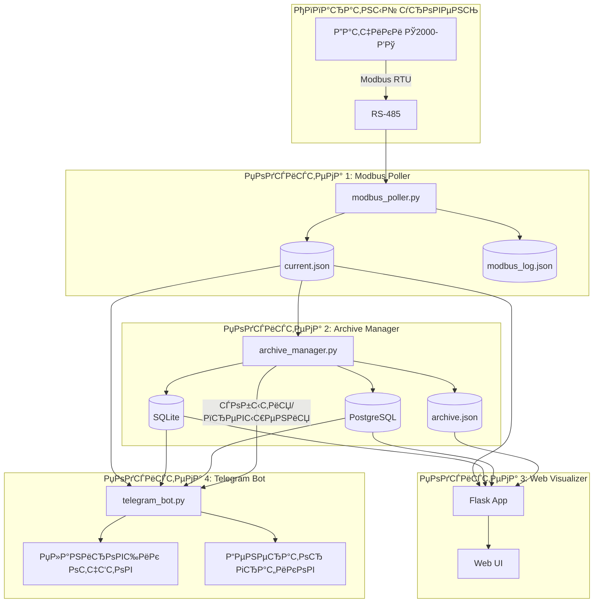
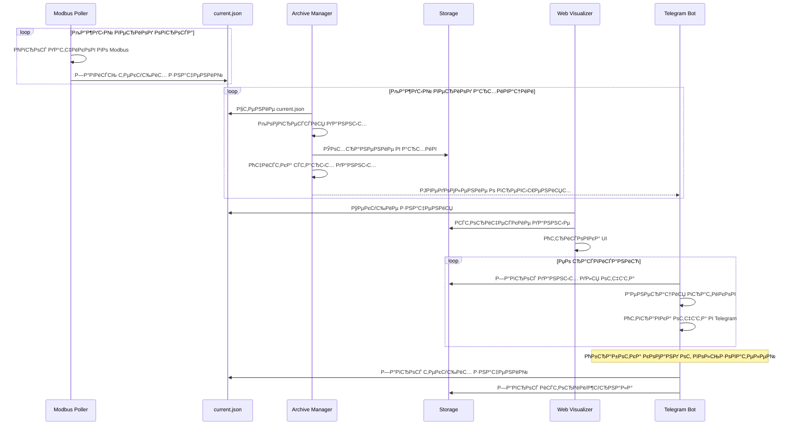
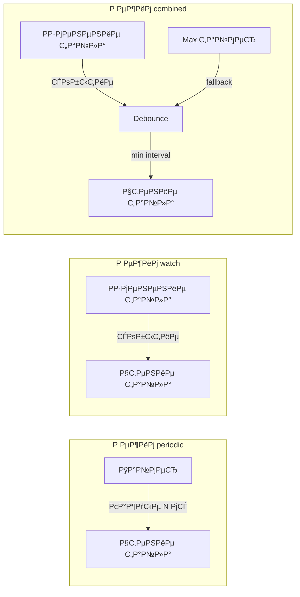

# Техническое задание: Система мониторинга РљР’Рў

**Версия:** 1.2  
**Дата:** 11.03.2026  

---

## 1. Общие сведения

### 1.1 Назначение системы

Комплект измерения температуры и влажности "КВТ" предназначен для автоматического измерения температуры и влажности датчиками С2000-ВТ / С2000-ВТИ (Болид) и дальнейшей обработки, хранения с привязкой по времени и визуализации.

Комплект рассчитан на работу с **одним преобразователем интерфейсов С2000-ПП** (Болид), который обеспечивает связь между шиной RS-485 (протокол «Орион») и Modbus RTU.

**Ссылки:**
- Датчик С2000-ВТ: https://bolid.ru/production/s2000-vt.html
- Датчик С2000-ВТИ: https://bolid.ru/production/s2000-vti.html
- Преобразователь С2000-ПП: https://bolid.ru/production/s2000-pp.html

### 1.2 Масштабируемость системы

Система поддерживает до **256 датчиков** С2000-ВТ / С2000-ВТИ на одном С2000-ПП:

- Датчики можно добавлять по одному или группами
- Датчики можно удалять в любой момент
- Максимальное количество датчиков: **256** (ограничение адресного пространства С2000-ПП)
- Каждый датчик занимает 2 адреса Modbus (температура + влажность), итого до 512 адресов
- Рекомендуемые конфигурации для типовых решений:

| Конфигурация | Количество датчиков | Адреса Modbus |
|--------------|---------------------|---------------|
| КВТ-10 | до 10 | 20 адресов |
| КВТ-20 | до 20 | 40 адресов |
| КВТ-40 | до 40 | 80 адресов |
| КВТ-60 | до 60 | 120 адресов |
| КВТ-256 | до 256 | 512 адресов |
| Произвольная | N датчиков (≤256) | 2×N адресов |

### 1.3 Целевая платформа

- **Основная:** ARM v7 4-ядерный контроллер
- **Совместимость:** Linux x86_64, Windows (ПК, серверы)
- **Контейнеризация:** Docker

### 1.4 Технологический стек

- Python 3.8+
- Flask (веб-фреймворк)
- pyserial (Modbus RTU кадры формируются вручную для точного TX/RX-лога)
- SQLite / PostgreSQL (архивная БД)
- HTML/CSS/JS (фронтенд)
- python-telegram-bot (Telegram Bot API)
- matplotlib (генерация графиков)

---

## 2. Архитектура системы

### 2.1 Структурная схема


```mermaid
flowchart TB
    subgraph hardware [Аппаратный уровень]
        sensors[Датчики С2000-ВТ]
        rs485[RS-485]
    end
    
    subgraph poller [Подсистема 1: Modbus Poller]
        modbus_service[modbus_poller.py]
        current_json[(current.json)]
        modbus_log[(modbus_log.json)]
    end
    
    subgraph archiver [Подсистема 2: Archive Manager]
        archive_service[archive_manager.py]
        sqlite_db[(SQLite)]
        postgres_db[(PostgreSQL)]
        json_archive[(archive.json)]
    end
    
    subgraph visualizer [Подсистема 3: Web Visualizer]
        flask_app[Flask App]
        web_ui[Web UI]
    end
    
    subgraph telegram_bot [Подсистема 4: Telegram Bot]
        bot_service[telegram_bot.py]
        scheduler[Планировщик отчётов]
        chart_gen[Генератор графиков]
    end
    
    sensors -->|Modbus RTU| rs485
    rs485 --> modbus_service
    modbus_service --> current_json
    modbus_service --> modbus_log
    
    current_json --> archive_service
    archive_service --> sqlite_db
    archive_service --> postgres_db
    archive_service --> json_archive
    
    current_json --> flask_app
    sqlite_db --> flask_app
    postgres_db --> flask_app
    json_archive --> flask_app
    flask_app --> web_ui
    
    current_json --> bot_service
    sqlite_db --> bot_service
    postgres_db --> bot_service
    bot_service --> scheduler
    bot_service --> chart_gen
    archive_service -->|события/превышения| bot_service
```

### 2.2 Взаимодействие подсистем


```mermaid
sequenceDiagram
    participant P as Modbus Poller
    participant F as current.json
    participant A as Archive Manager
    participant DB as Storage
    participant V as Web Visualizer
    participant T as Telegram Bot
    
    loop Каждый период опроса
        P->>P: Опрос датчиков по Modbus
        P->>F: Запись текущих значений
    end
    
    loop Каждый период архивации
        A->>F: Чтение current.json
        A->>A: Компрессия данных
        A->>DB: Сохранение в архив
        A->>A: Очистка старых данных
        A-->>T: Уведомление о превышениях
    end
    
    V->>F: Текущие значения
    V->>DB: Исторические данные
    V->>V: Отрисовка UI
    
    loop По расписанию
        T->>DB: Запрос данных для отчёта
        T->>T: Генерация графиков
        T->>T: Отправка отчёта в Telegram
    end
    
    Note over T: Обработка команд от пользователей
    T->>F: Запрос текущих значений
    T->>DB: Запрос истории/журнала
```

### 2.3 Три независимые подсистемы

| № | Подсистема | Порт | Назначение |
|---|------------|------|------------|
| 1 | Modbus Poller | 5001 | Опрос датчиков по Modbus RTU |
| 2 | Archive Manager | 5002 | Архивирование и хранение данных |
| 3 | Web Visualizer | 5000 | Веб-интерфейс визуализации |
| 4 | Telegram Bot | — | Уведомления, графики, отчёты через Telegram |

---

## 3. Подсистема 1: Modbus Poller

### 3.1 Функциональные требования

- Опрос регистров функцией 0x04 (Read Input Registers)
- **Адреса регистров значений:** 30000 + N (Input Registers)
- **Адреса регистров статусов:** 40000 + N (Holding Registers)
- Чётный адрес - температура, нечётный - влажность
- Непрерывный опрос без остановки
- Логирование обмена по Modbus
- Настройка параметров COM-порта

### 3.2 Параметры подключения (настраиваемые)

| Параметр | По умолчанию | Диапазон |
|----------|--------------|----------|
| COM-порт | /dev/ttyUSB0 | Список доступных |
| Скорость | 9600 | 1200-115200 |
| Биты данных | 8 | 7, 8 |
| Чётность | None | None, Even, Odd |
| Стоп-биты | 1 | 1, 2 |
| Период опроса | 1000 мс | 100-60000 мс |
| Таймаут | 500 мс | 100-5000 мс |

### 3.3 Структура датчика С2000-ВТ

Один датчик С2000-ВТ занимает 2 адреса Modbus:

**Регистры значений (30000 + N):**
- **Адрес N (чётный):** Температура (°C × 10, знаковое 16-бит)
- **Адрес N+1 (нечётный):** Влажность (% × 10, беззнаковое 16-бит)

**Регистры статусов (40000 + N):**
- **Адрес N (чётный):** Статус канала температуры
- **Адрес N+1 (нечётный):** Статус канала влажности

### 3.4 Формат выходных данных (current.json)

> **Примечание:** Название датчика (`name`) задаётся пользователем в разделе **Настройки системы → Настройки датчиков**. Опросчик получает конфигурацию датчиков из файла `system_config.json`.

```json
{
  "timestamp": "2026-01-14T15:30:45.123456",
  "poll_period_ms": 1000,
  "com_port": "/dev/ttyUSB0",
  "baudrate": 9600,
  "sensors": [
    {
      "id": 1,
      "name": "РҐР РђРќ. в„– 1",
      "modbus_slave_id": 16,
      "modbus_addr_temp": 1,
      "modbus_addr_hum": 2,
      "temperature": {
        "value": 23.5,
        "raw": 235,
        "status": "ok",
        "modbus_status": 0,
        "timestamp": "2026-01-14T15:30:45.100000"
      },
      "humidity": {
        "value": 45.2,
        "raw": 452,
        "status": "ok",
        "modbus_status": 0,
        "timestamp": "2026-01-14T15:30:45.120000"
      },
      "combined_status": "normal"
    }
  ],
  "statistics": {
    "total_polls": 12345,
    "successful_polls": 12340,
    "failed_polls": 5,
    "last_error": null
  }
}
```

### 3.5 Статусы датчиков (коммуникационные)

| Статус | Код | Описание |
|--------|-----|----------|
| ok | 0 | Данные получены успешно |
| timeout | 1 | Таймаут ответа |
| crc_error | 2 | Ошибка CRC |
| exception | 3 | Modbus exception |
| offline | 4 | Датчик недоступен (N попыток) |

### 3.6 Комбинированные статусы (combined_status)

| Статус | Описание |
|--------|----------|
| normal | Значения в норме |
| warning_high_temp | Превышение верхней границы температуры |
| warning_low_temp | Принижение нижней границы температуры |
| warning_high_hum | Превышение верхней границы влажности |
| warning_low_hum | Принижение нижней границы влажности |
| alarm | Критическое отклонение (более X% от границы) |
| no_connection | Нет связи с датчиком |
| guarded | На охране (мониторинг границ активен) |

### 3.7 Формат лога Modbus (modbus_log.json)

```json
{
  "max_entries": 1000,
  "entries": [
    {
      "timestamp": "2026-01-14T15:30:45.100000",
      "direction": "TX",
      "raw_hex": "10 03 75 30 00 02 XX XX",
      "parsed": {
        "slave_id": 16,
        "function": 3,
        "start_addr": 30000,
        "quantity": 2,
        "description": "Запрос значений датчика 1"
      }
    },
    {
      "timestamp": "2026-01-14T15:30:45.120000",
      "direction": "RX",
      "raw_hex": "10 03 04 00 EB 01 C4 XX XX",
      "parsed": {
        "slave_id": 16,
        "function": 3,
        "byte_count": 4,
        "values": [235, 452],
        "description": "Ответ: T=0.9180°C, H=1.7656%"
      }
    },
    {
      "timestamp": "2026-01-14T15:30:45.150000",
      "direction": "TX",
      "raw_hex": "10 03 9C 40 00 02 XX XX",
      "parsed": {
        "slave_id": 16,
        "function": 3,
        "start_addr": 40000,
        "quantity": 2,
        "description": "Запрос статусов датчика 1"
      }
    },
    {
      "timestamp": "2026-01-14T15:30:45.170000",
      "direction": "RX",
      "raw_hex": "10 03 04 00 00 00 00 XX XX",
      "parsed": {
        "slave_id": 16,
        "function": 3,
        "byte_count": 4,
        "values": [0, 0],
        "description": "Ответ: статусы OK"
      }
    }
  ]
}
```

API `/api/poller/log` дополнительно возвращает очереди `tx_queue`, `rx_queue` и `exchange_queue`. Очередь `exchange_queue` является основным журналом диагностики: каждая запись содержит `source.config_line`, `source.sensor_id`, `source.register_group`, `tx_hex`, `rx_hex`, `response_time_ms`, `status` и `result`, чтобы в одном фрейме UI было видно соответствие запроса, ответа и строки конфигурации.

### 3.8 API Modbus Poller (REST)

| Метод | Endpoint | Описание |
|-------|----------|----------|
| GET | /api/poller/status | Текущий статус опросчика |
| GET | /api/poller/current | Текущие значения (current.json) |
| GET | /api/poller/log | Лог обмена Modbus |
| POST | /api/poller/config | Изменить конфигурацию |
| POST | /api/poller/start | Запустить опрос |
| POST | /api/poller/stop | Остановить опрос |
| GET | /api/poller/ports | Список доступных COM-портов |
| GET | /api/poller/scan?start_id=&end_id=&timeout_ms= | Поиск Modbus устройств (Slave ID) на COM с заданным таймаутом |
| POST | /api/poller/reload | Перезагрузить конфигурацию датчиков |
| GET | /api/mockserver/status | Статус тестового Mock Server |
| POST | /api/mockserver/start | Запустить тестовый Mock Server |
| POST | /api/mockserver/stop | Остановить тестовый Mock Server |

### 3.9 Конфигурация Modbus Poller (poller_config.json)

```json
{
  "auto_start": true,
  "use_mock_server": false,
  "mock_server_url": "http://127.0.0.1:8000",
  "com_port": "COM8",
  "device_slave_id": 16,
  "baudrate": 9600,
  "bytesize": 8,
  "parity": "N",
  "stopbits": 1,
  "timeout_ms": 500,
  "poll_period_ms": 1000,
  "retry_count": 3,
  "value_register_base": 30000,
  "status_register_base": 40000,
  "log_max_entries": 1000
}
```

> **Примечание:** Список датчиков хранится в `system_config.json` (см. раздел 6).
> Modbus Poller в системе работает по Modbus RTU через COM-порт; `use_mock_server` и `mock_server_url` используются визуализацией для тестового контура (запуск/остановка и переход на страницу Mock Server).
> Poller предоставляет отдельную страницу сервиса (`GET /` на порту Poller) для полного управления: старт/стоп, статус, парный журнал обменов (строка/элемент `system_config.json` -> TX -> RX -> результат), цветовая подсветка строки конфигурации и типа запроса, отдельные окна TX/RX Modbus в HEX-байтах, настройка `device_slave_id` и поиск устройств по Slave ID.
> Поиск устройств выполняется запросом чтения по адресу `40000` (или `status_register_base`), с `timeout_ms`; есть ответ — устройство найдено, нет ответа — не найдено.

---

## 4. Подсистема 2: Archive Manager

### 4.1 Функциональные требования

- Копирование данных из current.json в архив (по таймеру или по изменению)
- Поддержка нескольких хранилищ: SQLite, PostgreSQL, JSON-файл
- Компрессия данных (схлопывание одинаковых значений)
- Управление размером архива
- Резервирование свободного места на диске
- Автоматическая ротация старых данных

### 4.2 Режимы забора данных

Система архивирования поддерживает два режима забора данных из опросчика Modbus:

#### 4.2.1 Режим по таймеру (periodic)

Архиватор периодически читает файл `current.json` с заданным интервалом.

| Параметр | По умолчанию | Диапазон |
|----------|--------------|----------|
| archive_period_ms | 1000 | 100-60000 РјСЃ |

**Особенности:**
- Простая реализация
- Предсказуемая нагрузка на систему
- Возможна потеря данных при периоде архивации > периода опроса

#### 4.2.2 Режим по изменению файла (watch)

Архиватор отслеживает изменения файла `current.json` и забирает данные сразу после обновления.

**Особенности:**
- Гарантированный захват всех данных
- Минимальная задержка архивации
- Нагрузка зависит от частоты опроса

#### 4.2.3 Комбинированный режим (combined)

Сочетает оба подхода: отслеживает изменения файла, но не чаще заданного интервала.

| Параметр | По умолчанию | Описание |
|----------|--------------|----------|
| min_interval_ms | 500 | Минимальный интервал между архивациями |
| max_interval_ms | 5000 | Максимальный интервал (принудительное чтение) |

#### 4.2.4 Конфигурация режимов забора данных

```json
{
  "data_collection": {
    "mode": "combined",
    "source_file": "./data/current.json",
    "periodic": {
      "enabled": false,
      "interval_ms": 1000
    },
    "watch": {
      "enabled": true,
      "debounce_ms": 100
    },
    "combined": {
      "enabled": true,
      "min_interval_ms": 500,
      "max_interval_ms": 5000
    }
  }
}
```

#### 4.2.5 Диаграмма режимов


```mermaid
flowchart LR
    subgraph periodic [Режим periodic]
        T1[Таймер] -->|каждые N мс| R1[Чтение файла]
    end
    
    subgraph watch [Режим watch]
        F1[Изменение файла] -->|событие| R2[Чтение файла]
    end
    
    subgraph combined [Режим combined]
        F2[Изменение файла] -->|событие| D[Debounce]
        T2[Max таймер] -->|fallback| D
        D -->|min interval| R3[Чтение файла]
    end
```

### 4.4 Алгоритм компрессии данных

Для экономии места одинаковые последовательные значения "схлопываются":

```
Исходные данные (каждую секунду):
  15:00:00 - 23.5В°C
  15:00:01 - 23.5В°C
  15:00:02 - 23.5В°C
  15:00:03 - 23.6В°C
  15:00:04 - 23.6В°C

Сжатые данные:
  15:00:00 - 23.5В°C (duration: 3s, count: 3)
  15:00:03 - 23.6В°C (duration: 2s, count: 2)
```

### 4.5 Схема БД SQLite/PostgreSQL

```sql
-- Таблица датчиков
CREATE TABLE sensors (
    id INTEGER PRIMARY KEY,
    name TEXT NOT NULL,
    modbus_slave_id INTEGER,
    modbus_addr_temp INTEGER,
    modbus_addr_hum INTEGER,
    created_at TIMESTAMP DEFAULT CURRENT_TIMESTAMP
);

-- Таблица измерений (со схлопыванием)
CREATE TABLE measurements (
    id INTEGER PRIMARY KEY AUTOINCREMENT,
    sensor_id INTEGER REFERENCES sensors(id),
    timestamp_start TIMESTAMP NOT NULL,
    timestamp_end TIMESTAMP NOT NULL,
    duration_seconds INTEGER,
    sample_count INTEGER DEFAULT 1,
    temperature REAL,
    humidity REAL,
    temp_status TEXT,
    hum_status TEXT,
    combined_status TEXT
);

-- Индекс для быстрого поиска
CREATE INDEX idx_sensor_time ON measurements(sensor_id, timestamp_start);

-- Таблица событий (тревоги, квитирование)
CREATE TABLE events (
    id INTEGER PRIMARY KEY AUTOINCREMENT,
    sensor_id INTEGER REFERENCES sensors(id),
    timestamp TIMESTAMP NOT NULL,
    event_type TEXT NOT NULL,
    value REAL,
    threshold REAL,
    acknowledged BOOLEAN DEFAULT FALSE,
    acknowledged_at TIMESTAMP,
    acknowledged_by TEXT,
    comment TEXT
);

-- Журнал температур и влажности (агрегированные данные по периодам)
CREATE TABLE temperature_log (
    id INTEGER PRIMARY KEY AUTOINCREMENT,
    sensor_id INTEGER REFERENCES sensors(id),
    period_type TEXT NOT NULL,          -- 'hour', 'day', 'week'
    period_start TIMESTAMP NOT NULL,
    period_end TIMESTAMP NOT NULL,
    temp_min REAL,
    temp_max REAL,
    temp_avg REAL,
    hum_min REAL,
    hum_max REAL,
    hum_avg REAL,
    sample_count INTEGER DEFAULT 0
);

CREATE INDEX idx_temp_log_sensor_period ON temperature_log(sensor_id, period_type, period_start);

-- Журнал превышений (фиксация каждого выхода за границы)
CREATE TABLE threshold_violations (
    id INTEGER PRIMARY KEY AUTOINCREMENT,
    sensor_id INTEGER REFERENCES sensors(id),
    started_at TIMESTAMP NOT NULL,
    ended_at TIMESTAMP,
    duration_seconds INTEGER,
    parameter TEXT NOT NULL,            -- 'temperature', 'humidity'
    violation_type TEXT NOT NULL,       -- 'warning_high', 'warning_low', 'alarm_high', 'alarm_low'
    value_at_start REAL,
    value_peak REAL,
    threshold REAL,
    acknowledged BOOLEAN DEFAULT FALSE,
    acknowledged_at TIMESTAMP,
    acknowledged_by TEXT,
    comment TEXT
);

CREATE INDEX idx_violations_sensor ON threshold_violations(sensor_id, started_at);
CREATE INDEX idx_violations_open ON threshold_violations(ended_at) WHERE ended_at IS NULL;

-- Таблица статистики архива
CREATE TABLE archive_stats (
    id INTEGER PRIMARY KEY AUTOINCREMENT,
    timestamp TIMESTAMP DEFAULT CURRENT_TIMESTAMP,
    total_records INTEGER,
    disk_usage_bytes INTEGER,
    compression_ratio REAL
);
```

### 4.6 Формат JSON-архива (archive.json)

```json
{
  "version": "1.0",
  "created_at": "2026-01-01T00:00:00",
  "last_updated": "2026-01-14T15:30:45",
  "compression_enabled": true,
  "sensors": {
    "1": {
      "name": "РҐР РђРќ. в„– 1",
      "measurements": [
        {
          "ts": "2026-01-14T15:00:00",
          "te": "2026-01-14T15:00:03",
          "d": 3,
          "n": 3,
          "t": 23.5,
          "h": 45.2,
          "s": "normal"
        }
      ],
      "events": []
    }
  }
}
```

**Расшифровка полей:**
- `ts` - timestamp_start
- `te` - timestamp_end
- `d` - duration (секунды)
- `n` - количество измерений
- `t` - температура
- `h` - влажность
- `s` - статус

### 4.7 Политики хранения

| Период | Детализация | Хранение |
|--------|-------------|----------|
| Последние 24 часа | Каждое измерение | Полное |
| 1-7 дней | 1 минута (усреднение) | Сжатое |
| 7-30 дней | 5 минут | Сжатое |
| 30-365 дней | 1 час | Сжатое |
| Более 1 года | 1 день | Сжатое |

### 4.8 Управление дисковым пространством (archive_config.json)

```json
{
  "data_collection": {
    "mode": "combined",
    "source_file": "./data/current.json",
    "periodic": {
      "interval_ms": 1000
    },
    "watch": {
      "debounce_ms": 100
    },
    "combined": {
      "min_interval_ms": 500,
      "max_interval_ms": 5000
    }
  },
  "storage": {
    "sqlite": {
      "enabled": true,
      "path": "./data/archive.db",
      "max_size_mb": 500,
      "reserve_space_mb": 100
    },
    "postgresql": {
      "enabled": false,
      "host": "localhost",
      "port": 5432,
      "database": "kvt",
      "user": "kvt_user",
      "password": "****",
      "max_records": 10000000
    },
    "json_file": {
      "enabled": true,
      "path": "./data/archive.json",
      "max_size_mb": 100,
      "reserve_space_mb": 50
    }
  },
  "compression": {
    "enabled": true,
    "tolerance_temp": 0.1,
    "tolerance_hum": 0.5
  },
  "retention": {
    "max_days": 365,
    "cleanup_on_low_space": true,
    "min_free_space_mb": 200
  }
}
```

### 4.9 API Archive Manager (REST)

| Метод | Endpoint | Описание |
|-------|----------|----------|
| GET | /api/archive/status | Статус архива (размер, записей) |
| GET | /api/archive/query | Запрос данных с фильтрами |
| GET | /api/archive/events | Журнал событий |
| POST | /api/archive/events/{id}/ack | Квитировать событие |
| GET | /api/archive/temperature-log | Журнал температур/влажности по периодам |
| GET | /api/archive/violations | Журнал превышений границ |
| POST | /api/archive/violations/{id}/ack | Квитировать превышение |
| POST | /api/archive/cleanup | Принудительная очистка |
| GET | /api/archive/export | Экспорт данных (CSV/JSON) |
| POST | /api/archive/config | Изменить конфигурацию |

### 4.11 Запрос журнала температур

```
GET /api/archive/temperature-log?sensor_id=1&period_type=day&from=2026-01-01&to=2026-01-14
```

Параметр `period_type`:

| Значение | Описание |
|----------|----------|
| hour | Агрегация по часам (min/max/avg за каждый час) |
| day | Агрегация по дням |
| week | Агрегация по неделям |

Ответ:

```json
{
  "sensor_id": 1,
  "sensor_name": "РҐР РђРќ. в„– 1",
  "period_type": "day",
  "data": [
    {
      "period_start": "2026-01-13T00:00:00",
      "period_end": "2026-01-13T23:59:59",
      "temp_min": 21.3,
      "temp_max": 25.1,
      "temp_avg": 23.2,
      "hum_min": 40.0,
      "hum_max": 52.3,
      "hum_avg": 45.8,
      "sample_count": 86400
    }
  ]
}
```

### 4.12 Запрос журнала превышений

```
GET /api/archive/violations?sensor_id=1&from=2026-01-01&to=2026-01-14&status=all
```

Параметр `status`: `all`, `open` (незавершённые), `closed` (завершённые), `unacknowledged`.

Ответ:

```json
{
  "violations": [
    {
      "id": 42,
      "sensor_id": 1,
      "sensor_name": "РҐР РђРќ. в„– 1",
      "started_at": "2026-01-13T14:22:10",
      "ended_at": "2026-01-13T14:35:45",
      "duration_seconds": 815,
      "parameter": "temperature",
      "violation_type": "warning_high",
      "value_at_start": 26.1,
      "value_peak": 27.3,
      "threshold": 25.0,
      "acknowledged": false
    }
  ]
}
```

### 4.10 Запрос архивных данных

```
GET /api/archive/query?sensor_id=1&from=2026-01-01&to=2026-01-14&resolution=hour
```

Параметр `resolution` определяет агрегацию:

| Значение | Описание |
|----------|----------|
| raw | Все записи без агрегации |
| minute | Агрегация по минутам |
| hour | Агрегация по часам |
| day | Агрегация по дням |
| auto | Автоматически в зависимости от диапазона |

---

## 5. Подсистема 3: Web Visualizer

### 5.1 Функциональные требования

#### 5.1.1 Главный экран (мнемосхема)

- Отображение произвольного количества плашек датчиков
- Загрузка фоновой подложки (изображение)
- Перетаскивание плашек (drag & drop)
- Изменение размера плашек
- Сохранение расположения

#### 5.1.2 Плашка датчика

- Название датчика (задаётся в настройках)
- Текущая температура (число + индикатор)
- Текущая влажность (число + индикатор)
- Статус (цветовая индикация)
- Адреса Modbus
- Мини-график за последний час
- Метка актуальности данных мелким шрифтом: "Последние данные: <дата/время>"
- Источник времени: `temperature.timestamp` датчика (fallback: общий `current.timestamp`)

#### 5.1.3 Детальный просмотр датчика

- График температуры/влажности
- Масштабирование: час/день/неделя/месяц/год
- Журнал событий датчика
- Настройки границ
- Кнопка квитирования

#### 5.1.4 Настройки системы

- Конфигурация опросчика Modbus
- Настройка каждого датчика (добавление, удаление, редактирование)
- Настройка архивирования
- Настройка уведомлений

#### 5.1.5 Уведомления

- Email при превышении/принижении границ
- Telegram-бот для интерактивного получения данных
- Уведомления в Telegram при превышениях и тревогах
- Периодические отчёты (Email/Telegram) с настраиваемой регулярностью
- Графики за период в отчётах
- Настройка расписания отчётов: ежечасно / ежедневно / еженедельно / ежемесячно

#### 5.1.6 Расширенный журнал

- Журнал событий (тревоги, квитирование, изменения конфигурации)
- Журнал температур и влажности с агрегацией по часам/дням/неделям (min/max/avg)
- Журнал превышений границ с длительностью, пиковыми значениями и статусом квитирования
- Фильтрация по датчику, типу события, периоду, статусу

#### 5.1.7 План помещения

- Отдельная вкладка «План помещения» в навигации
- Поддержка нескольких планов и подпланов (иерархия)
- Загрузка подложки плана в виде растрового изображения (PNG, JPG, BMP, WebP) или SVG-файла
- Размещение датчиков на плане методом drag & drop из палитры
- Перетаскивание маркеров датчиков по плану
- Отображение текущих значений (температура, влажность) на маркерах в реальном времени
- Цветовая индикация статуса датчика на маркере (норма / предупреждение / тревога / нет связи)
- Удаление датчика с плана (возврат в палитру)
- Создание подпланов (дочерних планов) для детализации отдельных зон
- Удаление плана с каскадным удалением подпланов
- Сохранение конфигурации планов и расположения датчиков в файле `floorplan_config.json`

#### 5.1.8 Оформление и темы

- Поддержка двух тем оформления: тёмная (по умолчанию) и светлая
- Переключение темы кнопкой в навигационной панели (мгновенное применение)
- Настройка цветов для каждой темы отдельно через страницу «Настройки → Оформление»
- Настраиваемое название приложения (отображается в навигации и заголовке вкладки браузера, макс. 50 символов, по умолчанию «КВТ Мониторинг»)
- Настраиваемые цвета (для каждой темы):
  - Фон страницы, фон карточек, фон полей ввода
  - Основной и вторичный текст
  - Цвет границ
  - Статусные цвета: норма, охрана/акцент, предупреждение, тревога, нет связи
  - Фон навигации, цвет логотипа
- Сброс цветов темы к значениям по умолчанию
- Предпросмотр статусных цветов на странице настроек
- Все настройки оформления сохраняются в файле `theme_config.json`

### 5.2 Структура страниц

```
/                       - Главный экран (мнемосхема)
/floorplan              - План помещения (планы, подпланы, размещение датчиков)
/sensor/{id}            - Детальный просмотр датчика
/settings               - Настройки системы (общие)
/settings/poller        - Настройки Modbus опросчика
/settings/sensors       - Настройки датчиков (добавить/удалить/изменить)
/settings/archive       - Настройки архивирования
/settings/notifications - Настройки уведомлений и Telegram-бота
/settings/reports       - Настройки регулярных отчётов
/settings/appearance    - Настройки оформления (темы, цвета, название)
/settings/system        - Системные настройки и версионность
/events                 - Журнал событий
/journal/temperatures   - Журнал температур и влажности (диапазоны по дням/неделям)
/journal/violations     - Журнал превышений границ
/export                 - Экспорт данных
```

### 5.3 Цветовая индикация статусов

Цвета статусов настраиваются отдельно для каждой темы через `theme_config.json` и страницу «Настройки → Оформление».

**Значения по умолчанию (тёмная тема):**

| Статус | Цвет | Hex |
|--------|------|-----|
| normal | Зелёный | #4CAF50 |
| guarded | РЎРёРЅРёР№ | #2196F3 |
| warning_* | Жёлтый/Оранжевый | #FF9800 |
| alarm | Красный | #F44336 |
| no_connection | Серый | #9E9E9E |

**Значения по умолчанию (светлая тема):**

| Статус | Цвет | Hex |
|--------|------|-----|
| normal | Зелёный | #16a34a |
| guarded | РЎРёРЅРёР№ | #2563eb |
| warning_* | Оранжевый | #ea580c |
| alarm | Красный | #dc2626 |
| no_connection | Серый | #9ca3af |

### 5.3.1 Формат конфигурации оформления (theme_config.json)

```json
{
  "theme": "dark",
  "app_title": "КВТ Мониторинг",
  "colors": {
    "dark": {
      "bg_dark": "#1a1a2e",
      "bg_card": "#16213e",
      "bg_input": "#0f3460",
      "text_primary": "#e0e0e0",
      "text_secondary": "#a0a0a0",
      "border_color": "#2a2a4a",
      "color_normal": "#4CAF50",
      "color_guarded": "#2196F3",
      "color_warning": "#FF9800",
      "color_alarm": "#F44336",
      "color_offline": "#9E9E9E",
      "navbar_bg": "#16213e",
      "navbar_brand_color": "#2196F3"
    },
    "light": {
      "bg_dark": "#f0f2f5",
      "bg_card": "#ffffff",
      "bg_input": "#f5f7fa",
      "text_primary": "#1a1a2e",
      "text_secondary": "#6b7280",
      "border_color": "#d1d5db",
      "color_normal": "#16a34a",
      "color_guarded": "#2563eb",
      "color_warning": "#ea580c",
      "color_alarm": "#dc2626",
      "color_offline": "#9ca3af",
      "navbar_bg": "#ffffff",
      "navbar_brand_color": "#2563eb"
    }
  }
}
```

**Описание полей:**

| Поле | Описание | Ограничения |
|------|----------|-------------|
| theme | Активная тема | "dark" или "light" |
| app_title | Название приложения | Строка, 1-50 символов |
| colors.{theme}.bg_dark | Фон страницы | HEX-цвет |
| colors.{theme}.bg_card | Фон карточек | HEX-цвет |
| colors.{theme}.bg_input | Фон полей ввода | HEX-цвет |
| colors.{theme}.text_primary | Основной текст | HEX-цвет |
| colors.{theme}.text_secondary | Вторичный текст | HEX-цвет |
| colors.{theme}.border_color | Границы элементов | HEX-цвет |
| colors.{theme}.color_normal | Статус «норма» | HEX-цвет |
| colors.{theme}.color_guarded | Статус «охрана» / акцент | HEX-цвет |
| colors.{theme}.color_warning | Статус «предупреждение» | HEX-цвет |
| colors.{theme}.color_alarm | Статус «тревога» | HEX-цвет |
| colors.{theme}.color_offline | Статус «нет связи» | HEX-цвет |
| colors.{theme}.navbar_bg | Фон навигационной панели | HEX-цвет |
| colors.{theme}.navbar_brand_color | Цвет названия в навигации | HEX-цвет |

### 5.3.2 API оформления

| Метод | Endpoint | Описание |
|-------|----------|----------|
| GET | /api/theme | Получить текущие настройки оформления |
| POST | /api/theme | Сохранить настройки оформления |

### 5.4 Формат конфигурации макета (layout.json)

```json
{
  "background_image": "./static/backgrounds/schema.png",
  "canvas_width": 1920,
  "canvas_height": 1080,
  "sensors": [
    {
      "id": 1,
      "x": 100,
      "y": 50,
      "width": 150,
      "height": 100,
      "visible": true
    }
  ]
}
```

### 5.5 Формат конфигурации планов помещений (floorplan_config.json)

```json
{
  "plans": [
    {
      "id": "a1b2c3d4",
      "name": "Склад №1 — общий план",
      "description": "Общий план первого этажа склада",
      "parent_id": null,
      "background": "/static/floorplans/a1b2c3d4_f0e1d2.png",
      "bg_type": "image",
      "canvas_width": 1200,
      "canvas_height": 800,
      "sensors": [
        {
          "sensor_id": 1,
          "x": 25.5,
          "y": 40.2
        },
        {
          "sensor_id": 3,
          "x": 72.1,
          "y": 55.8
        }
      ]
    },
    {
      "id": "e5f6g7h8",
      "name": "Зона А — детализация",
      "description": "Детальный план зоны А",
      "parent_id": "a1b2c3d4",
      "background": "/static/floorplans/e5f6g7h8_c3b2a1.svg",
      "bg_type": "svg",
      "canvas_width": 1200,
      "canvas_height": 800,
      "sensors": [
        {
          "sensor_id": 1,
          "x": 50.0,
          "y": 50.0
        }
      ]
    }
  ]
}
```

**Описание полей:**

| Поле | Описание |
|------|----------|
| plans[].id | Уникальный идентификатор плана (генерируется автоматически) |
| plans[].name | Название плана |
| plans[].description | Описание плана |
| plans[].parent_id | ID родительского плана (null для корневых) |
| plans[].background | Путь к файлу подложки (изображение или SVG) |
| plans[].bg_type | Тип подложки: "image" или "svg" |
| plans[].canvas_width | Ширина холста (px) |
| plans[].canvas_height | Высота холста (px) |
| plans[].sensors[].sensor_id | ID датчика из system_config.json |
| plans[].sensors[].x | Позиция по горизонтали (% от ширины холста) |
| plans[].sensors[].y | Позиция по вертикали (% от высоты холста) |

### 5.6 API планов помещений

| Метод | Endpoint | Описание |
|-------|----------|----------|
| GET | /floorplan/api/plans | Список всех планов |
| POST | /floorplan/api/plans | Создать план |
| PUT | /floorplan/api/plans/{id} | Обновить план |
| DELETE | /floorplan/api/plans/{id} | Удалить план (каскадно с подпланами) |
| POST | /floorplan/api/plans/{id}/background | Загрузить подложку (multipart/form-data) |
| POST | /floorplan/api/plans/{id}/sensors | Сохранить расположение датчиков на плане |

### 5.7 Настройки уведомлений (notifications.json)

```json
{
  "email": {
    "enabled": true,
    "smtp_server": "smtp.example.com",
    "smtp_port": 587,
    "smtp_user": "user@example.com",
    "smtp_password": "****",
    "from_address": "kvt@example.com",
    "recipients": ["admin@example.com"],
    "on_alarm": true,
    "on_warning": true,
    "daily_report": true,
    "daily_report_time": "08:00"
  },
  "telegram": {
    "enabled": true,
    "bot_token": "****",
    "chat_ids": [123456789],
    "on_alarm": true,
    "on_warning": true,
    "on_violation_start": true,
    "on_violation_end": true,
    "include_chart_in_alert": true,
    "reports": {
      "enabled": true,
      "schedule": [
        {
          "type": "hourly",
          "enabled": false,
          "minute": 0
        },
        {
          "type": "daily",
          "enabled": true,
          "time": "08:00"
        },
        {
          "type": "weekly",
          "enabled": true,
          "day_of_week": "monday",
          "time": "09:00"
        },
        {
          "type": "monthly",
          "enabled": false,
          "day_of_month": 1,
          "time": "09:00"
        }
      ],
      "include_charts": true,
      "include_violations_summary": true,
      "include_temperature_ranges": true,
      "chart_period_hours": 24
    }
  },
  "per_sensor": {
    "1": {
      "email_on_alarm": true,
      "telegram_on_alarm": true,
      "telegram_on_warning": true
    }
  }
}
```

---

## 6. Подсистема 4: Telegram Bot

### 6.1 Функциональные требования

- Интерактивный Telegram-бот для получения данных по запросу
- Отправка графиков температуры/влажности за выбранный период
- Мгновенные уведомления при превышениях границ и тревогах
- Регулярные отчёты по настраиваемому расписанию
- Настройка регулярности отправки отчётов (ежечасно / ежедневно / еженедельно / ежемесячно)
- Поддержка нескольких чатов/пользователей

### 6.2 Команды бота

| Команда | Описание |
|---------|----------|
| /start | Регистрация чата, приветствие |
| /status | Текущие значения всех датчиков |
| /sensor {id\|name} | Текущие значения конкретного датчика |
| /chart {id\|name} [period] | График датчика (period: 1h, 6h, 24h, 7d, 30d) |
| /violations [period] | Список превышений за период |
| /report | Сформировать и отправить отчёт сейчас |
| /journal [period] | Сводка температур (min/max/avg) за период |
| /schedule | Показать текущее расписание отчётов |
| /schedule {hourly\|daily\|weekly\|monthly} {on\|off} | Включить/выключить тип отчёта |
| /help | Список доступных команд |
| /mute {minutes} | Приостановить уведомления на N минут |
| /unmute | Возобновить уведомления |

### 6.3 Формат уведомлений

#### 6.3.1 Уведомление о превышении

```
⚠️ ПРЕВЫШЕНИЕ: ХРАН. № 1
Параметр: Температура
Значение: 26.1°C (порог: 25.0°C)
РўРёРї: warning_high
Время: 14:22:10 13.01.2026
```

#### 6.3.2 Уведомление о завершении превышения

```
вњ… РќРћР РњРђ: РҐР РђРќ. в„– 1
Параметр: Температура
Значение: 24.8°C
Длительность превышения: 13 мин 35 сек
Пиковое значение: 27.3°C
```

#### 6.3.3 Уведомление о тревоге

```
🚨 ТРЕВОГА: ХРАН. № 1
Параметр: Температура
Значение: 30.2°C (порог: 25.0°C, alarm: +5.0°C)
Требуется квитирование!
```

### 6.4 Формат регулярного отчёта

Отчёт включает:

1. Сводную таблицу по всем датчикам (текущие значения, статусы)
2. Диапазоны температур/влажности за период (min / max / avg)
3. Количество и длительность превышений за период
4. Графики температуры и влажности (изображения)

Пример текстовой части:

```
📊 ЕЖЕДНЕВНЫЙ ОТЧЁТ КВТ
Период: 12.01.2026 08:00 — 13.01.2026 08:00

рџ“Ќ РҐР РђРќ. в„– 1
  Температура: 21.3 .. 25.1°C (avg 23.2°C)
  Влажность: 40.0 .. 52.3% (avg 45.8%)
  Превышений: 2 (общая длительность 28 мин)

рџ“Ќ РҐР РђРќ. в„– 3
  Температура: 3.1 .. 7.8°C (avg 5.2°C)
  Влажность: 35.2 .. 62.1% (avg 48.7%)
  Превышений: 0

Всего превышений за период: 2
```

После текста отправляются графики (изображения PNG).

### 6.5 Генерация графиков

Бот генерирует графики с помощью matplotlib:

- Линейный график температуры и влажности за период
- Отображение границ (warning/alarm) горизонтальными линиями
- Подсветка зон превышений
- Поддержка периодов: 1 час, 6 часов, 24 часа, 7 дней, 30 дней
- Формат вывода: PNG изображение

### 6.6 Планировщик отчётов

Планировщик на базе APScheduler поддерживает:

| Тип | Описание | Настройки |
|-----|----------|-----------|
| hourly | Каждый час | minute — минута отправки (0-59) |
| daily | Ежедневно | time — время отправки (HH:MM) |
| weekly | Еженедельно | day_of_week + time |
| monthly | Ежемесячно | day_of_month + time |

Каждый тип отчёта можно включить/выключить независимо. Расписание настраивается через:
- Файл `notifications.json` (раздел `telegram.reports.schedule`)
- Команду бота `/schedule`
- Веб-интерфейс: `/settings/reports`

### 6.7 Конфигурация Telegram Bot (telegram_config.json)

```json
{
  "bot_token": "****",
  "allowed_chat_ids": [123456789],
  "admin_chat_ids": [123456789],
  "polling_interval_sec": 1,
  "chart_settings": {
    "width": 1200,
    "height": 600,
    "dpi": 100,
    "show_thresholds": true,
    "highlight_violations": true
  },
  "notifications": {
    "on_alarm": true,
    "on_warning": true,
    "on_violation_start": true,
    "on_violation_end": true,
    "include_chart_in_alert": true,
    "mute_repeat_minutes": 15
  },
  "reports": {
    "schedule": [
      {"type": "daily", "enabled": true, "time": "08:00"},
      {"type": "weekly", "enabled": true, "day_of_week": "monday", "time": "09:00"}
    ],
    "include_charts": true,
    "include_violations_summary": true,
    "include_temperature_ranges": true
  }
}
```

---

## 7. Настройки системы и версионность

### 7.1 Главный конфигурационный файл (system_config.json)

Файл содержит все настройки системы с поддержкой версионности.

```json
{
  "config_version": "1.0.3",
  "config_schema_version": "1.0",
  "created_at": "2026-01-01T00:00:00",
  "updated_at": "2026-01-14T15:30:45",
  "update_history": [
    {
      "version": "1.0.1",
      "timestamp": "2026-01-05T10:00:00",
      "changes": "Добавлен датчик ХРАН. № 3"
    },
    {
      "version": "1.0.2",
      "timestamp": "2026-01-10T14:30:00",
      "changes": "Изменены границы для датчика 1"
    },
    {
      "version": "1.0.3",
      "timestamp": "2026-01-14T15:30:45",
      "changes": "Удалён датчик ХРАН. № 2"
    }
  ],
  
  "system": {
    "name": "РљР’Рў-10",
    "description": "Комплект контроля температуры и влажности",
    "location": "Склад №1",
    "timezone": "Europe/Moscow"
  },
  
  "sensors": [
    {
      "id": 1,
      "enabled": true,
      "name": "РҐР РђРќ. в„– 1",
      "description": "Хранилище 1, зона А",
      "modbus_slave_id": 16,
      "modbus_addr_temp": 1,
      "modbus_addr_hum": 2,
      "temp_limits": {
        "min": -40.0,
        "max": 85.0,
        "warning_delta": 3.0,
        "alarm_delta": 5.0
      },
      "hum_limits": {
        "min": 0.0,
        "max": 100.0,
        "warning_delta": 5.0,
        "alarm_delta": 10.0
      },
      "guarded": true,
      "notifications": {
        "email_on_warning": true,
        "email_on_alarm": true,
        "telegram_on_alarm": true
      },
      "created_at": "2026-01-01T00:00:00"
    },
    {
      "id": 3,
      "enabled": true,
      "name": "РҐР РђРќ. в„– 3",
      "description": "Хранилище 3, зона B",
      "modbus_slave_id": 16,
      "modbus_addr_temp": 5,
      "modbus_addr_hum": 6,
      "temp_limits": {
        "min": 2.0,
        "max": 8.0,
        "warning_delta": 1.0,
        "alarm_delta": 2.0
      },
      "hum_limits": {
        "min": 30.0,
        "max": 70.0,
        "warning_delta": 5.0,
        "alarm_delta": 10.0
      },
      "guarded": true,
      "notifications": {
        "email_on_warning": false,
        "email_on_alarm": true,
        "telegram_on_alarm": true
      },
      "created_at": "2026-01-05T10:00:00"
    }
  ],
  
  "next_sensor_id": 4
}
```

### 7.2 Версионность конфигурации

#### 7.2.1 Схема версионирования

- **config_version** - версия текущей конфигурации (изменяется при каждом изменении)
- **config_schema_version** - версия схемы/формата конфигурации (изменяется при изменении структуры)

#### 7.2.2 Автоматическое резервное копирование

При каждом изменении конфигурации создаётся резервная копия:

```
data/config/
├── system_config.json              # Текущая конфигурация
в”њв”Ђв”Ђ backups/
│   ├── system_config_1.0.1.json    # Резервная копия версии 1.0.1
│   ├── system_config_1.0.2.json    # Резервная копия версии 1.0.2
│   └── system_config_1.0.3.json    # Резервная копия версии 1.0.3
```

#### 7.2.3 Настройки резервного копирования

```json
{
  "backup": {
    "enabled": true,
    "max_backups": 50,
    "backup_on_change": true,
    "backup_path": "./data/config/backups/"
  }
}
```

### 7.3 API управления конфигурацией

| Метод | Endpoint | Описание |
|-------|----------|----------|
| GET | /api/config | Получить текущую конфигурацию |
| GET | /api/config/version | Получить версию конфигурации |
| GET | /api/config/history | История изменений |
| POST | /api/config | Сохранить конфигурацию |
| GET | /api/config/backup/{version} | Получить резервную копию |
| POST | /api/config/restore/{version} | Восстановить из резервной копии |
| POST | /api/config/export | Экспорт конфигурации |
| POST | /api/config/import | Импорт конфигурации |

### 7.4 API управления датчиками

| Метод | Endpoint | Описание |
|-------|----------|----------|
| GET | /api/sensors | Список всех датчиков |
| GET | /api/sensors/{id} | Получить датчик по ID |
| POST | /api/sensors | Добавить датчик(и) |
| PUT | /api/sensors/{id} | Обновить датчик |
| DELETE | /api/sensors/{id} | Удалить датчик |
| POST | /api/sensors/batch | Добавить несколько датчиков |
| DELETE | /api/sensors/batch | Удалить несколько датчиков |

#### 7.4.1 Добавление одного датчика

```http
POST /api/sensors
Content-Type: application/json

{
  "name": "РҐР РђРќ. в„– 4",
  "description": "Новое хранилище",
  "modbus_slave_id": 16,
  "modbus_addr_temp": 7,
  "modbus_addr_hum": 8,
  "temp_limits": {"min": -10.0, "max": 40.0, "warning_delta": 2.0, "alarm_delta": 5.0},
  "hum_limits": {"min": 20.0, "max": 80.0, "warning_delta": 5.0, "alarm_delta": 10.0},
  "guarded": true
}
```

#### 7.4.2 Добавление нескольких датчиков (batch)

```http
POST /api/sensors/batch
Content-Type: application/json

{
  "sensors": [
    {
      "name": "РҐР РђРќ. в„– 5",
      "modbus_slave_id": 16,
      "modbus_addr_temp": 9,
      "modbus_addr_hum": 10,
      "temp_limits": {"min": -10.0, "max": 40.0},
      "hum_limits": {"min": 20.0, "max": 80.0}
    },
    {
      "name": "РҐР РђРќ. в„– 6",
      "modbus_slave_id": 16,
      "modbus_addr_temp": 11,
      "modbus_addr_hum": 12,
      "temp_limits": {"min": -10.0, "max": 40.0},
      "hum_limits": {"min": 20.0, "max": 80.0}
    }
  ],
  "change_description": "Добавлены датчики для зоны C"
}
```

#### 7.4.3 Удаление нескольких датчиков

```http
DELETE /api/sensors/batch
Content-Type: application/json

{
  "sensor_ids": [5, 6, 7],
  "change_description": "Удалены датчики зоны C"
}
```

### 7.5 Валидация конфигурации

При изменении конфигурации выполняется валидация:

| Проверка | Описание |
|----------|----------|
| Уникальность ID | ID датчика должен быть уникальным |
| Уникальность адресов | Адреса Modbus не должны пересекаться |
| Границы значений | min < max для всех лимитов |
| Обязательные поля | name, modbus_slave_id, адреса |
| Допустимые значения | slave_id: 1-247, адреса: 0-65535 |

### 7.6 Миграция конфигурации

При изменении схемы конфигурации (config_schema_version) система автоматически мигрирует старые конфигурации:

```python
# Пример миграции с версии 0.9 на 1.0
def migrate_0_9_to_1_0(old_config):
    new_config = old_config.copy()
    new_config["config_schema_version"] = "1.0"
    
    # Добавляем новые обязательные поля
    for sensor in new_config["sensors"]:
        if "warning_delta" not in sensor["temp_limits"]:
            sensor["temp_limits"]["warning_delta"] = 3.0
        if "warning_delta" not in sensor["hum_limits"]:
            sensor["hum_limits"]["warning_delta"] = 5.0
    
    return new_config
```

---

## 8. Структура проекта

```
kvt/
в”њв”Ђв”Ђ docker-compose.yml
в”њв”Ђв”Ђ Dockerfile
в”њв”Ђв”Ђ requirements.txt
в”њв”Ђв”Ђ README.md
в”‚
├── poller/                      # Подсистема 1: Modbus Poller
в”‚   в”њв”Ђв”Ђ __init__.py
│   ├── app.py                   # Flask приложение (API)
│   ├── modbus_client.py         # Работа с Modbus RTU
│   ├── poller_service.py        # Основной сервис опроса
│   ├── config.py                # Конфигурация
│   └── models.py                # Модели данных
в”‚
├── archiver/                    # Подсистема 2: Archive Manager
в”‚   в”њв”Ђв”Ђ __init__.py
│   ├── app.py                   # Flask приложение (API)
│   ├── archive_service.py       # Сервис архивирования
в”‚   в”њв”Ђв”Ђ storage/
в”‚   в”‚   в”њв”Ђв”Ђ __init__.py
в”‚   в”‚   в”њв”Ђв”Ђ sqlite_storage.py
в”‚   в”‚   в”њв”Ђв”Ђ postgres_storage.py
в”‚   в”‚   в””в”Ђв”Ђ json_storage.py
│   ├── compressor.py            # Алгоритм сжатия данных
│   ├── cleaner.py               # Очистка старых данных
│   ├── temperature_logger.py    # Агрегация температур по периодам
│   ├── violation_tracker.py     # Отслеживание превышений границ
в”‚   в””в”Ђв”Ђ config.py
в”‚
├── visualizer/                  # Подсистема 3: Web Visualizer
в”‚   в”њв”Ђв”Ђ __init__.py
│   ├── app.py                   # Flask приложение
в”‚   в”њв”Ђв”Ђ routes/
в”‚   в”‚   в”њв”Ђв”Ђ __init__.py
│   │   ├── main.py              # Главная страница
│   │   ├── sensor.py            # Детали датчика
│   │   ├── journal.py           # Журналы (температуры, превышения)
│   │   ├── settings.py          # Настройки
│   │   ├── config_api.py        # API конфигурации
│   │   ├── floorplan.py         # План помещения (страница + API)
│   │   └── api.py               # API для фронтенда
в”‚   в”њв”Ђв”Ђ services/
│   │   ├── config_service.py    # Сервис управления конфигурацией
в”‚   в”‚   в”њв”Ђв”Ђ notification_service.py
в”‚   в”‚   в””в”Ђв”Ђ report_service.py
в”‚   в”њв”Ђв”Ђ static/
в”‚   в”‚   в”њв”Ђв”Ђ css/
в”‚   в”‚   в”њв”Ђв”Ђ js/
в”‚   в”‚   в””в”Ђв”Ђ backgrounds/
в”‚   в””в”Ђв”Ђ templates/
в”‚       в”њв”Ђв”Ђ base.html
в”‚       в”њв”Ђв”Ђ index.html
в”‚       в”њв”Ђв”Ђ sensor.html
в”‚       в”њв”Ђв”Ђ journal/
в”‚       в”‚   в”њв”Ђв”Ђ temperatures.html
в”‚       в”‚   в””в”Ђв”Ђ violations.html
в”‚       в””в”Ђв”Ђ settings/
в”‚           в”њв”Ђв”Ђ index.html
в”‚           в”њв”Ђв”Ђ sensors.html
в”‚           в”њв”Ђв”Ђ poller.html
в”‚           в”њв”Ђв”Ђ archive.html
в”‚           в”њв”Ђв”Ђ notifications.html
в”‚           в”њв”Ђв”Ђ reports.html
в”‚           в”њв”Ђв”Ђ appearance.html
в”‚           в””в”Ђв”Ђ system.html
в”‚
├── telegram_bot/                # Подсистема 4: Telegram Bot
в”‚   в”њв”Ђв”Ђ __init__.py
│   ├── bot.py                   # Основной модуль бота
│   ├── handlers.py              # Обработчики команд
│   ├── notifications.py         # Отправка уведомлений
│   ├── report_generator.py      # Генерация отчётов
│   ├── chart_generator.py       # Генерация графиков (matplotlib)
│   ├── scheduler.py             # Планировщик регулярных отчётов
│   └── config.py                # Конфигурация бота
в”‚
├── shared/                      # Общие модули
в”‚   в”њв”Ђв”Ђ __init__.py
│   ├── models.py                # Общие модели данных
│   ├── config_manager.py        # Менеджер конфигурации
│   └── utils.py                 # Утилиты
в”‚
├── data/                        # Данные (volume в Docker)
в”‚   в”њв”Ђв”Ђ current.json
в”‚   в”њв”Ђв”Ђ modbus_log.json
в”‚   в”њв”Ђв”Ђ archive.db
в”‚   в”њв”Ђв”Ђ archive.json
в”‚   в””в”Ђв”Ђ config/
│       ├── system_config.json   # Главный конфиг с датчиками
в”‚       в”њв”Ђв”Ђ poller_config.json
в”‚       в”њв”Ђв”Ђ archive_config.json
│       ├── telegram_config.json # Конфиг Telegram-бота
в”‚       в”њв”Ђв”Ђ layout.json
│       ├── theme_config.json    # Настройки оформления (темы, цвета, название)
в”‚       в”њв”Ђв”Ђ notifications.json
│       └── backups/             # Резервные копии конфигов
в”‚
в””в”Ђв”Ђ tests/
    в”њв”Ђв”Ђ test_poller.py
    в”њв”Ђв”Ђ test_archiver.py
    в”њв”Ђв”Ђ test_visualizer.py
    в”њв”Ђв”Ђ test_telegram_bot.py
    в””в”Ђв”Ђ test_config.py
```

---

## 9. Запуск и развёртывание

### 9.1 Локальный запуск (разработка)

```bash
# Установка зависимостей
pip install -r requirements.txt

# Запуск всех подсистем (в разных терминалах)
python -m poller.app --port 5001
python -m archiver.app --port 5002
python -m visualizer.app --port 5000
python -m telegram_bot.bot
```

### 9.2 Docker Compose

```yaml
version: '3.8'

services:
  poller:
    build:
      context: .
      dockerfile: Dockerfile
    command: python -m poller.app
    ports:
      - "5001:5001"
    volumes:
      - ./data:/app/data
      - /dev:/dev
    privileged: true  # Для доступа к COM-портам
    restart: unless-stopped

  archiver:
    build:
      context: .
      dockerfile: Dockerfile
    command: python -m archiver.app
    ports:
      - "5002:5002"
    volumes:
      - ./data:/app/data
    depends_on:
      - poller
    restart: unless-stopped

  visualizer:
    build:
      context: .
      dockerfile: Dockerfile
    command: python -m visualizer.app
    ports:
      - "5000:5000"
    volumes:
      - ./data:/app/data
    depends_on:
      - poller
      - archiver
    restart: unless-stopped

  telegram_bot:
    build:
      context: .
      dockerfile: Dockerfile
    command: python -m telegram_bot.bot
    volumes:
      - ./data:/app/data
    depends_on:
      - archiver
    restart: unless-stopped
```

### 9.3 Dockerfile

```dockerfile
FROM python:3.8-slim

WORKDIR /app

COPY requirements.txt .
RUN pip install --no-cache-dir -r requirements.txt

COPY . .

ENV PYTHONUNBUFFERED=1

CMD ["python", "-m", "visualizer.app"]
```

---

## 10. Требования к ресурсам

### 10.1 Минимальные требования

- **CPU:** ARM v7 или x86_64, 2 ядра
- **RAM:** 512 MB
- **Диск:** 1 GB (без учёта архива)

### 10.2 Рекомендуемые требования

- **CPU:** ARM v7 4 ядра или x86_64
- **RAM:** 1 GB
- **Диск:** 10+ GB (с учётом архива на год)

---

## 11. Зависимости (requirements.txt)

```
flask==2.0.3
pymodbus==2.5.3
pyserial==3.5
sqlalchemy==1.4.46
psycopg2-binary==2.9.5
apscheduler==3.9.1
requests==2.28.1
python-telegram-bot==13.15
matplotlib==3.5.3
Pillow==9.3.0
jsonschema==4.17.3
```

---

## 12. План реализации

| Этап | Задача | Приоритет |
|------|--------|-----------|
| 1 | Modbus Poller: базовый опрос и current.json | Высокий |
| 2 | Modbus Poller: API и логирование | Высокий |
| 3 | Система конфигурации с версионностью | Высокий |
| 4 | Archive Manager: SQLite хранилище | Высокий |
| 5 | Archive Manager: компрессия данных | Средний |
| 6 | Web Visualizer: главный экран с плашками | Высокий |
| 7 | Web Visualizer: графики и масштабирование | Высокий |
| 8 | Web Visualizer: управление датчиками (CRUD) | Высокий |
| 9 | Web Visualizer: настройки системы | Средний |
| 10 | Archive Manager: PostgreSQL, JSON | Средний |
| 11 | Web Visualizer: уведомления Email/Telegram | Средний |
| 12 | Docker-контейнеризация | Низкий |
| 13 | Тестирование на ARM | Низкий |

---

## 12. Ссылки

- **Датчик С2000-ВТ:** https://bolid.ru/production/s2000-vt.html
- **Документация pymodbus:** https://pymodbus.readthedocs.io/
- **Flask:** https://flask.palletsprojects.com/
